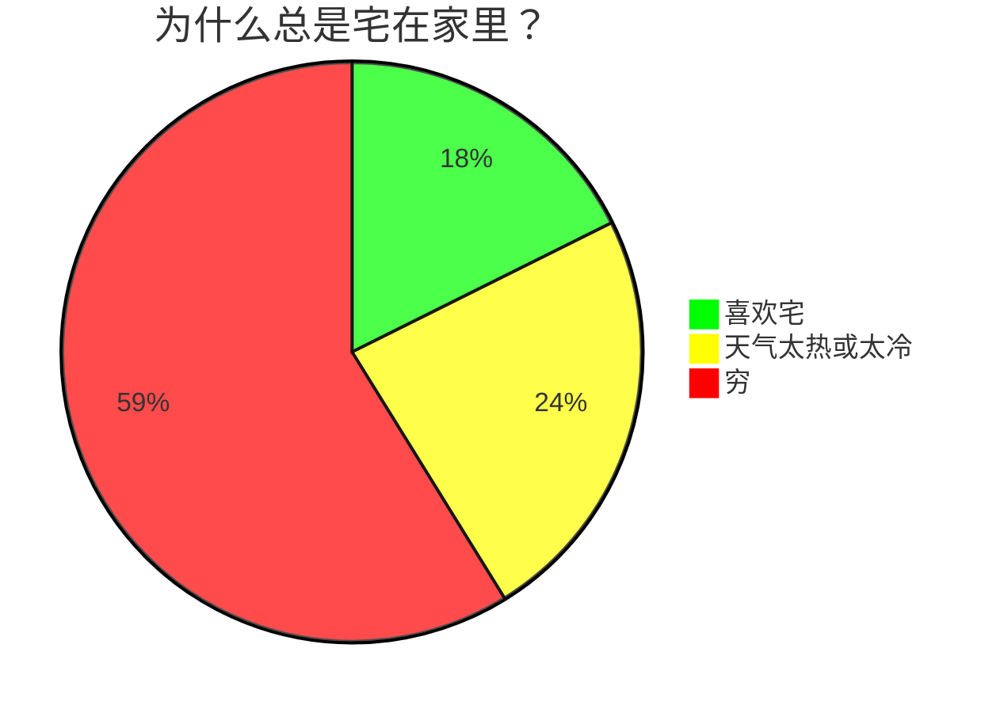
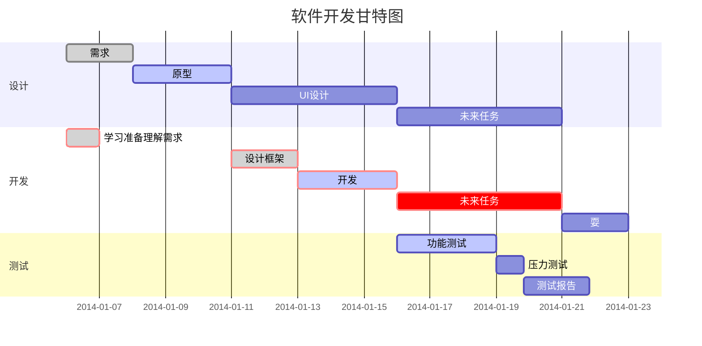

## Markdown常用语法

[TOC]

### 基本用法

**粗体**

~~删除线~~

<u>下划线</u>

创建脚注[^脚注]

事物
: 事物的定义

代码块定义
: 代码块定义……

      var a = 10;         // 保持空一行与 递进缩进

开头一个`:` + `Tab` 或 四个空格

### 字体

face : 字体样式
<font face= "华文彩云">华文彩云</font> 
  
color : 可以用十六位颜色值，也可以用已知颜色名
<font color="#f00">标红字体</font> 

size : 规定文本尺寸大小,可能值从 1~7，浏览器默认值为 3
<font size="1">1号尺寸</font>

### 背景色

<table>
  <tr>
    <td bgcolor=orange>背景色是：orange</td>
  </tr>
</table>

### 格式化文本

保持输入排版格式不变
<pre>
hello world
         hi
  hello world
</pre>

### 其他特殊字符

代码	显示结果
&#10084;	❤
&#10003;	✓
&#9728;	  ☀
&#9733;	  ★
&#10052;	❄
&#10003;	☂
&#9762;	  ☢
&#9742;	  ☎
&#9835;	  ♫
&#8734;	  ∞

### 锚点 {#index}

插入锚点: {#index}
跳转锚点: [描述](#index)

### emoji表情符号

:smile:
:smiley:
:worried:

### 多选项

- [ ] 选项一
- [ ] 选项二

### 链接

[链接](https://www.ggangliu.cn)

<https://www.ggangliu.cn>

高级链接, 这个链接用1作为网址变量 [ggangliu.cn][1]

### 图片


### 表格

|  表头   | 表头  |
|  ----  | ----  |
| 单元格  | 单元格 |
| 单元格  | 单元格 |

<table class="tg">
  <tr>
    <th class="tg-0pky" rowspan="2">AAA</th>
    <th class="tg-0pky" colspan="2">BBB</th>
  </tr>
  <tr>
    <td class="tg-0pky"></td>
    <td class="tg-fymr" rowspan="2">CCC</td>
  </tr>
  <tr>
    <td class="tg-0pky" colspan="2">DDD</td>
  </tr>
</table>

### 高级技巧

不在 Markdown 涵盖范围之内的标签，都可以直接在文档里面用 HTML 撰写

- 使用 <kbd>Ctrl</kbd>+<kbd>Alt</kbd>+<kbd>Del</kbd> 重启电脑
- \*\* 正常显示星号 \*\*
- 公式
  Markdown Preview Enhanced 使用 KaTeX 或者 MathJax 来渲染数学表达式
  
  ``` bash
  $...$ 或者 \(...\) 中的数学表达式将会在行内显示
  $$...$$ 或者 \[...\] 或者 ```math 中的数学表达式将会在块内显示
  ```
  
  $ f(x) = sin(x) + 12 $

  $$ \sum_{n=1}^{100} $$

  $$
    \begin{Bmatrix}
      a & b \\
      c & d
    \end{Bmatrix}
  $$
  
  $$
    \begin{CD}
      A @>a>> B \\
    @VbVV @AAcA \\
      C @= D
    \end{CD}
  $$

- 饼图



- 甘特图

**任务状态**
done 已完成
active 正在进行
crit 关键任务

**任务描述**
在des1、des2位置添加任务描述，其它任务引用时直接引用des1就可以。

**after**
描述任务时间关系。des3, after des2表示des3紧跟在des2之后

**任务时长有三种方式**
时间范围 如：2014-01-06,2014-01-08
指定天数 如：5d
指定开始日期+天数 如：2014-01-06，5d



> [Markdown 高级技巧](https://www.runoob.com/markdown/md-advance.html)
> <https://zhuanlan.zhihu.com/p/355997933>

### 备注块

[!NOTE]
[!TIP]
[!IMPORTANT]
[!CAUTION]
[!WARNING]
[!ADMINISTRATION]
[!AVAILABILITY]
[!PREREQUISITES]
[!ERROR]
[!INFO]
[!SUCCESS]

### Media


<iframe width="420" height="315" src="https://video.tv.adobe.com/v/29770/?quality=12" frameborder="0" allowfullscreen></iframe>

[1]:https://ggangliu.cn

## Reference

- [如何使用Markdown编写技术文档](https://experienceleague.adobe.com/docs/contributor/contributor-guide/writing-essentials/markdown.html?lang=zh-Hans)
- [A Jekyll plugin to provide powerful supports](https://github.com/jeffreytse/jekyll-spaceship)
- [Markdown Preview Enhanced](https://shd101wyy.github.io/markdown-preview-enhanced/#/)

[^脚注]:学习使用脚注
