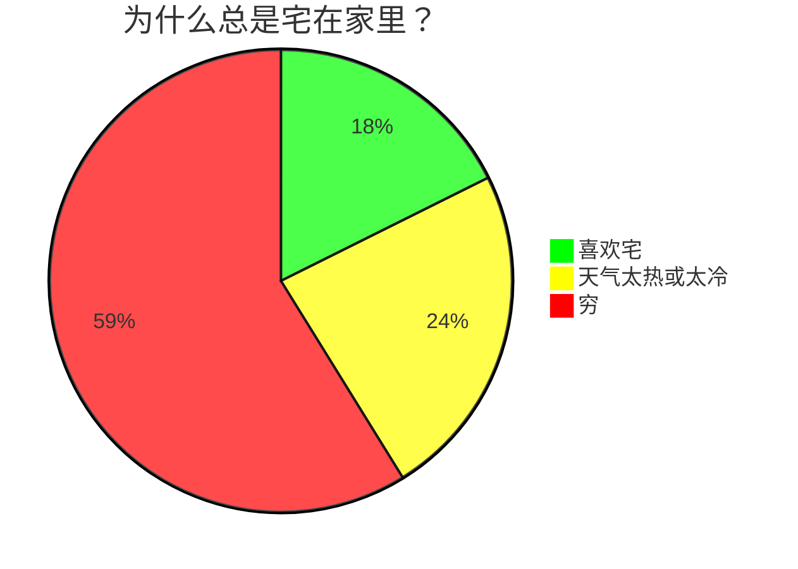
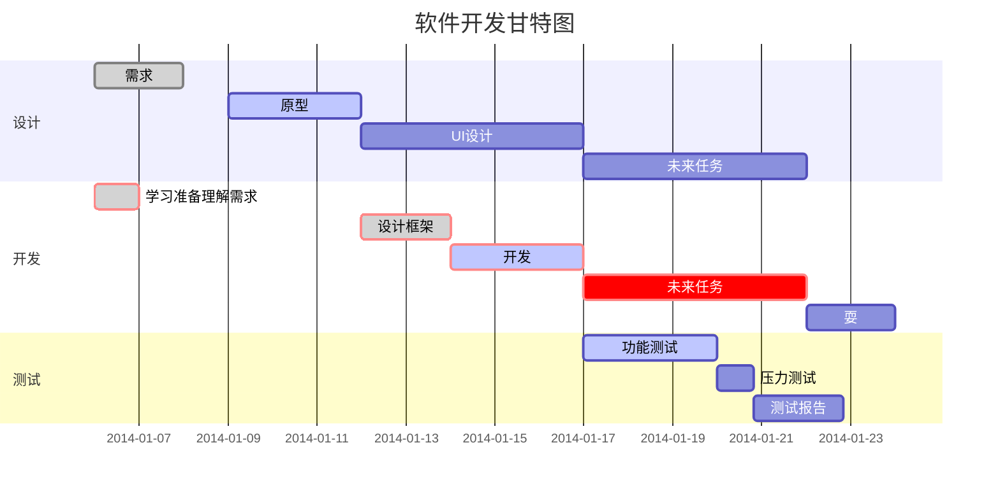

## Markdown常用语法

### 字体

**粗体**

~~删除线~~

<u>下划线</u>

创建脚注[^脚注]

### 链接

[链接]()

<https://www.ggangliu.cn>

高级链接, 这个链接用1作为网址变量 [ggangliu.cn][1]

### 图片


### 表格

|  表头   | 表头  |
|  ----  | ----  |
| 单元格  | 单元格 |
| 单元格  | 单元格 |

### 高级技巧

不在 Markdown 涵盖范围之内的标签，都可以直接在文档里面用 HTML 撰写

- 使用 <kbd>Ctrl</kbd>+<kbd>Alt</kbd>+<kbd>Del</kbd> 重启电脑
- \*\* 正常显示星号 \*\*
- 公式
  Markdown Preview Enhanced 使用 KaTeX 或者 MathJax 来渲染数学表达式
  
  ``` bash
  $...$ 或者 \(...\) 中的数学表达式将会在行内显示
  $$...$$ 或者 \[...\] 或者 ```math 中的数学表达式将会在块内显示
  ```
  
  $f(x) = sin(x) + 12

  $$\sum_{n=1}^{100}$$

  $$
    \begin{Bmatrix}
      a & b \\
      c & d
    \end{Bmatrix}
  $$
  
  $$
    \begin{CD}
      A @>a>> B \\
    @VbVV @AAcA \\
      C @= D
    \end{CD}
  $$

- 饼图



- 甘特图

**任务状态**
done 已完成
active 正在进行
crit 关键任务

**任务描述**
在des1、des2位置添加任务描述，其它任务引用时直接引用des1就可以。

**after**
描述任务时间关系。des3, after des2表示des3紧跟在des2之后

**任务时长有三种方式**
时间范围 如：2014-01-06,2014-01-08
指定天数 如：5d
指定开始日期+天数 如：2014-01-06，5d



> [Markdown 高级技巧](https://www.runoob.com/markdown/md-advance.html)
> <https://zhuanlan.zhihu.com/p/355997933>

### 备注块

[!NOTE]
[!TIP]
[!IMPORTANT]
[!CAUTION]
[!WARNING]
[!ADMINISTRATION]
[!AVAILABILITY]
[!PREREQUISITES]
[!ERROR]
[!INFO]
[!SUCCESS]

### Media

[!VIDEO](https://video.tv.adobe.com/v/29770/?quality=12)

[1]:https://ggangliu.cn

> [如何使用Markdown编写技术文档](https://experienceleague.adobe.com/docs/contributor/contributor-guide/writing-essentials/markdown.html?lang=zh-Hans)
> [A Jekyll plugin to provide powerful supports](https://github.com/jeffreytse/jekyll-spaceship)

[^脚注]:学习使用脚注
