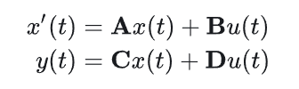
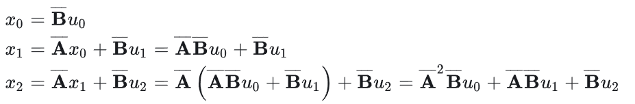
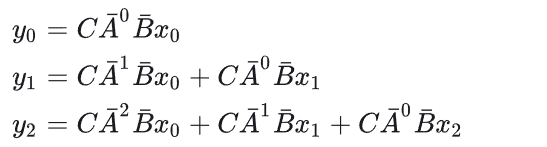

# Understanding Mamba

[Mamba: Linear-Time Sequence Modeling with Selective State Spaces](https://arxiv.org/abs/2312.00752)
<https://arxiv.org/abs/2312.00752>

## Paper

structured state space models (SSMs) have been developed to address Transformers’ computational inefficiency on long sequences.

We propose a new class of selective state space models, that improves on prior work on several axes to achieve the modeling power of Transformers while scaling linearly in sequence length.

**Selection Mechanism** allows the model to filter out irrelevant information and remember relevant information indefinitely

**Hardware-aware Algorithm** computes the model recurrently with a scan instead of convolution, scaling linearly in sequence length, compared to pseudo-linear for all convolution-based SSMs

**Architecture** 

Structured state space sequence models (S4) are a recent class of sequence models for deep learning that are broadly related to RNNs, and CNNs, and classical state space models. S4 models are defined with four parameters (∆, A, B, C), which define a sequence-to-sequence transformation in two stag.

## 1. RNN

- 训练慢 空间复杂度O(n)
- 推理快 时间复杂度O(1)

传统RNN的典型公式(有一个非线性的tanh())

## 2. Transformer

- 训练快(训练过程可以并行化计算)
- 推理慢

## 3. SSM

- 训练快(并行训练)
- 推理快(递归预测，是Transformer的5倍)

Mamba 最独特的地方在于它脱离了传统的注意力和 MLP（多层感知器）模块。这种简化使得模型更轻便、更快速，并且能随着序列长度线性地缩放，这是之前模型无法做到的。

### 基础模型

连续状态的时不变系统

该系统的状态方程可以表示为(A, B, C, D均为可以学习的矩阵)：

其中D被称为skip connection, 可以理解为经过变换的残差连接。因此通常把不包括在内的部分特指为SSM。

该系统有两个点需要强调：

1. 该系统为一个时不变系统（对后面mamba的改造非常关键）；
2. 该系统是一个连续系统（实际处理中需要离散化）；

### 离散化及其解法

1. 微分极限法（微分定义）
2. 双线性变换（积分思想）
3. 零序保持（Mamba）

离散化之后状态方程就变为如下，经过离散化后就实现了线性的循环模式

由此可以写出前几步的状态变量，即状态X可以表示成输入的函数。

同理可以写出前几步的输出变量

卷积核

卷积计算过程

为了计算K，关键在于计算A，最理想的状态是特征对角化。除此之外还有一种HiPPO(High-Order Polynomial Projection Operator) 矩阵的初始化方法，即

在Transformer架构中，前文的信息存储在了KV Cache中，而SSM中不存在类似模块，因此其循环形式并不擅长处理上下文相关的学习问题，那么就引出了Mamba的优化和改进。

## Mamba的突围

概况而言，Mamba主要解决的问题有以下两方面：

1. 选择性复制：在语言模型的上下文中，选择性复制是指从给定输入中辨别相关信息并将其适当地再显或合并到生成的输出中的能力。涉及模型从输入数据中识别和重现特定短语、实体或模式的能力，从而增强生成文本的相关性和连贯性
2. 归纳头：语言模型中的归纳头输入专门组件，可促进模型从输入数据中推断和概括知识的能力。与人类根据观察到的模式得出结论和进行推论的方式类似，归纳头使模型能够推断信息、理解潜在的关系，并应用学到的概念来生成更细致、更适合上下文的响应。

### Mamba的选择机制

普通SSM无法学习选择性复制任务的原因是它们是时不变的。这意味这可学习参数随着每个新token的传入而保持固定。

Mamba的第一个改进就是选择性扫描(Selective Scan)，即放弃卷积核递归的双重属性，仅依赖于循环。具体来说就是参数时变化。矩阵A保持不变，但B和C现在成为了输入的函数，也就是系统由时不变成为了时变系统。通过下面的算法可以理解两者的差异。

### 训练加速--并行扫描

由于上述操作仅具有循环形式，不具有卷积形式，那么训练就无法实现加速并行化。

下图算法为并行扫描，为其工作原理：

Mamba不可并行化(因为它是时变的)，因此需要依赖循环操作。Mamba的作者采用三种经典技术来提供循环操作速度：

- 并行扫描算法(Parallel Scan)
- 核融合(Kernel Fusion)
- 激活重计算(Activation Recomputation)

### Mamba的结构与实现

Mamba模型是由多层Mamba层连接而成，与Transformer的模型非常相似。Mamba层是H3和门控MLP操作的组合。

**After the parameters have been transformed from (∆, A, B, C) ↦ (A, B, C), the model can be computed in two ways, either as a linear recurrence (2) or a global convolution (3). Commonly, the model uses the convolutional mode (3) for efficient parallelizable training where the whole input sequence is seen ahead of time), and switched into recurrent mode (2) for efficient autoregressive inference (where
the inputs are seen one timestep at a time).**

是一个混合了CNN与RNN的模型，既有CNN的并行优势，又有RNN的长程感知能力。这里 ht-1 与 ht 是一个典型的 RNN 型计算，而 Bt，A，Ct，dt 这些计算又都是一些类似 y=wx+b 这样的类似 CNN 的运行或者说标准的神经网络计算。所以它即有良好的并行能力，又有 RNN 的记忆优势。

这里的K是卷积核. 这个卷积核非常大, 大到长度等于输入sequence length. 因为这个 kernel 的长度和 sequence length 一样, 所以原文又称之为 global attention.

更 fundamental 的理解是:

1. 不同的yt是可以独立计算的(但独立计算是有代价的，本来yt可以通过递归的形式从yt-1一步算出来，但为了独立计算yt，要从头开始计算每个yt)
2. 每个yb计算的pattern类似(共用一个 kernel 去和输入做 dot product)

但独立计算似乎不是根本追求，根本追求是能不能并行计算，只有并行计算才能高效的利用GPU。

### 3.1 SSM(State Space Models)

Structured state space sequence models (S4)

### 3.2 Selective State Space Models

选择性SSM：通过选择性 SSM，Mamba 能够过滤掉不相关信息，专注于重要数据，从而更高效地处理序列。

S4 与 S6 的唯一计算区别就是参数 B 、 C 、 d∆ 的区别

time-invariant -> time-variant
从时不变到时变

#### 3.2.1 Hardware-aware

- Memory
  将所有的SSM参数(A,B,C)加载到SRAM中，再执行discreization和recurrence in SRAM，再将最终结果写回DRAM
- Kernel fusion
  hidden特征先写会DRAM，每次计算再读入，改进为多次计算融合，单词计算不再写回DRAM，多次计算后将结果保存回DRAM

## 4. Diffusion-based with Structured State Space Model

- 用Transformer替换UNet
- 用SSM替换UNet
- 用Mamba替换UNet

## 5. Reference

- <https://github.com/state-spaces/mamba>
- <https://zhuanlan.zhihu.com/p/680833040>