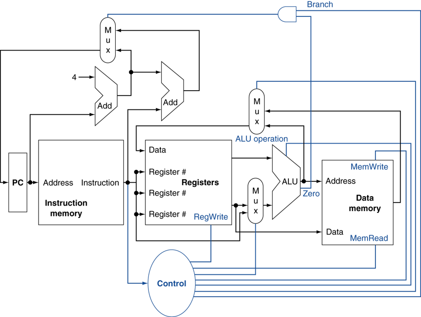

# Computer Architecture

[TOC]

## Datapath

### Datapath without control signal


### Datapath with control signal



## Instruction Set

### Format

- R-type

  - add rd, rs, rt
  - sub rd, rs, rt
  - and rd, rs, rt
  - or  rd, rs, rt
  - slt rd, rs, rt
- I-type

  - lw   rt, rs, imm16
  - st   rt, rs, imm16
  - addi rt, rs, imm16
  - beq  rt, rs, imm16
- J-type

  - j target

## Pipelining

Executing multiple instructions in parallel, to increase ILP:

- Deeper pipeline
  - Less work per stage => shorter clock cycle
- Multiple pipeline
  - Replicate pipeline stages => multiple pipelines
  - Start multiple instructions per clock cycle
  - CPI < 1
- Static multiple issue
  - Compiler groups instructions to be issued together
  - Packages them into "issue slots"
  - Compiler detects and avoids hazards
  - Scheduling static multiple issue
    - Compiler must remove some/all hazards
      - Reorder instructions into issue packets
      - No dependencies with a packet
      - Possibly some dependencies between packets
      - Pad with nop if necessary
  - Example, MIPS with static dual issue
    |Address	|Instruction type	|CC1  |CC2  |CC3  |CC4  |CC5  |CC6  |CC7  |
    |:---     |:----            |:--- |:--- |:--- |:--- |:--- |:--- |:--- |
    |n	      |ALU/branch	      |IF	  |ID	  |EX	  |MEM  |WB   |     |     |
    |n + 4	  |Load/store	      |IF	  |ID	  |EX	  |MEM  |WB   |     |     |
    |n + 8	  |ALU/branch		    |     |IF	  |ID	  |EX	  |MEM  |WB   |     |
    |n + 12	  |Load/store		    |     |IF	  |ID	  |EX	  |MEM  |WB   |     |
    |n + 16	  |ALU/branch			  |     |     |IF	  |ID	  |EX   |MEM  |WB   |
    |n + 20	  |Load/store			  |     |     |IF	  |ID	  |EX   |MEM  |WB   |
- Dynamic multiple issue
  - CPU examines instruction stream and chooses instructions to issue each cycle
  - CPU resolves hazards using advanced techniques at runtime
  - Compiler can help by reordering instructions
  - Allow the CPU to execute instructions out of order to avoid stalls, but commit result to register in order
  - Dynamically scheduled CPU
    
  - Example, can start sub while addu is waiting for lw

    ``` asm
    lw   $t0, 20($s2)
    addu $t1, $t0, $t2
    sub  $s4, $s4, $t3
    slti $t5, $s4, 20
    ```

### Single cycle datapath

- IF(Instruction Fetch)
- ID(Instruction Decode and register file read)
- EX(Execution or address calculation)
- MEM(Data memory access)
- WB(Write back)

### Multiple cycle datapath

### Pipeline datapath

#### Hazard

- Data hazard
  - WAR
  - WAW
  - RAW
- Control hazard
- Structure hazard
