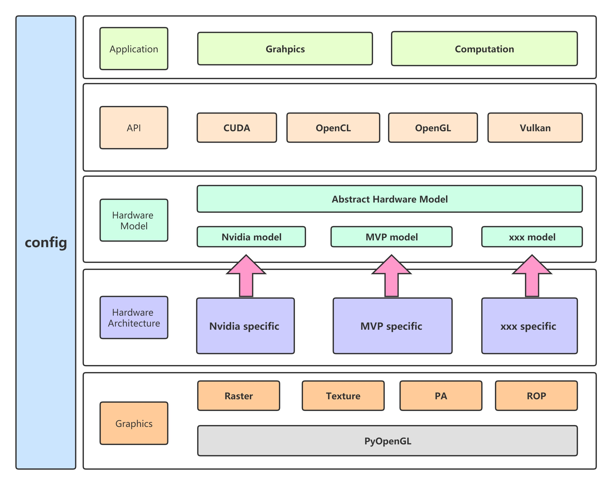
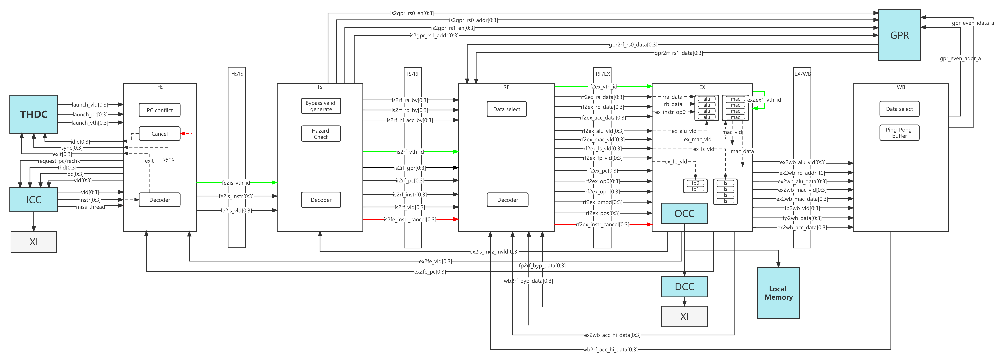
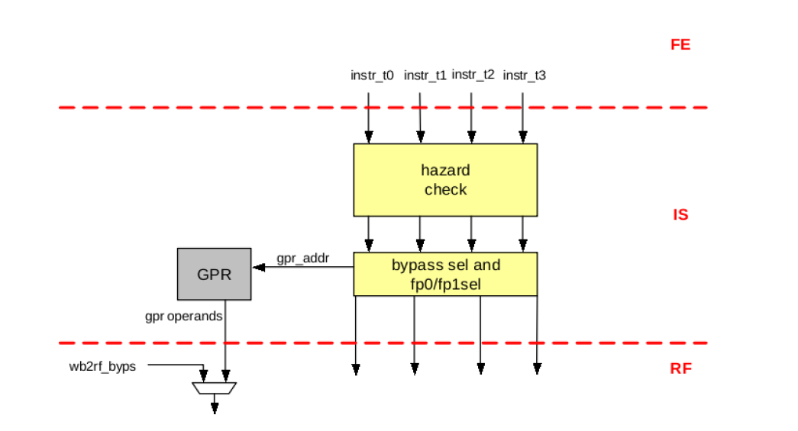
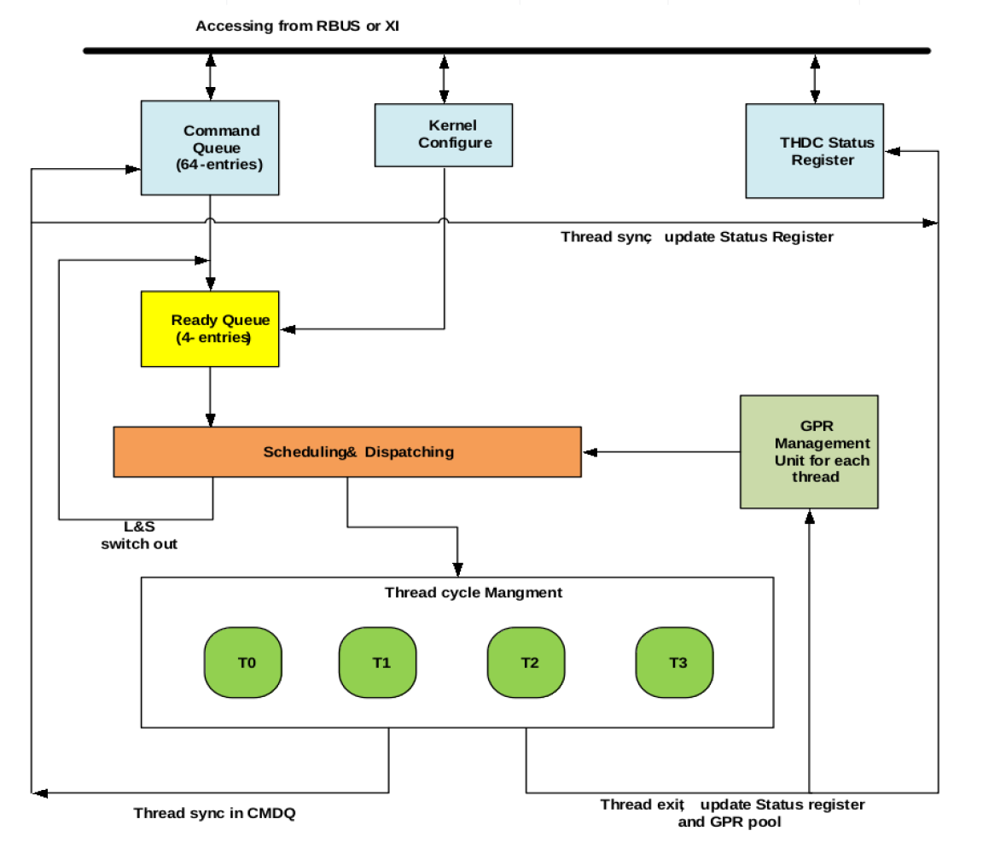
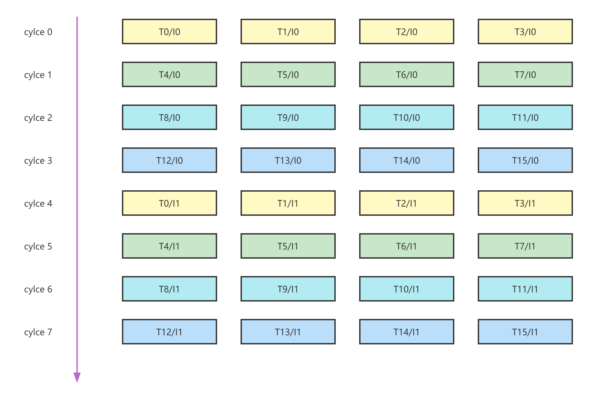
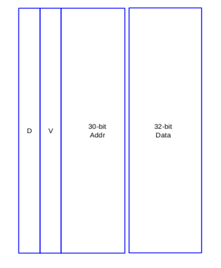
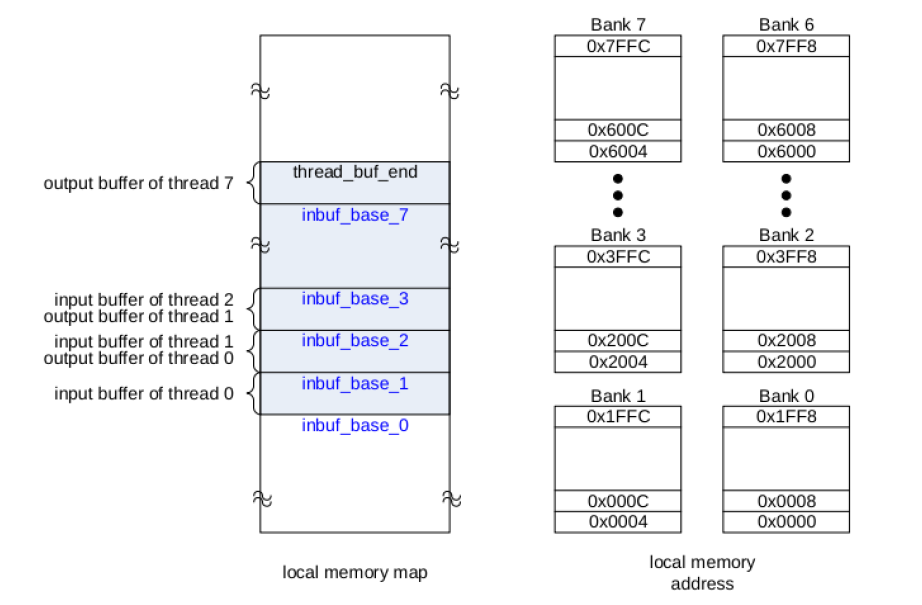

# MVPGPU-Sim Architecture Manual

MVPGPU-Sim is developed based on GPGPU-Sim, and Added lots of features which MVP GPU dedicated

## Revision history

| Date    | Version          | Description | Author     |
|:--------|:-----------------|:------------|:-----------|
|2023-3-27|V0.00             |Initial      |Liu Yonggang|

## Table of Contents

- [MVPGPU-Sim Architecture Manual](#mvpgpu-sim-architecture-manual)
  - [Revision history](#revision-history)
  - [Table of Contents](#table-of-contents)
  - [Why we use markdown as file format](#why-we-use-markdown-as-file-format)
  - [Platform Architecture Design](#platform-architecture-design)
    - [Function Lists](#function-lists)
    - [Folder and Code structure](#folder-and-code-structure)
    - [Key concept mapping](#key-concept-mapping)
  - [Basic Design Principles](#basic-design-principles)
  - [Application](#application)
    - [Benchmark \& CTS](#benchmark--cts)
  - [API](#api)
  - [Hardware Model](#hardware-model)
  - [Hardware Architecture](#hardware-architecture)
    - [MVP Architecture](#mvp-architecture)
      - [MVP ISA](#mvp-isa)
      - [MVP Compiling](#mvp-compiling)
      - [MVP Instruction Parsing](#mvp-instruction-parsing)
    - [MVP Microarchitecture](#mvp-microarchitecture)
    - [MVP Microarchitecture Run-time](#mvp-microarchitecture-run-time)
    - [MVP Kernel and Thread](#mvp-kernel-and-thread)
  - [Graphics](#graphics)
    - [Graphics function list](#graphics-function-list)
    - [Graphics Process Flow](#graphics-process-flow)
    - [OpenGL Shader Compilation Flow](#opengl-shader-compilation-flow)
  - [What we can do in next step](#what-we-can-do-in-next-step)

## Why we use markdown as file format

- It's possible to convert to other file format
- It's easy to do version control based on git repo
  - Revision history
  - Web-style release

## Platform Architecture Design

Here is the architecture design of MVPGPU-Sim as a long-term target

### Function Lists

- [x] MVP ISA support
- [x] OpenCL support
- [ ] OpenGL support

> :memo: **Note:** OpenCL API is still on developing

### Folder and Code structure

Source code folder and Class relationship structure

### Key concept mapping

|  MVP  |     OpenCL     | CUDA View |        Description        |
| :----------------------------- | :------------- | :-------- | :------------------------ |
| 😊                              | NDRange        | grid      |                           |
| 😊                              | wave-group     | block/CTA |                           |
| warp                           | wavefront(AMD) | warp      | The minimum schedule unit |
| thread                         | work-item      | thread    |                           |
| ALU                            | PE             | CUDA Core |                           |
| SP                             | CU             | SM        |                           |

## Basic Design Principles

1. Modularization, Each coulde be compiled as dynamic library(.so), and provide headers for external (xxx.so + include/xxx.hpp)
2. Each class only occupy one cpp/hpp file, don't allow to be placed in different files
3. Naming-style, using hardware name to match hardware structure and concept
4. Separate abstraction and implementation, support unified up-layer abstraction and differentated low-layer implementation
5. Makefile contians specific include path by -I

## Application

- [ ] nuFHE (OpenCL)
- [x] Pytorch (OpenCL)
- [x] Graphics Rasterizer
- [ ] LearnOpenGL

### Benchmark & CTS

- [ ] ispass2009-benchmark
- [ ] OpenCL CTS

## API

- [x] OpenCL
- [x] Cuda
- [ ] OpenGL
- [ ] Vulkan

## Hardware Model

High level hardware model abstraction

## Hardware Architecture

Low level hardware architecture implementation

|MVP   |V2.1 |V3.0 |   |
|:--   |:--  |:--  |:--|
|GPC   |0    |     |   |
|TPC   |4    |     |   |
|SM    |8    |     |   |
|SP    |32   |     |   |
|INT32 |128  |     |   |
|FP32  |128  |     |   |
|SFU   |32   |     |   |
|LD/ST |128  |     |   |

INT32
: MAC: mul/mac/mas
: ALU: add/sub/beq/ble

FP32
: MAC: fadd/fsub/fmul/fmac/fmas
: ALU: fbeq/fble

SFU
: Fixed Floating Point Function, actually there are two different function unit for different instruction. So I can think that there is only one SFU.

The whole MVP architecture as the following shows:

The detailed SP architecture as below:

### MVP Architecture

MVP Architecture is the interface between software and hardware microarchitecture

#### MVP ISA

MVP instruction set architecture is the most important part of MVP GPU

#### MVP Compiling

- How to compile OpenCL
- How to compile OpenGL

#### MVP Instruction Parsing

- How to parse MVP assembly language
- Lex/Yacc

### MVP Microarchitecture

MVP Microarchitecture is the implementation of the MVP ISA

- GPC
  Current MVP architecture has no this concept. But there are 4 TPCs, 1 PA and 1 Rast.
- TPC
  There are 2 SMs, 1 ROP and 1 Texture in each TPC.
- SM
  There are 4 SPs in each SM.
- SP
  SP is the minimum execution unit in MVP architecture.

  - Pipeline
    Multi-thread Virtual pipeline stream Processor(MVP) has the goal of replacing the MPU, DSP or GPU into a single scalable core and delivering the most cost efficient performance in the whole system by offloading the host processor's application work load, exploiting instruction level parallelism(ILP), data level parallelism(DLP) and task level parallelism(TLP), enabling load balancing between resources inside MVP and hiding memory or I/O latency due to cache miss. It supports a maximum of **16** running threads and can issue 4 instructions per cycle.
    
    - FE
      Instruction fetch for 4 of the running threads per cycle
      - FE State Machine
        SYNC instruction will tells all threads to synchronize before further execution, the fetch unit stops fetching instruction and notifies the thread control unit about the pause when it fetches the SYNC instruction and all instructions before SYNC are executed. The thread control unit then waits for the SYNC notifications from all other threads
        EXIT instruction will stops fetching the instructions, and thread control unit updates the thread status
      > m_inst_fetch_buffer = ifetch_buffer_t(m_warp[mf->get_wid()]->get_pc(), mf->get_access_size(), mf->get_wid());
    - IS
      The issue unit gets 4 instructions from horizontal threads and performs both data and resource hazard check, issue instruction, set up GPR address. All instruction must be issued in-order.
      **Data hazard** (RaW)
      **Resource hazard** (FP0/FP1)
      
      >📝 Timing is not sufficient due to sram type GPR, so added extra pipeline stage RF between IS and EX
    - RF
      For better timing consideration, the data from SRAM type GPR will be received at this stage. RF stage will also receive data bypassed from WB stage if there is RaW data dependency.
      Get operand from GPR
    - EX
      MVP can only get the instruction operands from either GPR or bypass data from later pipeline stage. There are 4 ALUs，4 MACs，4 LSs and 1 fix functions units.
      - Ex0
        Get operands from GPR or bypass, instruction decode and execution, load/store memory effective address generation by ALU, resolve branch condition
      - Ex1
        Determine memory address space, on-chip memory or external if cache miss occurs
      - Ex2
        Get data from cache or local memory
    - WB
      In WB stage, the execution result write-back to GPR or memory, or already written back to ACC/HI reg. There are at most 2 operands are retrieved from and 1 result is written back to GPR. Hence four banks 2rw port SRAM, that each bank is divided into two blocks are sufficient.
      
      When odd thread is at IS stage, it will generate two operand's GPR read signals to odd GPR sram, and gets data at RF stage. Then even thread will do that same when it is at IS stage, and get data from even GPR sram next stage. Every thread will write data to GPR sram when it is at WB stage. We use odd/even GPR sram to resolve 2r1w requirement of GPR.
      When there is data dependency, the data at WB stage will be bypassed to RF stage, and then mux with GPR data.
    - SIMT Stack
    - Scoreboard
    - Operand Collector
  - THDC
    THDC is used to schedule the threads when and how to switch in and switch out of pipeline. There are total 64 threads supported by hardware to cover the mis-branch penalty and L&S latency to L2CC. When ther is L&S cache miss, the corresponding thread will be switched out, and a new set of horizontal threads will be switched in, and at the same time, the miss request will be processed.
    

    There are 4 horizontal running threads simultaneously, and have four groups of vertical threads. So the core support maximum of 16 running threads. The 4 horizontal threads are simultaneous-multi-thread(SMT) threads that are running at the same cycle among the 4 sets of execution units, e.g. MACs and ALUs. Most of time, their PC are identical and as such executed in a SIMD manner. The 4 vertical threads are time-shared threads which are running in a round-robin manner. Hence, instructions from one thread will only be fetched and executed every 4 cycles.
    

    In total there are 64 threads inside SP. Except 16 running threads, 48 threads are waiting for scheduling.
    
  - ICC
    ICC is responsible to check if it is a cache hit when the fetch unit requests for instructions in every cycle. Otherwise, external access request is sent to XI to get the instruction from external memory. ICC can issue four requests to XI at the same time. ICC has the highest priority in external access.
    
  - DCC
    DCC is responsible to evaluate if the request data is in the data cache. If so, data and valid signal are returned in the next cycle. Data is written back to external memory when the data has been modified and cache word is replaced due to cache miss.
  - OCC(On-Chip Controller)
    The memory access in MVP is basically controlled by On-Chip Controller and Data Cache Controller. And ensure the load/store instructions are executed in order. Whenever there is a valid load/store, it determines whether the memory address is an on-chip address, if the address is a off-chip address, it sends the valid signal and memory address to DCC.
    
  - Memory
    - GPR
      There are 16-entry by 32-bit GPRs for each thread, so totally has 64x16x32 bits GPRs. There are at most 2 operands are retrieved from and 1 result is written back to GPR.
    - Cache
      - I-Cache
        There is 32KB instruction cache divided into 4 banks each of which is used by one running horizontal thread. Instruction cache line size are 256-bit(8x32-bit).
      - D-Cache
        There are only word buffers in Data Cache. The word buffers are for all the horizontal and vertical threads.
        - It is a write back word buffer
        - The size of word buffer is 64x2x32bit
        - Each entry is composed of {valid, dirty, address, data}
        
        Data is written back to external memory when the data has been modified and cache word is replaced due to cache miss. For better performance and to collect the cache miss request, we use one request fifo to deal with the cache miss. The fifo will show which thread's word buffer need update or write back.
        1. read access
           1. cache hit, it returns the data in next cycle
           2. cache miss,
              1. if dirty bit set, write back to external memory
              2. retrieve data from external memory and replace the cache line
        2. write access
           1. cache hit, update cache line and set the dirty bit
           2. cache miss,
              1. if dirty bit set, write back to external memory
              2. retrieve data from external memory and replace the cache line
              3. update the cache line and set the dirty bit
    - Local memory
      Local memory size in MVP is 32KB. It is physically origanized as 8 buffer banks to reduce the possibility of bank conflicts. One port for both read and write accesses.
      
  - XI
    External Interface is the only place through which the external access can be accomplished. There are 3 clients that can request for external access: ICC and DCC from MEM, and the DMA controller.
  - DDR

### MVP Microarchitecture Run-time

- Block Assignment
- Warp Assignment
  - issue_block2core()
    - ptx_sim_init_thread()
    - init_warps()
- Warp Scheduling
  - scheduler_unit::cycle()
- Thread Execution
  - ptx_thread_info::ptx_exec_inst()
- Instruction Execution

### MVP Kernel and Thread

- Kernel
  Kernel is the static existing of user shader program
- Thread
  Thread is the active existing of user shader program
- How to pass arguments between kernel and thread

## Graphics

### Graphics function list

- [ ] Primitive Assembly
- [ ] Rasterization
- [ ] Texture
- [ ] ROP

### Graphics Process Flow

|Input      |VS    |PA       |Raster   |PS    |ROP      |Output      |
|:---       |:---  |:---     |:---     |:---  |:---     |:---        |
|OpenGL API |GPGPU |Graphics |Graphics |GPGPU |Graphics |Framebuffer |

- Input assembler
  - Load index data and vertices data
- VS
  - MVP tranforms
- PA
  - Primitive assemble
    - Triangle
    - Line
    - Point
  - View clipping
  - Screen mapping
- Raster
  - Barycentric interpolation
- FS
  - Shading
  - Texture mapping
- ROP
  Perform color and depth frame buffer operations directly on memory
  - Z-buffer
  - Blending

### OpenGL Shader Compilation Flow

Using two steps compiling flow for simplifying compiling process.

1. OpenGL shader compiling
   Offline-compiling shader program as MVP assemble program
2. OpenGL application compiling
   GCC compile application, and using OpenGL API to load MVP assemble program into kernel for executing

## What we can do in next step

1. Shared memory for low-latency access to data shared by cooperating threads in the same SM
2. TMA(Tensor Memory Accelerator), hardware async data load
3. Asynchronous copy
4. Asynchronous barrier
5. 局部数据通过shared memory限制在SM内，不能跨SM
6. GPC内部通过交叉互联网络将数据共享层次扩展到SM之间，GPC内的SM可以高效访问彼此的共享内存
7. Simultaneous execution of FP32 and INT32 operations
