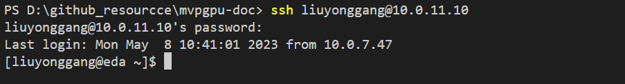

# How to clone and commit code

>This material will be as a guide for new comer to learn how to configure git related environment, source code clone and code commit

## Table of Contents

- [How to clone and commit code](#how-to-clone-and-commit-code)
  - [Table of Contents](#table-of-contents)
  - [Basic configuration](#basic-configuration)
  - [Clone source code and submodule](#clone-source-code-and-submodule)
  - [Clone mvpgpu-doc](#clone-mvpgpu-doc)
  - [Work with Gerrit](#work-with-gerrit)
    - [Login with Gerrit](#login-with-gerrit)
    - [Review](#review)
    - [Submit](#submit)
    - [Submodules](#submodules)
    - [Tag](#tag)
  - [Usefull usage](#usefull-usage)
    - [git stash](#git-stash)
    - [How to remove remote branch](#how-to-remove-remote-branch)
    - [How to modify git message template](#how-to-modify-git-message-template)
  - [FAQ](#faq)

## Basic configuration

```bash
$
$ git config --global user.name "name"
$ git config --global user.email "email@email.com"

$ git config --global alias.co checkout
$ git config --global alias.br branch
$ git config --global alias.ci commit
$ git config --global alias.st status

$ git config --global alias.lg 'log --oneline'
$ git config --global alias.last 'log -1 HEAD'

$ git config --global diff.tool meld
$ git config --global difftool.meld.path "/opt/git_meld.sh"
$ git config --global difftool.prompt false

$ git config --global commit.template "/opt/gitmessage.txt"
$ git config --global core.editor gedit
$ git config -l
```

More detailed refer to [Git Alias](https://www.atlassian.com/git/tutorials/git-alias)

## Clone source code and submodule

```bash
$
$ git clone "ssh://{user}@localhost:29418/mvpgpu-sim"
$ cd mvpgpu-sim
$ git submodule update --init --recursive
```

## Clone mvpgpu-doc

```bash
git clone <user_name>@10.0.11.10:/var/www/html/mvpgpu-doc
```

Then, You must execute the following script if you submit a new commit and would like to show it in web immediately, otherwise your changes won't be show in brower

- login ssh server first

```bat
ssh <username>@10.0.11.10
```



- Update in server side

```yaml
[liuyonggang@eda mvpgpu-doc]$ ./update_to_the_latest.sh 
```

## Work with Gerrit

Before start your work, checking your user profile of gerrit, make sure you set the full name that we can call you. Contact to the administrators to make sure you are in the right group so that you can see your project.

### Login with Gerrit

on `119` service\
<http://localhost:8081>

Now we do not have stmp email so skip this!

```bash
<!-- here list some commands that usually used by user -->

<!-- Clone with commit-msg hook by copy the commands in general page of reposity in gerrit-->

git clone "ssh://gerrithost:29418/XXX.git" && (cd "pytorch-gpgpu-sim" && mkdir -p .git/hooks && curl -Lo `git rev-parse --git-dir`/hooks/commit-msg ssh://gerrithost:29418/XXX.git; chmod +x `git rev-parse --git-dir`/hooks/commit-msg)


<!-- Push for Code Review -->

git commit
git push origin HEAD:refs/for/master

<!-- the last one is branch which is consistant with the one after "origin", this is the same as: -->
git commit
git push origin HEAD:refs/for/refs/heads/master
<!--other branch-->
git push origin <branch_name>:refs/for/refs/heads/<branch_name>
<!-- Push with bypassing Code Review -->
git commit
git push origin HEAD:master

<!-- this is the same as: -->
git commit
git push origin HEAD:refs/heads/master

<!-- Push new Patch Set -->
git commit --amend
git push origin HEAD:refs/for/master
```

### Review

on the gerrit web, In the change screen reviewers can be added explicitly to a change.

Mainly this functionality is used to request the review of specific person who is known to be an expert in the modified code or who is a stakeholder of the implemented feature. Normally it is not needed to explicitly add reviewers on every change, but you rather rely on the project team to watch their project and to process the incoming changes by importance, interest, time etc.

### Submit

Submitting a change means that the code modifications of the current patch set are applied to the target branch. Submit requires the Submit access right and is done on the change screen by clicking on the Submit button.

In order to be submittable changes must first be approved by voting on the review labels. By default a change can only be submitted if it has a vote with the highest value on each review label and no vote with the lowest value (veto vote). Projects can configure custom labels and custom submit rules to control when a change becomes submittable.

Submitting a change may fail with conflicts. In this case you need to rebase the change locally, resolve the conflicts and upload the commit with the conflict resolution as new patch set.

If a change cannot be merged due to path conflicts this is highlighted on the change screen by a bold red Cannot Merge label.

```bash
<!-- Rebase a Change locally -->

<!-- update the remote tracking branches -->
git fetch

<!-- fetch and checkout the change -->
<!-- (checkout command copied from change screen) -->
git fetch https://gerrithost/myProject refs/changes/74/67374/2 && git checkout FETCH_HEAD

<!-- do the rebase -->
git rebase origin/master

<!-- resolve conflicts if needed and stage the conflict resolution -->
  ...
git add <path-of-file-with-conflicts-resolved>

<!-- continue the rebase -->
git rebase --continue

<!-- push the commit with the conflict resolution as new patch set -->
git push origin HEAD:refs/for/master
```

If you want to learn more about Gerrit, see the guides in [Tools Intro](/ebook/Tools%20Instro/).

### Submodules

More detailed info, please refer to [Gerrit Submodules Support](https://archive.kernel.org/oldwiki/git.wiki.kernel.org/index.php/Gerrit_Submodules_Support.html)

### Tag

```bash
git tag <tag_name>   //当前分支所在的提交上打上轻量标签
git tag <tag_name> <commit hash value> //为某次具体的提交打上轻量标签
git tag -a <anotated_name> -m <tag_message> //为当前分支所在提交打上附注标签
git push origin <tag_name>  //推送某个标签到远程仓库
git push origin --tags //推送所有标签到远程仓库

git tag //列出所有的标签名
git show <tag_name> //显示标签对应提交记录的具体信息
git ls-remote --tags origin  //显示远端的tag

git tag -d <tag_name>  //删除某个标签
git ls-remote --tags origin //找出要删除的远端标签，类似于ref/tags/<tag_name>的格式
git push origin :refs/tags/<tag_name> //删除远程仓库某个标签
```

## Usefull usage

### git stash

This command is used to save temporary code which you don't want to commit or push

```bash
$
$ git stash
$
$ git stash save -m "This code is for feature A"
$
$ git stash [apply | pop | drop]
```

### How to remove remote branch

```bash
$
$ git br -d remotes/origin/xxx
$ git push origin --delete remote/origin/login
```

### How to modify git message template

```bat
vim /opt/gitmessage.txt
```

## FAQ

- fatal: No url found for submodule path 'ispass2009-benchmarks' in .gitmodules
  > git rm --cached ispass2009-benchmarks
- How to modify commit message
  > git commit --amend
