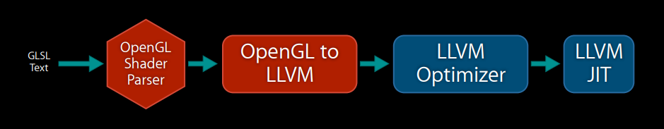
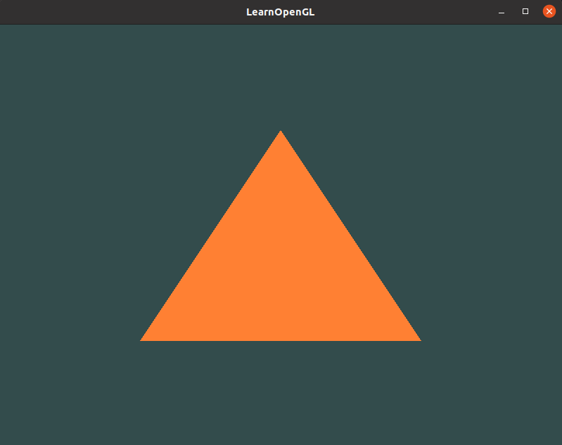

# How to compile GLSH to LLVM IR

## 0. Offline GLSL compilation

Only a discussing topic

## 1. LLVM



## 2. Mesa

Reusing the produced MVP assemble file seems the only way for now.

### 2.1 Dependences

- GLFW
- OpenGL (need to link to the libGL.so library by adding -lGL)

> For Linux users compiling with GCC, the following command line options may help you compile the project: -lglfw3 -lGL -lX11 -lpthread -lXrandr -lXi -ldl. Not correctly linking the corresponding libraries will generate many undefined reference errors.

```bash
apt-get install libsoil-dev libglm-dev libassimp-dev libglew-dev libglfw3-dev libxinerama-dev libxcursor-dev  libxi-dev libfreetype-dev libgl1-mesa-dev xorg-dev
```

Virtual Machine 可以运行


## 3. OpenGL Shader Compiler

This implementation can be done by generating llvm extended intrinsic functions from shader parser of frontend compiler as well as llvm backend converting those intrinsic to gpu instructions.[^opengl-shader-compiler]

``` sh
#version 320 es
uniform sampler2D x;
out vec4 FragColor;

void main()
{
    FragColor = texture(x, uv_2d, bias);
}

... 
// LLVM IR
!1 = !{!"sampler_2d"}
!2 = !{i32 SAMPLER_2D} : SAMPLER_2D is integer value for sampler2D, for example: 0x0f02
; A named metadata.
!x_meta = !{!1, !2}

define void @main() #0 {
    ...
1 = @llvm.gpu0.texture(metadata !x_meta, %1, %2, %3); // %1: %sampler_2d, %2: %uv_2d, %3: %bias
    ...
}

...
// gpu machine code
sample2d_inst $1, $2, $3 // $1: %x, $2: %uv_2d, $3: %bias
```

About llvm intrinsic extended function, please refer to [^intrinsic]

### Texture

GPU provides ‘Texture Unit’ to speedup fragment shader.

```ini
gvec4 texture(gsampler2D sampler, vec2 P, [float bias]);
```

## 4. xvfb

sudo apt install xvfb
xvfb-run [ options ] command

## Reference

- [OpenGL to LLVM Implementation](LLVM-for-OpenGL-and-other-stuff.pdf)

[^opengl-shader-compiler]: https://jonathan2251.github.io/lbd/gpu.html#opengl-shader-compiler
[^intrinsic]: https://jonathan2251.github.io/lbd/funccall.html#add-specific-backend-intrinsic-function