# MVPGPU-SIM Techincal Report

[TOC]

## 1. MVPGPU-SIM Project Introduction

### 1.1 Project Scope

将立项文档中的项目需求创建为用户故事


### 1.2 Project Flow

1. 制定了迭代计划
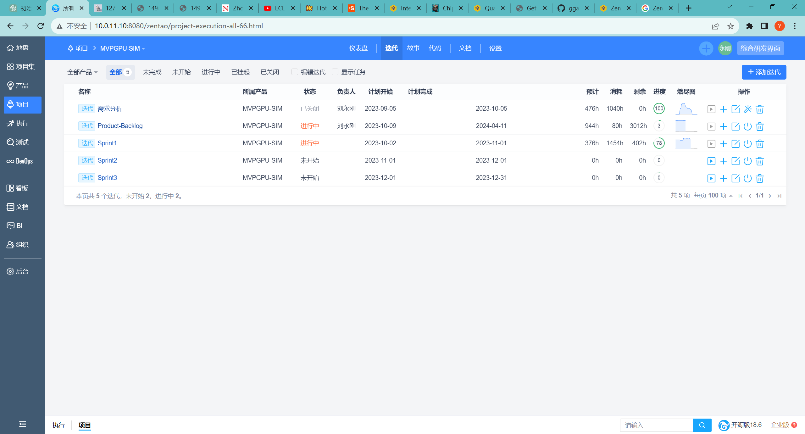

2. 进行需求分析，根据需求创任务，输出到Product Backlog
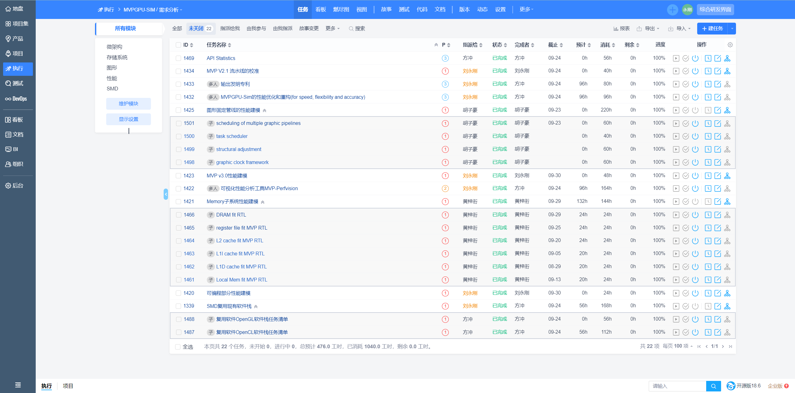

3. 所有已识别出的任务（包括子任务）均创建在Product Backlog中（开发过程中会根据实际情况增删任务）


4. Sprint1从Backlog中提取优先级最高的任务，开始实施执行
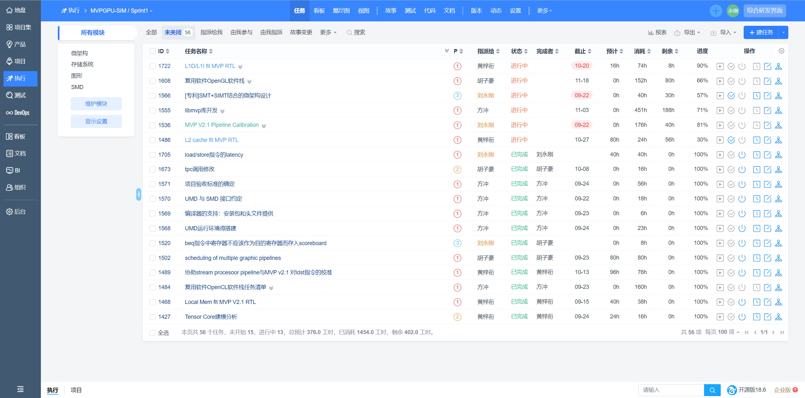

5. Sprint2的任务将在Sprint1结束后从Backlog中根据优先级和计划进行提取

6. Sprint3依次类推

### 1.3 Schedule Overview

``` mermaid
gantt
dateFormat YYYY-MM-DD
%%axisFormat WK%W
inclusiveEndDates
todayMarker stroke-width:3px,stroke:#0f0,opacity:0.5
title "MVP v3.0 Modeling Schedule"

section 需求分析
  Analyze requirement                           :done, r1, 2023-08-02, 4w 
section Sprint 1
  MVP v3.0 design and exploring                  :done, t, 2023-07-01, 2w
  Report release v0.1                            :done, milestone, crit, m0, after t, 1d   
  GPC/TPC/SM/SP                                  :done, t0, after m0, 3w
  MVP v2.1 Calculation                           :done, t0.0, 2023-09-10, 4w
  SP Pipeline                                    :active, t0.1, 2023-10-10, 3w
  Register file size                             :t1, after t0, 3w
  LDST Unit                                      :done, t1-1, after t0, 3w  
  L1 Instruction Cache size                      :t2, 2023-07-28, 3w
  L1 Data Cache size                             :t3, after t2, 3w
  Local memory size                              :t4, after t3, 3w
  Report release v1.0                            :milestone, crit, m1, after t4, 1d
  L2 Cache size                                  :t5, after m1, 3w
  Bus bandwidth                                  :t6, after t5, 3w 
  DRAM                                           :t7, after t6, 3w
  Report release v2.0                            :milestone, crit, m2, after t7, 1d  
  Evaluating L3 Cache which shared by all GPCs   :t8, after m2, 3w
section Sprint 2
  PA performance and quantity                    :t9, after t8, 3w
  RAST performance and quantity                  :t10, after t9, 3w
  ROP performance and quantity                   :t11, after t10, 3w
  TEXT performance and quantity                  :t12, after t11, 3w
  Report release v3.0                            :milestone, crit, m3, after t12, 1d
section Sprint 3
  Area                                           :t13, after m3, 4w
  Power                                          :t14, after t13, 4w
  Report release v4.0                            :milestone, crit, m4, after t14, 1d
```

```mermaid
gantt
dateFormat YYYY-MM-DD
%%axisFormat WK%W
inclusiveEndDates
todayMarker stroke-width:3px,stroke:#0f0,opacity:0.5
title "Memory Subsystem Schedule"

section 需求分析
  Memory subsystem requirement analysis         :done, r1, 2023-09-30, 4w 
section Sprint 1
  MVP v2.1 Performance Roofline Model           :done, t0.0, 2023-08-30, 2w
  Report release v0.1                            :milestone, crit, m0, after t0.0, 1d  
  Analysis Tools AerialVision/Logfiles/etc      :done, t0, 2023-09-15, 2w
  Local Mem Implement Fit MVP RTL                :done, t1, 2023-09-30, 3w 
  LDST Unit For LD/ST Inst Pipeline Support      :done, t1-1, 2023-10-13, 3w  
  L1 Instruction Cache Fit MVP RTL               :t2, 2023-10-23, 2w
  L1 Data Cache Fit MVP RTL                      :t3, 2023-10-23, 2w
  L2 Cache Fit MVP RTL                           :t4, after t3, 2w
  Report release v1.0                            :milestone, crit, m1, after t5, 1d
section Sprint 2
  Register file Fit MVP RTL                      :t5, after t4, 3w
  DRAM                                           :t6, after t5, 3w
  Cache/DRAM/XBAR Bandwidth                      :t7, after t6, 4w 
  Report Release v2.0                            :milestone, crit, m2, after t7, 1d
  Performance Overview of the whole GPU Pipeline :t8, after m2, 2w
  Single/Multiple SP Performance                 :t9, after m2, 2w
  Memory Occupancy                               :t10, after t9, 2w
  Patent                                         :t11, after t9, 1w
  Report release v3.0                            :milestone, crit, m3, after t11, 1d
section Sprint 3
  Design L3 Cache                                :t12, after t11, 3w
  Design Tensor Core                             :t13, after t12, 3w
  Analysis Tools Support                         :t14, after t13, 3w
  Power                                          :t15, after t15, 4w
  Report release v4.0                            :milestone, crit, m4, after t15, 1d
```

```mermaid
gantt
dateFormat YYYY-MM-DD
%%axisFormat WK%W
inclusiveEndDates
todayMarker stroke-width:3px,stroke:#0f0,opacity:0.5
title "SMD Developing Schedule"

section 需求分析
  Requirement analysis                           :done, r1, 2023-08-02, 4w 
section Sprint 1
  SMD design and exploring                  :done, t, 2023-08-01, 2w
  Report release v0.1                            :done, milestone, crit, m0, after t, 1d   
  SMD  development documentation, writing and review                                :done, t0, after m0, 3w
  SMD development environment setup                           :done, t0.0, 2023-09-10, 4w
  mvpgpu-sim library packaging                                     :active, t0.1, 2023-10-10, 3w
  SMD code framework                            :done, t1, after t0, 3w
  UMD and SMD interface conventions                                      :active, t1, after t0, 3w  
  UMD-SMD-mvpgpu-sim calls the link up                      :t2, 2023-09-28, 3w
  SMD developing                             :t3, after t2, 3w
  SMD patent disclosure                              :t4, after t3, 3w
  Report release v1.0                            :milestone, crit, m1, after t4, 1d
  section Sprint 2
  SMD submodule unit testing                                   :t5, after m1, 3w
  SMD integration testing                                  :t6, after t5, 3w 
  Test report                                           :t7, after t6, 3w
  Report release v1.1                            :milestone, crit, m2, after t7, 1d  
section Sprint 2
section Sprint 3
  OpenCL-1.2 CTS                                           :t8, after t7, 4w
  documentation & technology  sharing                                          :t9, after t8, 4w
  Report release v1.2                            :milestone, crit, m4, after t9, 1d
```

```mermaid
gantt
dateFormat YYYY-MM-DD
%%axisFormat WK%W
inclusiveEndDates
todayMarker stroke-width:3px,stroke:#0f0,opacity:0.5
title "MVP-sim Graphic Schedule"

section 需求分析
  Requirement analysis                           :done, r1, 2023-08-02, 4w 
section Sprint 1
  graphic cycle                                  :done, t0, after r1, 3w   
  graphic task scheduling                                  :done, t1, after t0, 3w
  scheduling of multiple graphic pipelines                           :done, t0.0, 2023-09-10, 4w
  graphic call of tpc                                     :done, t0.1, 2023-10-10, 3w
  Pomegranate algorithm                                     :done, t0.1, 2023-10-10, 3w
  mvp-isa def bug                            :done, t0.1, 2023-10-10, 1w
  graphic-related patent                   :t11, after t0, 3w
  graphic perf to aerialvision                   :t18, after t11, 3w
section Sprint 2
  Transfer umd request                    :t9, after t18, 3w
  BO and submit umd request                   :t10, after t9, 3w
  remaining umd request                  :t12, after t10, 2w
  opengl run success          :milestone, crit, m1, after t12, 1d
  new mvp isa                                            :t13, after t12, 3w
section Sprint 3
  source code view                                          :t14, after t13, 2w
  Area evaluation                                         :t15, after t14, 4w
  Interconnection                                          :t16, after t15, 4w
  pytorch on mvpgpusim                                          :t17, after t16, 4w
```

## 2. 模拟器简述

### 2.1 模拟vs模仿

模拟和模仿都涉及到模仿某种行为、动作或情境，但它们在含义和程度上有所不同。下面是它们的区别：

1. 模拟（Simulation）
   - 模拟是指通过模拟或模拟某种情境、过程或事件来尝试理解或重现它，通常是为了学习、训练、预测或测试目的
   - 模拟通常是一个较为抽象的过程，涉及到创建一个模型或仿真环境，以便观察其在不同条件下的行为
   - 模拟不一定要精确地复制原始情境，而是通过简化或抽象的方式来模拟关键特征和行为
2. 模仿（Imitation）
   - 模仿是指通过直接复制或模仿某人或某物的行为、动作或特征来学习或表现类似的行为
   - 模仿通常是一种生物学上的学习方式，尤其在婴儿和幼儿阶段非常常见
   - 模仿通常涉及到复制原始行为的外部表现，而不一定理解其内在原因或机制

总的来说，模拟更多地强调创建一个虚拟的模型或环境来研究和理解事物，而模仿则更强调复制行为或动作以学习或表现相似的行为

### 2.2 如何评估一个模拟器

| 维度        | 描述         |
|:------------------------|:---------------------|
| 模拟精度               | 评估模拟器模拟真实GPU行为的准确性       |
| 性能                   | 考虑模拟器的运行速度和效率              |
| 支持的GPU架构          | 确保模拟器支持所需的GPU架构             |
| 可扩展性               | 评估模拟器是否易于扩展和定制            |
| 用户友好性             | 考虑模拟器的界面和易用性                |
| 支持的操作系统和平台   | 检查模拟器是否适用于特定操作系统和硬件平台 |
| 可视化和分析工具       | 是否提供可视化和分析工具以便于结果理解和可视化 |
| 文档和社区支持         | 是否有详细文档和活跃的用户社区支持            |
| 准确性验证             | 是否对模拟器的准确性进行验证，与实际硬件结果进行比较     |
| 性能分析工具           | 是否提供性能分析工具来优化GPU程序的性能                   |
| 并行性和多线程支持     | 考虑模拟器是否支持多个GPU和并行计算                      |

### 2.3 GEM5和GPGPU-SIM在GPU建模方面进行了比较(from ChatGPT)

| 特性/维度           | GEM5                   | GPGPU-SIM               |
|----------------------|------------------------|-------------------------|
| 设计目标             | 通用计算机系统建模     | 专注于GPU建模和仿真    |
| 用途                 | 通用处理器和系统模拟   | GPU性能分析和建模       |
| 精确度               | 一般                   | 高度精确的GPU模拟      |
| GPU架构支持          | 可以扩展支持，相对通用 | 多种GPU架构的模拟支持   |
| 社区支持             | 活跃的开源社区         | 专注于GPU建模的社区    |
| 灵活性               | 非常灵活               | 更专注于GPU             |
| 性能分析工具         | 有限的性能分析工具     | 丰富的性能分析工具       |
| 适用领域             | 通用系统模拟和研究     | GPU性能分析、开发和研究 |

- **如果你需要进行通用系统模拟，并且研究涉及多个处理器架构（包括CPU和GPU）以及它们之间的互操作性，那么GEM5可能更适合，因为它具有更广泛的通用性和灵活性。**

- **如果你的工作主要集中在GPU建模、性能分析和GPU应用程序的开发上，那么GPGPU-SIM可能更适合，因为它专注于GPU，提供高度精确的GPU模拟和丰富的性能分析工具，以满足GPU相关研究和开发的需求。**

### 2.4 CPU vs GPU


### 2.5 GPGPU-SIM Introduction

1. 模拟GPU行为： GPGPU-SIM允许用户模拟GPU的行为，包括执行内核、内存访问和其他GPU操作。通过模拟，用户可以了解GPU在执行特定工作负载时的性能表现，包括吞吐量、延迟和资源利用率等。

2. 支持多种GPU架构： GPGPU-SIM支持多种不同的GPU架构，包括NVIDIA的CUDA架构和AMD的OpenCL架构等。这使得用户可以在不同的GPU平台上进行性能分析和比较。

3. 配置和定制： 用户可以配置GPGPU-SIM以模拟特定的GPU配置和性能特性。这包括GPU核心数、内存大小、缓存配置等。用户还可以自定义模拟参数以适应其研究或性能测试的需求。

4. 用于研究和开发： GPGPU-SIM广泛用于学术研究、GPU架构研究和GPU性能优化。它有助于了解GPU如何处理不同的工作负载，并提供洞察如何改进GPU应用程序的性能。

5. 开源： GPGPU-SIM是一个开源工具，可在个人和研究项目中免费使用。它的源代码可供查看和修改，以适应特定需求。

## 3. MVPGPU-SIM Introduction

### 3.1 MVPGPU-SIM Overview


#### 3.1.1 Graphics Processing Clusters

由配置文件控制创建多少个GPC，每个GPC包括TPC、PA和RAST。且每个components的数量可配置
> -mvpgpu_n_gpc 1
> -mvpgpu_n_pa_per_gpc 1
> -mvpgpu_n_rast_per_gpc 1

#### 3.1.2 Texture Processing Clusters

> -mvpgpu_n_tpc_per_gpc 4
> -mvpgpu_n_rop_per_tpc 1
> -mvpgpu_n_tex_per_tpc 1

#### 3.1.3 Streaming Multiprocessor

> -mvpgpu_n_sm_per_tpc 2

#### 3.1.4 Streaming Processor

> -mvpgpu_n_sp_per_sm 4
> -gpgpu_stack_size_limit 1024
> -gpgpu_runtime_sync_depth_limit 2
> -gpgpu_runtime_pending_launch_count_limit 2048
> -gpgpu_kernel_launch_latency 5000

> -mvpgpu_clock_domains in MhZ
> <core_clock>:<interconnect_clock>:<l2_clock>:<dram_clock>:<pa_clock>:<rop_clock>:<raster_clock>:<texture_clock>
> -mvpgpu_clock_domains 1000.0:1000.0:1000.0:800.0:1000.0:1000.0:1000.0:1000.0
> //This implies a maximum of 32 warps/SM n_thread_per_shader:warp_size
> -mvpgpu_n_threads_per_sp_and_warp_size 32:1
> -mvpgpu_num_block_per_sp 1
> -mvpgpu-thdc-hthread 4
> -mvpgpu-thdc-vthread 4

### 3.2 Pipeline


>:memo: **Note:** Don't support Register Forwarding

> //the number of pipeline registers to be equal to the number of SP units
> -mvpgpu_pipeline_widths 4,4,0,4,4,4,4,0,4,4,4,4,0,0
> -gpgpu_num_fp32_units_per_sp 4
-gpgpu_num_int32_units_per_sp 4
-gpgpu_num_sfu_units_per_sp 2
-mvpgpu_num_ldst_units_per_sp 4
-gpgpu_tensor_core_avail 0
-gpgpu_num_tensor_core_units_per_sp 0
//"ADD,MAX,MUL,MAD,DIV"
-ptx_opcode_latency_int 3,3,3,3,3,3
-ptx_opcode_initiation_int 1,1,1,1,1,1
-ptx_opcode_latency_fp 3,3,3,3,3,3
-ptx_opcode_initiation_fp 1,1,1,1,1,1
-ptx_opcode_latency_dp 3,3,3,3,3,3
-ptx_opcode_initiation_dp 1,1,1,1,1,1
-ptx_opcode_latency_load 3
-ptx_opcode_initiation_load 1
-ptx_opcode_latency_sfu 6
-ptx_opcode_initiation_sfu 1
-ptx_opcode_latency_tesnor 64
-ptx_opcode_initiation_tensor 1
//scheduler: < lrr | gto | two_level_active | thdc >
-gpgpu_scheduler thdc

### 3.3 Memory Subsystem

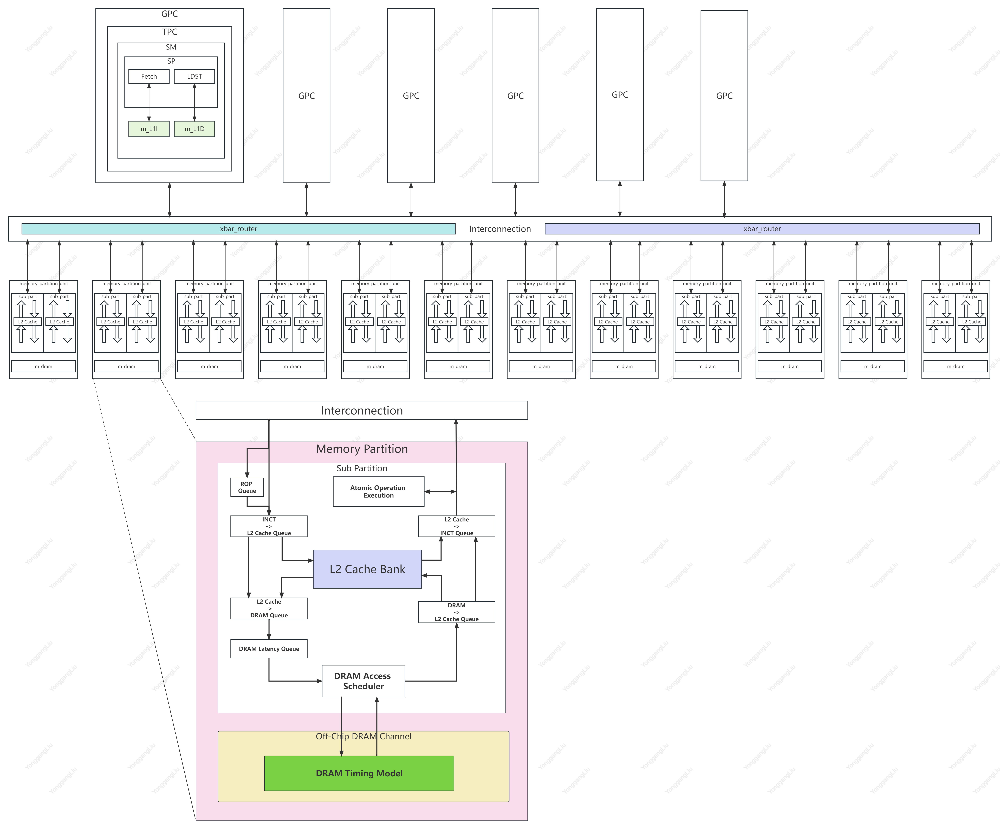

#### 3.3.1 Register File

> -gpgpu_num_reg_banks 16
-gpgpu_reg_file_port_throughput 16

#### 3.3.2 L1I Cache

Cache structure, cache policy, MSHR, memory coalescing

```s
<type>:<nsets>:<block_size>:<assoc>, <rep>:<wr>:<alloc>:<wr_alloc>:<set_index_fn>, <mshr>:<mshr_entry>:<merge>, <miss_queue>: <fifo_entries>, <data_port_width>
```

> -gpgpu_cache:il1 N:64:128:16,L:R:f:N:L,S:2:48,10:10,4
> -gpgpu_perfect_inst_const_cache 0

#### 3.3.3 L1D Cache

> -gpgpu_l1d_banks 8
-gpgpu_l1d_latency 0
-mvpgpu_l1d_perfect_cache 0
-gpgpu_cache:dl1  N:20:128:1,L:B\:m:N:L,S:128:32,16:0,32
-gpgpu_flush_l1_cache 1
-gpgpu_gmem_skip_L1D 0

#### 3.3.4 LI Const Cache

> -gpgpu_const_cache:l1 N:128:64:8,L:R:f:N:L,S:2:64,4

#### 3.3.5 L1 Text Cache

> -gpgpu_tex_cache:l1 N:4:128:256,L:R\:m:N:L,T:512:8,128:2

#### 3.3.6 Local Memory

> -mvpgpu_local_mem_num_banks 8
-mvpgpu_local_mem_read_cycle 1
-mvpgpu_local_mem_write_cycle 1
-mvpgpu_local_mem_size 65536
-mvpgpu_bank_size 4096

#### 3.3.7 Shared Memory

> -gpgpu_shmem_size 65536
-gpgpu_shmem_sizeDefault 65536
-gpgpu_shmem_per_block 65536
-gpgpu_smem_latency 3

#### 3.3.8 L2 Cache

> -gpgpu_cache:dl2 S:64:128:16,L:B\:m:L:P,A:192:4,32:0,32

#### 3.3.9 DRAM

> -gpgpu_dram_partition_queues 64:64:64:64
-dram_latency 1
-gpgpu_l2_rop_latency 1
-gpgpu_dram_scheduler 1
-gpgpu_frfcfs_dram_sched_queue_size 64
-gpgpu_dram_return_queue_size 192
-gpgpu_n_mem_per_ctrlr 1
-gpgpu_dram_buswidth 2
-gpgpu_dram_burst_length 16
-dram_data_command_freq_ratio 4
-gpgpu_mem_address_mask 1
-gpgpu_mem_addr_mapping dramid@8;00000000.00000000.00000000.00000000.0000RRRR.RRRRRRRR.RBBBCCCC.BCCSSSSS
//Use the same GDDR5 timing, scaled to 3500MHZ
-gpgpu_dram_timing_opt "nbk=16:CCD=4:RRD=10:RCD=20:RAS=50:RP=20:RC=62:
                        CL=20:WL=8:CDLR=9:WR=20:nbkgrp=4:CCDL=4:RTPL=4"

#### 3.3.10 Interconnection

> -network_mode 2
-icnt_in_buffer_limit 512
-icnt_out_buffer_limit 512
-icnt_subnets 2
-icnt_arbiter_algo 1
-icnt_flit_size 40

#### 3.3.11 Roof-line Model

Roof-line Model说的是很简单的一件事：**模型在一个计算平台的限制下，到底能达到多快的浮点计算速度**。更具体的来说，Roof-line Model解决的，**是计算量为A且访存量为B的模型在算力为C且带宽为D的计算平台所能达到的理论性能上限E是多少**这个问题

- 算力决定“屋顶”的高度（绿色线段）
- 带宽决定“房檐”的斜率（红色线段）


模型的计算强度 I
:  由计算量除以访存量就可以得到模型的计算强度，它表示此模型在计算过程中，每Byte内存交换到底用于进行多少次浮点运算。单位是FLOPs/Byte。可以看到，模计算强度越大，其内存使用效率越高。

模型的理论性能 P
:  我们最关心的指标，即模型在计算平台上所能达到的每秒浮点运算次数（理论值）。单位是 FLOPS or FLOP/s。

**计算瓶颈区域 Compute-Bound**
不管模型的计算强度 I 有多大，它的理论性能 P 最大只能等于计算平台的算力 π 。当模型的计算强度 I 大于计算平台的计算强度上限 Imax 时，模型在当前计算平台处于 Compute-Bound状态，即模型的理论性能 P 受到计算平台算力 π 的限制，无法与计算强度 I 成正比。但这其实并不是一件坏事，因为从充分利用计算平台算力的角度上看，此时模型已经完全利用了计算平台的全部算力。可见，计算平台的算力 π 越高，模型进入计算瓶颈区域后的理论性能 P 也就越大

**带宽瓶颈区域 Memory-Bound**
当模型的计算强度 I 小于计算平台的计算强度上限 Imax 时，由于此时模型位于“房檐”区间，因此模型理论性能 P 的大小完全由计算平台的带宽上限 β （房檐的斜率）以及模型自身的计算强度 I 所决定，因此这时候就称模型处于Memory-Bound 状态。可见，在模型处于带宽瓶颈区间的前提下，计算平台的带宽 β 越大（房檐越陡），或者模型的计算强度 I 越大，模型的理论性能 P 可呈线性增长

### 3.4 Graphic

Graphics当前已经支持了PA, Raster, Texture, ROP级的性能建模支持。

> //pa/rop/raster/texture config
-mvpgpu_n_pa_per_gpc 1
-mvpgpu_n_rast_per_gpc 1
-mvpgpu_n_rop_per_tpc 1
-mvpgpu_n_tex_per_tpc 1
-gpu_sim_cycle_per_triangle 4078
-gpu_sim_cycle_per_point 100
-gpu_sim_cycle_per_line 100
-gpu_sim_cycle_rop 20
-gpu_sim_cycle_raster 20

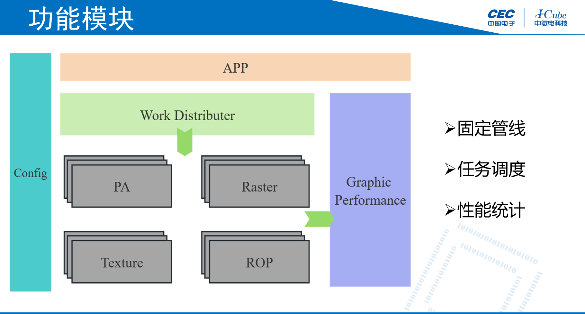
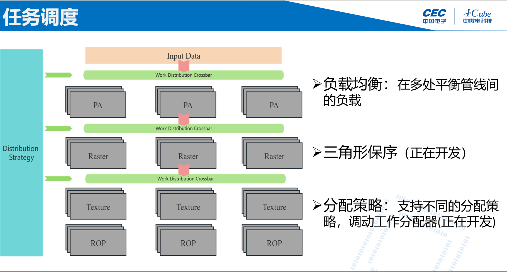

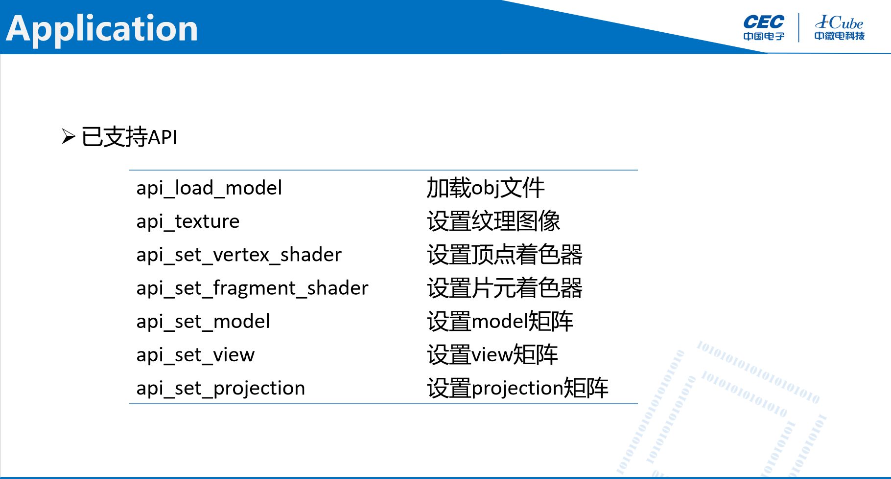
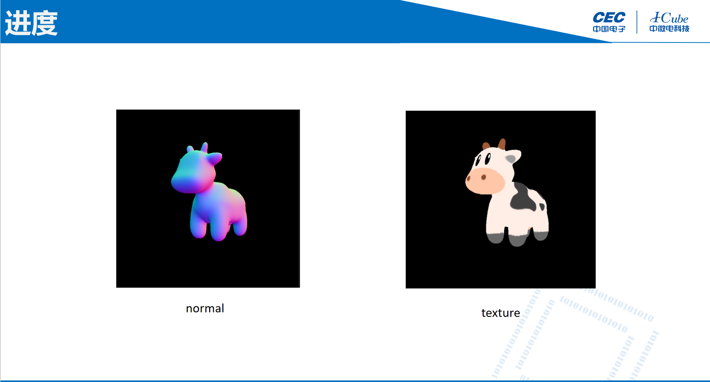

### 3.5 Simulator Mode Driver

复用软件栈，解决性能模拟器的软件生态问题。当前是Instruction Driven的模式，基于SMD将来有机会支持Trace driven的仿真。

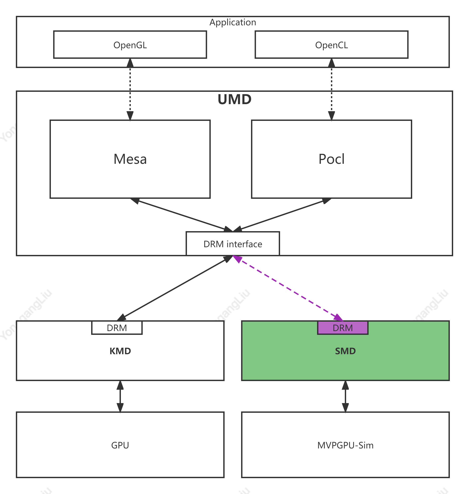

### 3.6 Visualized Performance Tool

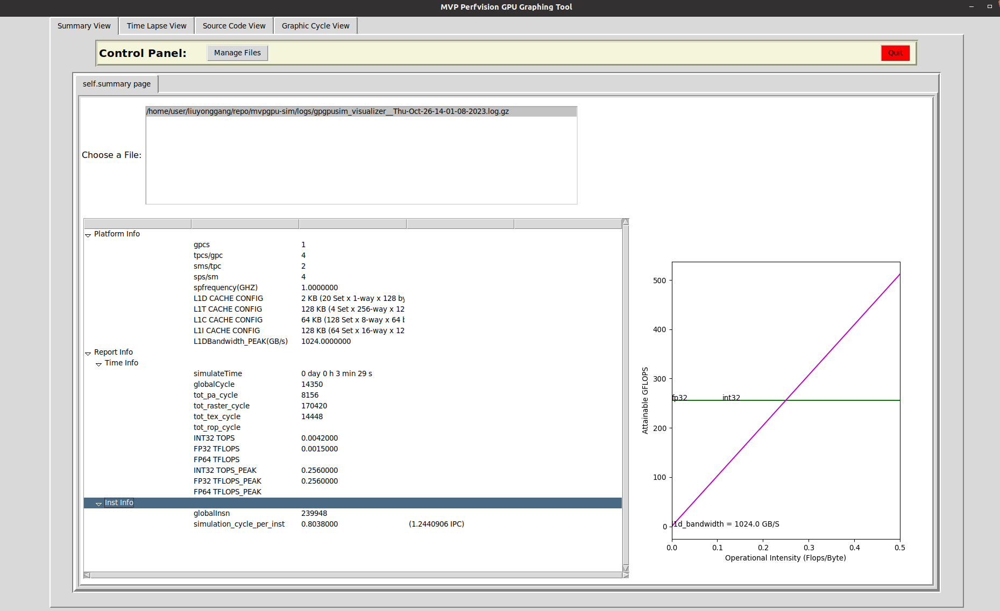


1. [Cycle级的日志文件](/mvpgpu-sim/output/l1i-perfect-l1d-cache/pipeline-analysis-sp-0.xlsx)
2. 单步调试的Debugger，支持逐条指令的查看执行情况（包括每个寄存器的值）
   
   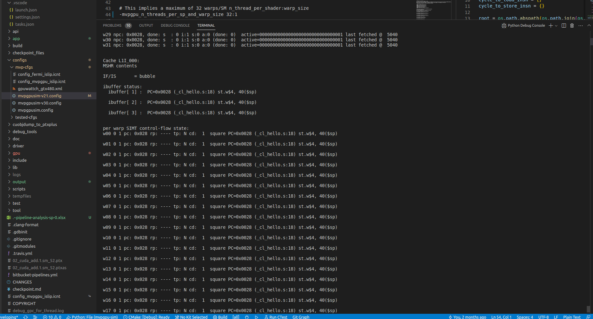

## 4. MVP Modeling

### 4.1 MVP V2.1 Modeling

There are 4 TPCs，each TPC has 2 SMs，and each SM has 4 SPs.
|TPCs |SMs  |SPs  |FP32 unit |
|:--  |:--  |:--  |:--       |
|4    |8    |32   |128       |

|PA   |RAST |ROPs |TEXTs     |
|:--  |:--  |:--  |:--       |
|1    |1    |4    |4         |


Each SP contains 4 INT32 units, 4 FP32 units, 4 LD/ST units, and 2 different SFU unit for different special function.


#### 4.1.1 Pipeline


>:memo: Note: Didn't implement OCC

#### 4.1.2 Memory


##### 4.1.2.1 L1I Cache

> -mvpgpu_l1i_banks 4
-mvpgpu_cache:l1i N:256:32:1,L:R:f:N:L,A:128:48,8:4,16
-gpgpu_perfect_inst_const_cache 0

##### 4.1.2.2 L1D Cache

> -mvpgpu_l1d_banks 4
-gpgpu_l1d_latency 0
-mvpgpu_l1d_read_latency 1
-mvpgpu_l1d_write_latency 1
-mvpgpu_l1d_perfect_cache 0
-mvpgpu_cache:l1d  N:64:32:1,L:B\:m:N:L,A:256:32,16:0,32

##### 4.1.2.3 Local Memory

> -mvpgpu_local_mem_num_banks 8
-mvpgpu_local_mem_read_cycle 1
-mvpgpu_local_mem_write_cycle 1
-mvpgpu_local_mem_size 32768
-mvpgpu_bank_size 4096

#### 4.1.3 Demo

##### 4.1.3.1 OpenCL

- hello

```opencl
const char *KernelSource = "\n" \
"__kernel void square(                                                       \n" \
"   __global float* input,                                              \n" \
"   __global float* output,                                             \n" \
"   const unsigned int count)                                           \n" \
"{                                                                      \n" \
"   int i = get_global_id(0);                                           \n" \
"   if(i < count)                                                       \n" \
"       output[i] = input[i] * input[i];                                \n" \
"   else                                                                \n" \
"       output[i] = 0;                                                  \n" \
"}                                                                      \n" \
"\n";
```

```asm
 PC=0x0000 (_cl_hello.s:13) sub$zero, $zero, $zero
 PC=0x0008 (_cl_hello.s:14) add.si$sp, $sp, -56
 PC=0x0010 (_cl_hello.s:15) st.w$ra, 52($sp)
 PC=0x0018 (_cl_hello.s:16) st.w$6, 36($sp)
 PC=0x0020 (_cl_hello.s:17) st.w$5, 32($sp)
 PC=0x0028 (_cl_hello.s:18) st.w$4, 40($sp)
 PC=0x0030 (_cl_hello.s:19) add.si$4, $zero, 0
 PC=0x0038 (_cl_hello.s:20) jplnk_Z13get_global_idj
 PC=0x0040 (_cl_hello.s:21) fadd$3, $zero, $zero
 PC=0x0048 (_cl_hello.s:22) ld.w$4, 36($sp)
 PC=0x0050 (_cl_hello.s:23) setlt.u$4, $2, $4
 PC=0x0058 (_cl_hello.s:24) beq$4, $zero, .LBB0_2
 PC=0x0060 (_cl_hello.s:25) jp.LBB0_1
 PC=0x0068 (_cl_hello.s:27) sfll.i$3, $2, 2
 PC=0x0070 (_cl_hello.s:28) ld.w$4, 40($sp)
 PC=0x0078 (_cl_hello.s:29) add$3, $4, $3
 PC=0x0080 (_cl_hello.s:30) ld.w$3, 0($3)
 PC=0x0088 (_cl_hello.s:31) fmul$3, $3, $3
 PC=0x0090 (_cl_hello.s:33) sfll.i$2, $2, 2
 PC=0x0098 (_cl_hello.s:34) ld.w$4, 32($sp)
 PC=0x00a0 (_cl_hello.s:35) add$2, $4, $2
 PC=0x00a8 (_cl_hello.s:36) st.w$3, 0($2)
 PC=0x00b0 (_cl_hello.s:37) ld.w$ra, 52($sp)
 PC=0x00b8 (_cl_hello.s:38) add.si$sp, $sp, 56
 PC=0x00c0 (_cl_hello.s:39) jr$ra
```

|ALU|FLOPs |LDST.local|LD.global|ST.global| In total |
|-- |--    |--        |--       |--       |--        |
|13 |2     |8         |1        |1        |25        |

>-mvpgpu_n_gpc 1  # high level architecture configuration
>-mvpgpu_n_tpc_per_gpc 4
>-mvpgpu_n_sm_per_tpc 2
>-mvpgpu_n_sp_per_sm 4
>-mvpgpu_n_threads_per_sp_and_warp_size 32:1
>-gpgpu_scheduler thdc

###### 4.1.3.1.1 Cache Perfect Case

>-gpgpu_perfect_inst_const_cache 1  # L1I Cache Perfect hit
>-mvpgpu_l1d_perfect_cache 1        # L1D Cache Perfect hit
>-mvpgpu-thdc-hthread 4
>-mvpgpu-thdc-vthread 4

Cycle 10/11 没有发射指令，原因在于前后指令之间的Data Hazard
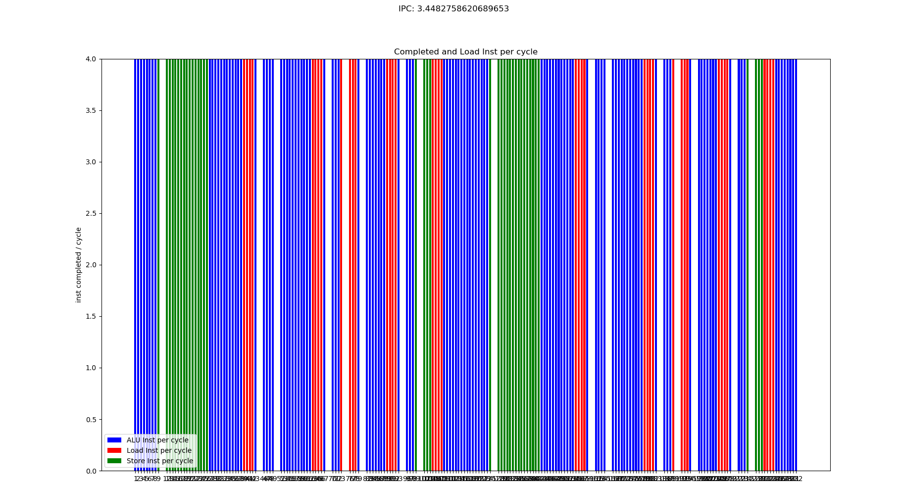
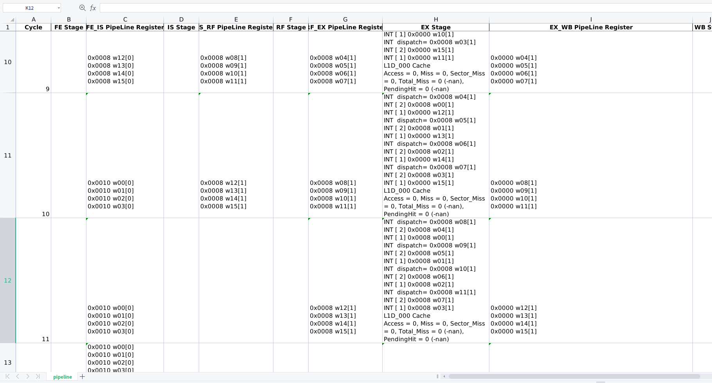
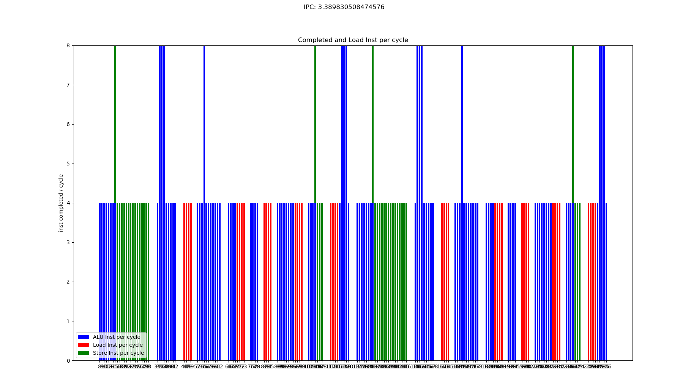

>-gpgpu_perfect_inst_const_cache 1  # L1I Cache Perfect hit
>-mvpgpu_l1d_perfect_cache 1        # L1D Cache Perfect hit
>-mvpgpu-thdc-hthread 4
>-mvpgpu-thdc-vthread 8

由于足够的线程用于调度，从而隐藏了指令之间的依赖
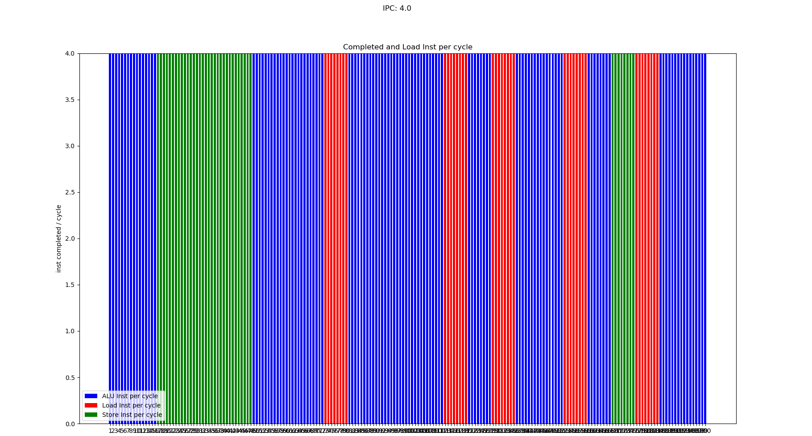
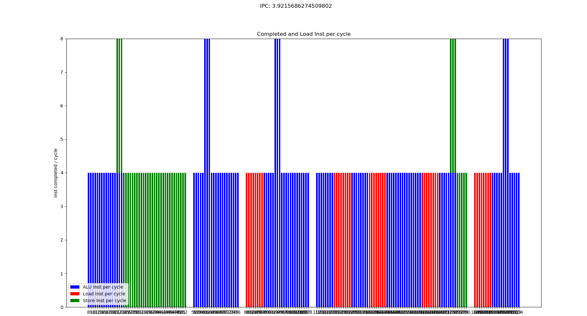

###### 4.1.3.1.2 Cache Normal Case

>-mvpgpu-thdc-hthread 4
>-mvpgpu-thdc-vthread 8
>-gpgpu_perfect_inst_const_cache 0  # L1I Cache Perfect hit
>-mvpgpu_l1d_perfect_cache 0        # L1D Cache Perfect hit
>-gpgpu_cache:il1 N:64:128:16,L:R:f:N:L,S:2:48,10:10,4
>-gpgpu_l1d_banks 8
>-gpgpu_l1d_latency 0
>-gpgpu_cache:dl1  N:20:128:1,L:B\:m:N:L,S:128:32,16:0,32

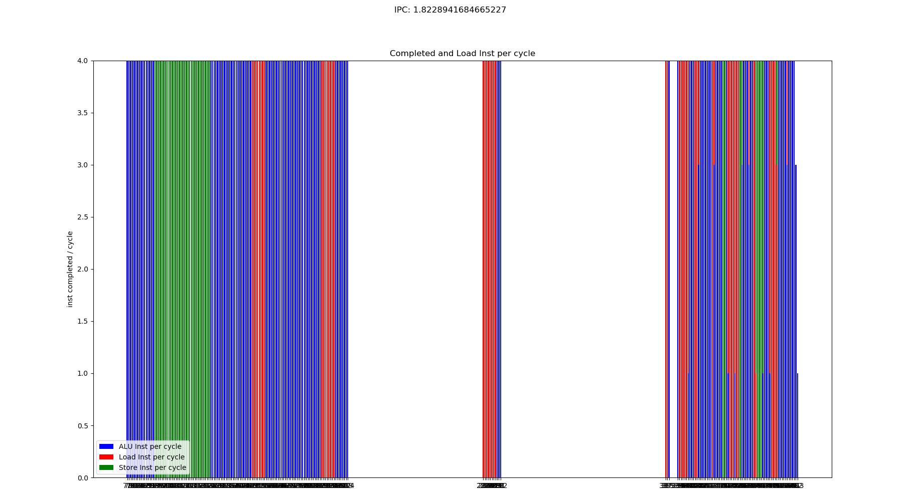
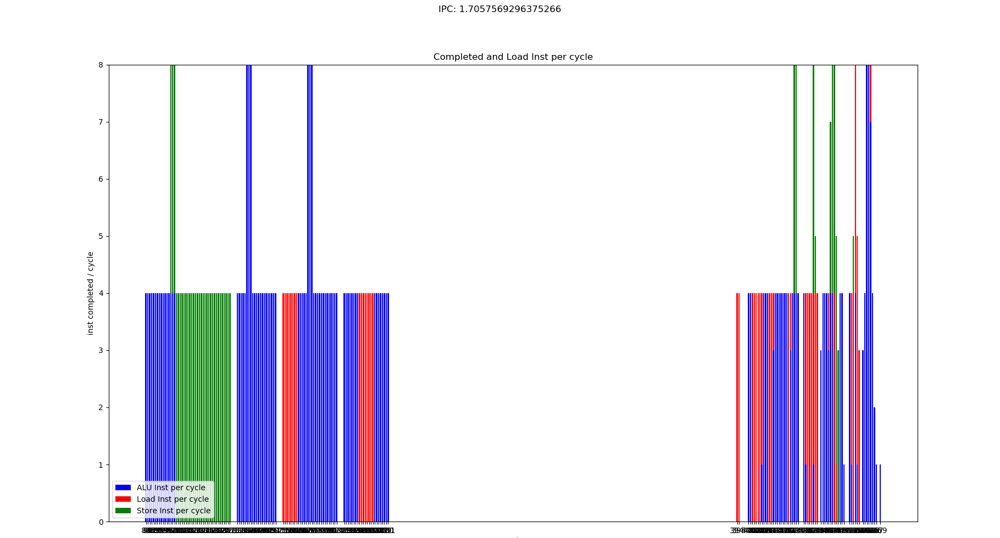

>-mvpgpu-thdc-hthread 4
>-mvpgpu-thdc-vthread 4


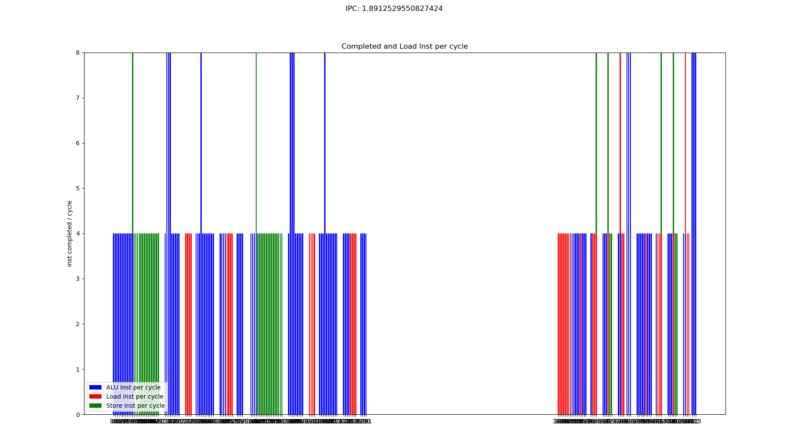

64
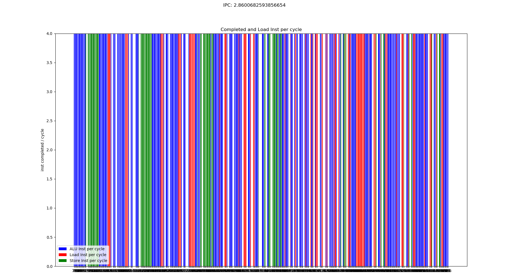
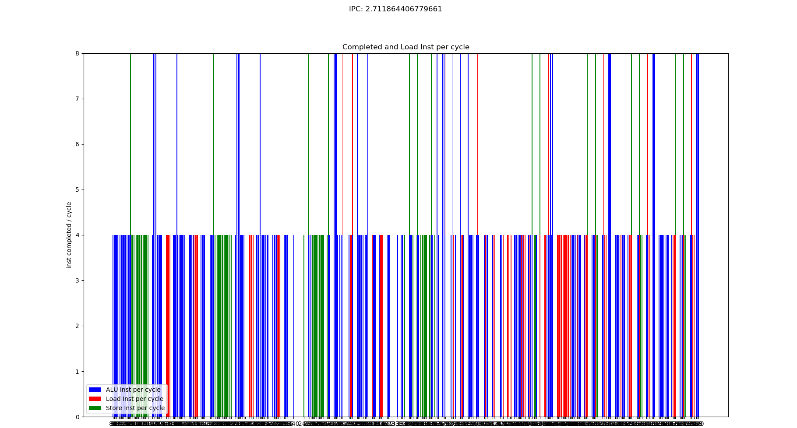

##### 4.1.3.2 Graphics

###### 4.1.3.2.1 Smoke test case

three_triangulated.obj

``` sh
# 3 Triangles
# Vertex coordinates
v 0.0 0.0 0.0
v 0.5 0.0 0.0
v 0.0 0.5 0.0
v -0.5 0.0 0.0
v 0.0 -0.5 0.0
# Texture coordinates
vt 0.5 0.5
vt 1.0 0.0
vt 1.0 1.0
vt 0.0 1.0
vt 0.0 0.0
# Normals
vn 0.0 0.0 1.0
# Triangle 1
f 1/1/1 2/2/1 3/3/1
# Triangle 2
f 3/3/1 4/4/1 1/1/1
# Triangle 3
f 4/4/1 5/5/1 2/2/1
```

Shader Program

```c
const char *frag_shader_source2 = R"(
__kernel void normal_fragment_shader(__global const float* coord,
                              __global const float* image,
                              __global float* pixel_color,
                              int width,
                              int height,
                              int pixel_size) {
    int gid = get_global_id(0);
    if (gid < pixel_size) {
        float tex_coord_x = coord[gid * 2 + 0];
        float tex_coord_y = coord[gid * 2 + 1];

        int u_img = (int)(tex_coord_x * width);
        int v_img = (int)((1.0f - tex_coord_y) * height);

        int index = (v_img * width + u_img)*3;
        float R = image[index + 0];
        float G = image[index + 1];
        float B = image[index + 2];
        pixel_color[gid*4 + 0] = R;
        pixel_color[gid*4 + 1] = G;
        pixel_color[gid*4 + 2] = B;
    }
}
)";
```

```c
int main(int argc, const char** argv)
{
   float angle = 140.0;
   bool command_line = false;

   // [Loading model] Load .obj File
   std::string root_dir = getenv("GPGPUSIM_ROOT");
   bool loadout = api_load_model(root_dir + "/app/rasterizer/models/triangle/three_triangulated.obj");

   // [Texture]
   std::string obj_path = root_dir + "/app/rasterizer/models/spot/";
   auto texture_path = "kitty.jpg";

   api_texture(obj_path + texture_path);

   Eigen::Vector3f eye_pos = {0,0,10};

   //api_set_vertex_shader(vertex_shader);
   api_set_fragment_shader("normal_fragment_shader", frag_shader_source2);

   api_set_model(get_model_matrix(angle));
   api_set_view(get_view_matrix(eye_pos));
   api_set_projection(get_projection_matrix(45.0, 1, 0.1, 50));

   api_draw();

   return 0;
}
```

The output as following:


### 4.2 MVP V3.0 Modeling

#### 4.2.1 Arcitecture and Resource Overview

- There are 6 GPCs, each GPC has 8 TPCs，each TPC has 2 SMs, and each SM has 4 SPs
- Each SP contains 16 INT32 unit, **16 FP32 unit**, 16 LDST unit and 4 SFUs


Below shows the comparison of MVP v2.0 and MVP v3.0 from high level structure and performance

|        |GPC |TPC |SM |SP  |FP32 unit |FP32 (tflops)|Speedup |
|:--     |:-- |:-- |:--|:-- |:--       |:--          |:--     |
|MVP v3.0|6   |48  |96 |384 |6144      |12.288       |48x     |
|MVP v2.0|0   |4   |8  |32  |128       |0.256        |-       |


Below shows the memory related comparison in total

|         Memory          | MVP v2.0 | MVP v3.0 |  Comments   |
| :---------------------- | :------- | :------- | :---------- |
| Thread                  | 2048     | 98304    | TBD         |
| Register file(KB)       | 128      | 6144     | TBD         |
| L1 Inst Cache(KB)       | 288      | 13824    | TBD         |
| L1 Data Cache(KB)       | 64       | 3072     | TBD         |
| Local memory(KB)        | 1024     | 49152    | TBD         |
| L2 Cache(KB)            | 2048     | 98304    | TBD         |
| DRAM                    | DDR4     | HBM2     | TBD         |
| Memory Interface (bit)  | 256      | 4096     | 16x256 DDR4 |
| Memory Data Rate (MHz)  | 800      | 1000     |             |
| Memory Bandwidth (GB/s) | 51.2     | 1024     |             |
| Memory Size (GB)        | 4        | 32       | 16x2  DDR4  |


#### 4.2.2 并行计算方式

|                  | 优点    | 缺点   |
|:---              |:---     |:---   |
|SMT               |         |       |
|SMT + SIMT        |         |       |
|SMT + SIMT + SIMD |         |       |
|SIMT              |         |       |
|SMT + SIMD        |         |       |

##### 4.2.2.1 SMT

- 保持当前的SMT设计，扩展为16个ALU/SP，即16个独立PC。
- 进行流水线的优化，添加ibuffer, operand_collector，支持2-issue，降低stall概率，提升并行性和占用率

##### 4.2.2.2 SMT + SIMT/SIMD

- 保持当前SMT设计的基础上，每个PC对应支持4个ALU，即4个ALU共享同一个PC，该4个ALU按SIMT模式运行
- 在该设计下，保持了SMT的灵活性，同时增加了吞吐率，4 SMT X 4 SIMT = 16

##### 4.2.2.3 SIMT

- 将当前的SMT模式改为SIMT模式，即每个SP只有一个PC，16个ALU共享同一个PC

#### 4.2.3 Way of Work

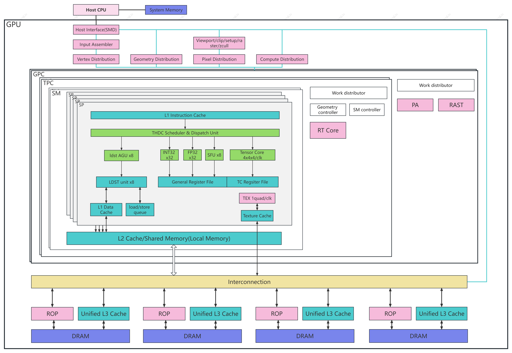

> The basic unit of pixel-fragment shader processing is the 2 x 2 pixel quad. The SM controller groups eight pixel quads into a warp of 32 threads. It similarly groups vertices and primitives into warps and packs 32 computing threads into a warp
> The texture unit processes one group of four threads(vertex, geometry, pixel, or compute) per cycle

#### 4.2.4 Pipeline

流水线的设计思路：

1. Peak算力（FLOPS）的提升是由硬件的FU数量及主频决定的
2. 实际算力是由FU的占用率来决定，而占用率是由调度决定
3. 调度可通过多发射，动态调度，海量线程等技术提升占用率


目前的设计中，在FE\IS\RF阶段都有Decoder。

- 流水线中支持的V线程（Warp数）需要结合流水级数确定，否则在前后指令有数据依赖时会有流水线stall的情况

##### 4.2.4.1 FE Stage

当前设计中，如果stall了，FE阶段不会取指，但是如果添加一个ibuffer，用来缓存FE取到的指令，那么FE就不会stall，每个cycle都可以取指并放入ibuffer中。IS阶段直接从ibuffer中选择指令。从而提高流水线的并发性，提升性能。

按照当前设计，如下指令在FE阶段完成并退出流水线

- break
- exit
- exret
- sync

##### 4.2.4.2 IS Stage

1. 添加scoreboard来记录需要写入的目的寄存器，以支持乱序发射。从ibuffer中取出的指令，如果其源寄存器或目的寄存器不在scoreboard中，那么该指令不依赖前一条指令，可以继续执行进入RF阶段，否则该指令不能进入RF阶段。同时做相关的结构冲突检测
2. 支持寄存器重命名，由于当前指令集最大支持32个寄存器，而在微架构的体系结构中的寄存器数量大于实际指令集中用的寄存器数量。因此可以利用寄存器重命名技术来解决WAW和WAR这类name dependences，以提升性能

##### 4.2.4.3 RF Stage

进入RF阶段的指令需要从寄存器文件中获取源寄存器的值，但由于寄存器文件的结构可能会出现bank冲突，因此可以增加Operand_Collector以缓存暂时由于Register File Bank冲突导致的暂时无法进入EX阶段的指令。当前的设计是由IS阶段将寄存器id传递给Register File，在RF阶段直接取数据，而且每次只发送4条指令，没有寄存器冲突。

从RF中正常拿到源寄存器值的指令进入EX阶段。

##### 4.2.4.4 EX Stage

1. ALU指令进行运算，但计算的结果在WB阶段写会寄存器文件。如果IS阶段的scoreboard中有指令依赖该目的寄存器，可以先解除依赖（Register Forwarding），因为(正常情况下)下一个cycle该目的寄存器会被写入

2. store指令直接写入cache中，结束指令。load指令可能会由于cache miss而导致该线程被换出。目前load指令最终需要到WB阶段将数据写入目的寄存器

3. 当前ldst单元是属于流水线的一部分，会stall流水线。可以考虑增加一个属于memory系统的ldst单元。将load、store指令直接送入该ldst单元，不stall流水线。load指令在ldst单元中等待cache返回，在未返回前，stall该线程。store指令理论上也需要等待write的返回（不影响线程继续执行，但线程结束前必须判断是否store已写入DDR中），否则数据可能并未真正写入DDR中。ldst单元每个cycle从L1D Cache中取read或write-ack的数据，并更新线程的状态

4. 同时也可以考虑ldst单元直接回写寄存器，load指令的回写操作不需要进入WB阶段

5. 支持Memory Coalescing，增加MSHR，来保存miss的memory request。当有新的memory request时，可以先检查是否会被miss的request包含，如果是则该新的请求就不在下发，避免浪费memory bandwidth。可能每个cache都需要支持

6. 基于目前模拟器的结构，Tensor Core较容易支持在SP内部

7. Dispatch unit负责分派指令到相应的执行单元，消耗1个cycle

##### 4.2.4.5 WB Stage

执行回写寄存器的操作，回写操作可能也会出现寄存器bank冲突。因此也可以交给Operand_Collector。同时有Operand_Collector更新Scoreboard。

按照当前设计，如下指令在FE阶段完成并退出流水线

- 所有需要写目的寄存器的指令

#### 4.2.5 Memory

##### 4.2.5.1 Register File

1. 通用寄存器和TC寄存器复用同一块寄存器空间
2. 在没有TC的操作的时候，可以利用TC寄存器做Register Renaming

##### 4.2.5.2 L1I Cache

TODO

##### 4.2.5.3 L1D Cache

TODO

##### 4.2.5.3 Text Cache

TODO

##### 4.2.5.4 LDST

增加属于Memory system的LDST单元

##### 4.2.5.5 L2 Cache / Shared Memory

L2 Cache和Shared Memory共享同一块空间，可配置大小

##### 4.2.5.6 Unified L3 Cache

每个L3 Cache对应一个DRAM，L3 Cache是全局共享的

##### 4.2.5.7 DRAM

需要多个DRAM，一是增加位宽和带宽，二是增加容量

## 5. Extension

### 5.1 NVArchSim

NVArchSim Overview


英伟达发表在HPCA 21上的Industry Track文章“Need for speed Experiences Building a Trustworthy System-Level GPU Simulator”，介绍了英伟达开发内部系统级GPU模拟器NVArchSim(NVAS)过程中的一些经验，相比学术界主流的GPU通用计算模拟器GPGPU-Sim，模拟性能有数量级的提升。

英伟达内部的模拟器NVAS开发了七年（暂无开源计划），被用于Research Evaluation和新产品开发验证，适合单GPU和多GPU场景，相比于GPGPU-Sim，模拟性能有40~250倍的提升。

**NVAS不是Cycle accurate的，而是所谓loose Cycle Accurate。设计原则是看作多个Roofline components的动态交互**。其component根据其内部设计规范Design Specification做仿真，而不是保留cycle精度的细节。大部分components根据[Roofline model](https://en.wikipedia.org/wiki/Roofline_model)做模拟，而没有展现出明显的Roofline效应的component，用最小的细节去仿真。

NVAS的特点是

- 由于GPU并行计算对延时的容忍度高，NVAS可以被设计成Loose Cycle精度的，不用去记录每个执行
- 混合Trace-driven和Instruction Driven的仿真，Trace跟踪的是SASS级别的指令
- 为了复现和调试的方便，设计成单线程
- Event-based，不活动的components不需要去做计算。
- 各个Components只需要改变参数配置，很容易被替换成其它component

作者只对已有NVAS进行两个修改

1. 调节指令延迟和吞吐量信息，加入新的指令（更新了tensor core操作）
2. 改变架构级参数，比如GPU不同部件间的通道延迟和带宽

部件保证度和仿真速度的平衡

NVAS通过改变主频、核心数、带宽、延迟这些参数，确保改变参数后仿真的结果符合正确的趋势，从而适应未来新的硬件参数的变化

NVAS的高仿真速度是通过只在必要的时候保持部件的高保真度来实现的（合理使用仿真细节）。设计可插拔的部件架构，避免复杂或过于详细的公开接口，这样就可以支持相同部件的多种实现，可以开发者根据需求自由的进行替换

NVArchSim已经成功用于NVIDIA内部跨越几个不同的领域的GPU研究，并继续作为他们未来GPU系统研究的主要工具

## 6. Reference

- [Need for Speed: Experiences Building a Trustworthy System-Level GPU Simulator](/ebook/villa2021.pdf)
- <https://zhuanlan.zhihu.com/p/502029361>
- <https://browser.geekbench.com/opencl-benchmarks>