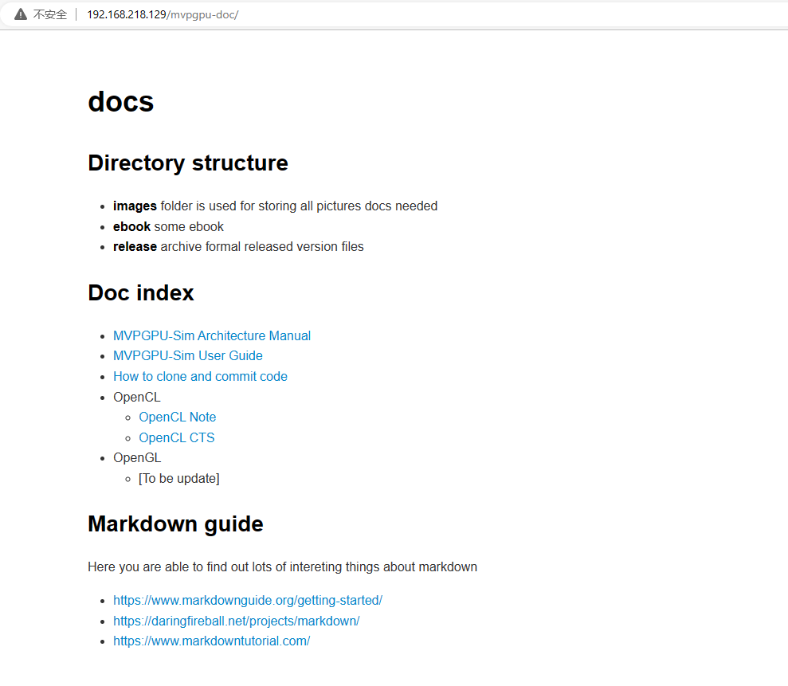

# How to add a git repo in var/www/html

1. 必须使用sudo权限
2. 在 **/var/www/html** 目录下创建mvppgu-doc
3. 创建后，进入mvpgpu-doc目录，进行git init初始化
4. git config --global --add safe.directory /var/www/html/mvpgpu-doc
5. git clone 192.168.218.129:/var/www/html/mvpgpu-doc *<font color='red'>这里还是需要一个用户名，也就是服务器上需要提供一个用户名及密码，否则不能clone</font>*

    ```md
    PS D:\github_resourcce> git clone 192.168.218.129:/var/www/html/mvpgpu-doc
    Cloning into 'mvpgpu-doc'...
    ggangliu@192.168.218.129's password:
    remote: Enumerating objects: 3, done.
    remote: Counting objects: 100% (3/3), done.
    remote: Compressing objects: 100% (2/2), done.
    remote: Total 3 (delta 0), reused 0 (delta 0)
    Receiving objects: 100% (3/3), done.
    PS D:\github_resourcce>
    ```

6. 目录下通过git上传index.html文件

   ```md
    PS D:\github_resourcce\mvpgpu-doc> ls
        目录: D:\github_resourcce\mvpgpu-doc
    Mode                 LastWriteTime         Length Name
    ----                 -------------         ------ ----
    -a----          2023/4/6     11:15          21251 how_to_clone_and_commit_code.html
    -a----          2023/4/6     11:15          15239 index.html
    -a----         2023/4/17     10:46           1793 index.md
    ```

7. 登录网页效果如下图

