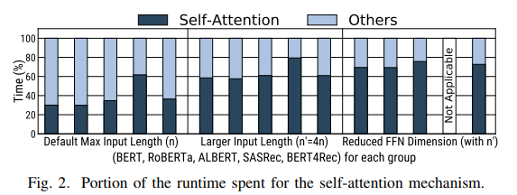
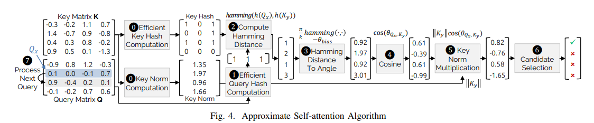
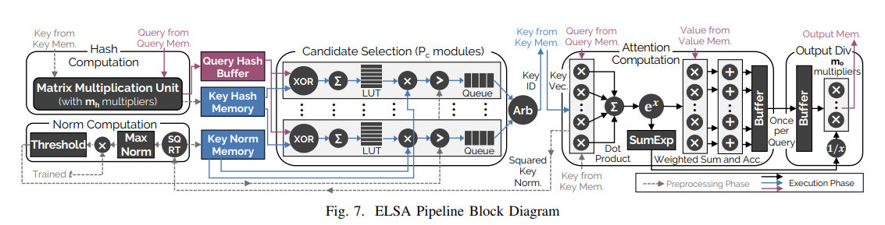
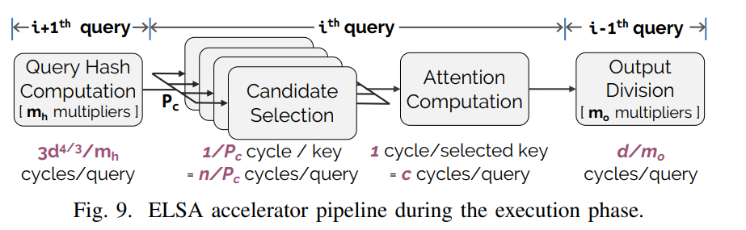
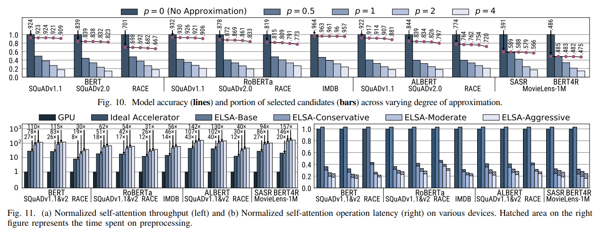

# ELSA: Hardware-Software Co-design for Efficient, Lightweight Self-Attention Mechanism in Neural Networks

## 引言

自注意力机制在神经网络（NNs）中的重要性日益凸显，尤其是在自然语言处理（NLP）任务中。然而，**自注意力操作的成本随着输入实体数量的增加而呈二次方增长**，导致推理运行时间显著增加。为了解决这一问题，本文提出了ELSA，一种硬件-软件协同设计的解决方案，旨在大幅减少自注意力机制的**运行时间和能耗**。

many existing NLP models such as Google BERT limit the self-attention to be applied for up to 512 tokens (e.g., words) to avoid the excessive performance and energy overhead

## 方案

近似自注意力，包括三个子操作：

1. 利用二进制哈希估计向量之间的角度
2. 基于估计的角度计算查询和键之间的近似相似性
3. 使用阈值确定键是否与查询相关

## 硬件架构

加速器通过预处理和执行阶段来处理自注意力操作，利用近似算法来提高性能和能效，可以与其他计算设备（如CPU、GPU）集成

### 硬件模块设计

ELSA包括多个硬件模块，如候选选择模块、注意力计算模块、输出除法模块、哈希计算模块和范数计算模块等，每个模块都针对特定的计算任务进行了优化

### 流水线设计

允许多个注意力计算模块并行工作，进一步提高处理自注意力操作的吞吐量

## 评估

通过评估多个代表性的自注意力导向神经网络模型，证明了ELSA加速器在保持精度的同时，相比传统硬件（如GPU）能够实现显著的性能和能效提升

Comparison with Google TPU.

we run ALBERT model that natively supports TPU execution on Google Cloud TPUv2.
Our experimental results show that ELSAbase achieves 8.3×, 6.4×, 2.4× better throughput4 on self-attention operations of ALBERT running SQuADv1.1/2, and RACE datasets.

For the same workloads, ELSA-moderate achieves 27.8×, 20.9×, 8.0×
speedup, respectively.

For the references, the measured TPU (peak-FLOPS-normalized) throughput was 5.5×, 6.7×, and 5.4× better than GPU throughput for the same workloads.