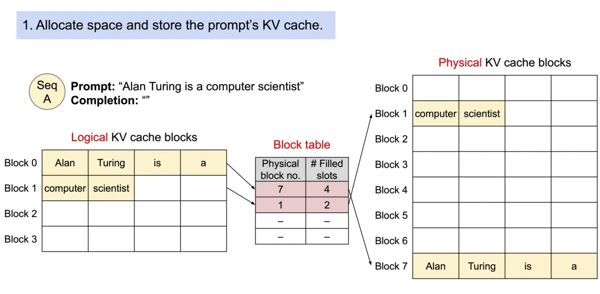
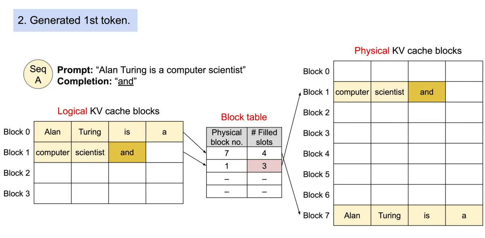
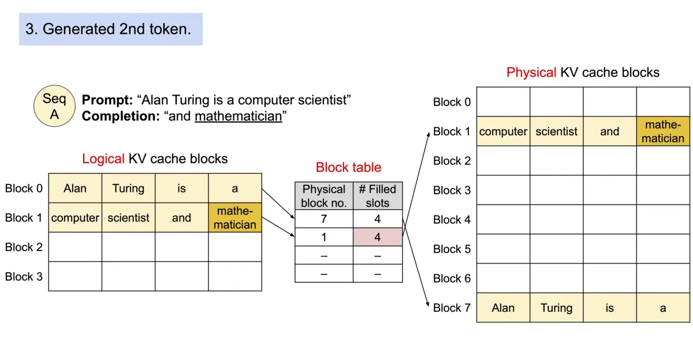
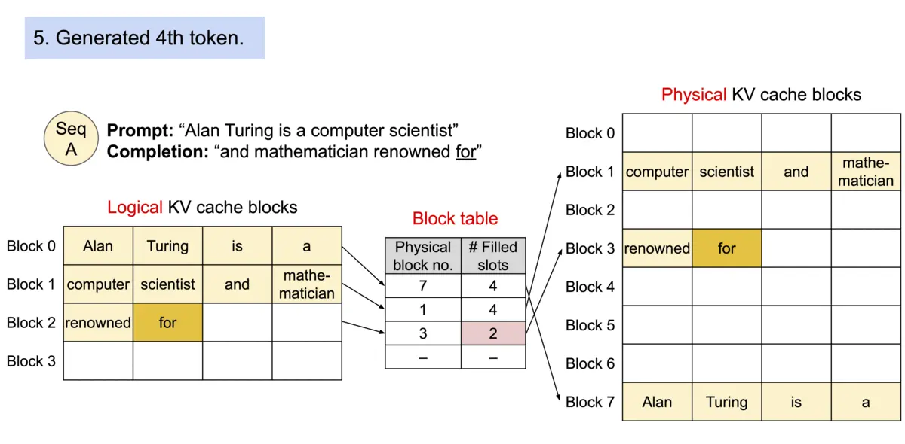
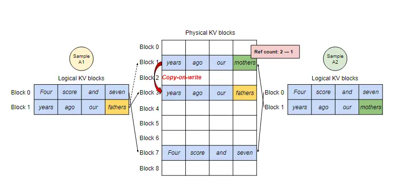
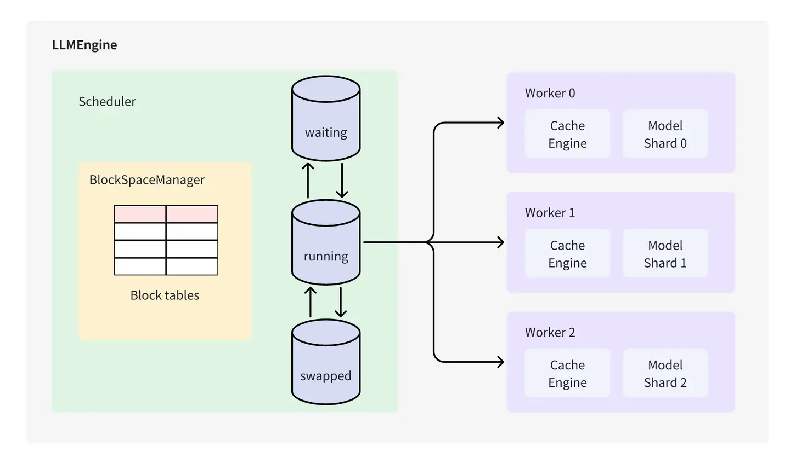

# vLLM

<https://github.com/vllm-project/vllm>

A high-throughput and memory-efficient inference and serving engine for LLMs

PagedAttention
    : 受操作系统虚拟内存和分页思想启发，将原本连续的 KV cache 存储在不连续的空间，以避免 KV cache 带来的显存浪费

KV cache
    : 一种缓存之前 token attention 计算过程的 key value 值以加速后续 token attention 计算的加速技巧

## Background

现有推理系统的 KV cache 利用率低下:

1. 提前分配过大的空间导致部分空间没有被使用：需根据请求的可能最大长度（prompt + output）预分配连续的空间，产生内部碎片（internal fragmentation，已经分配给请求但未被利用的空间）以及外部碎片（external fragmentation，过小而无法分配给其他请求）
2. 无法利用共享空间：有些解码算法（decoding alogorithm）会为一个请求生成多个输出，例如 parallel sampling 和 beam search，而现有推理系统无法利用这个特点将同一 prompt 存储在同一块空间

究其原因，KV cache 利用率低下是现有推理系统需将 KV cache 存储在连续的内存空间导致的，而内存空间的连续性正是深度学习框架处理张量所必须的。

## Solution

论文作者提出 PagedAttention，用以解决 KV cache 需存储在连续内存空间的问题，它的做法是**预先分配一大块显存，并将大块显存划分成较小的块（block），每块可以存放固定数量 token 的 key 和 value 值，为请求的 KV cache 分配空间时按需分配，且无需存储在连续的内存空间**。它将大块显存划分成小块并按需分配的做法有效解决了内部碎片和外部碎片，因为每块只存放固定数量（block size，这个值默认是16）的 token，对于每个 request，最多只会浪费 block size-1 个 token 所需的空间。另外，**由于它以块的方式存储 KV cache，因此它天然能够以块的粒度实现显存的共享**。

## How to do

## Architecture

Scheduler
    : 负责调度不同request，保证vLLM中的Cache Block资源足够现有的请求完成执行，否则对现有的request进行抢占。Scheduler 类控制 Block Manager 来管理 Phyical Token Block

Worker
    : 负责模型载入、模型执行，对于分布式推理，则通过创建多个worker在执行完整模型的一部分（Tensor Parallel）

Cache Engine
    : 管理CPU/GPU上完整的KV Cache Tensor，执行Scheduler 调度的request的block数据搬运。

Model Runner
    : 拥有实际执行的Model 实例，并负责进行数据的pre-process/ post-process 及sampling

## Reference

- <https://zhuanlan.zhihu.com/p/680153425>