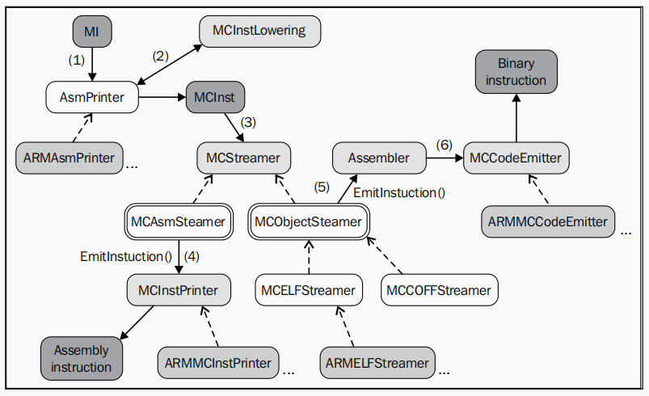

# "LLVM IR -> Lower IR before instruction selection"

LLVM后端主要流程

<div class="mermaid">
graph TD
  A1[LLVM IR] --> B1[Pass] --> A2[SelectionDAG] --> A3[指令调度] --> B2[Pass] --> A4[寄存器分配] --> B3[Pass];
  B3[Pass] --> A5[指令调度] --> B4[Pass] --> A6[代码导出];
  A6[代码导出] --> A7[汇编代码] & A8[目标代码];
</div>

LLVM IR到指令选择之间的一些主要流程及各阶段中的存在形式

|Steps |Represent |Description |
|:-----|:---------|:-----------|
|1     |LLVM IR   |IR Phase    |
|2     |SelectionDAG |- SelectionDAGBuilder映射IR指令至SelectionDAG节点，产生输出selectionDAG之后必须经过其他转换才能进行指令选择 <br> - it represents a basic block  |
|3     |DAG2DAG|- 通用的DAG合并在lib/CodeGen/SelectionDAG/DAGCombiner.cpp <br> - 特定与目标的合并一般在lib/Target/<Target_name>/<Target>ISelLowering.cpp <br> - DAG合并为了最小化SelectionDAG的冗余，此外DAG合并知道其当下在编译器所处的阶段，这使得合并过程可以更加的精确|
|4     |DAG2DAG |- 类型合法化流程保证指令选择阶段只需要处理合法的类型，"合法类型"指的是编译目标原生支持的类型 <br> - 对于仅支持i32类型的目标，操作数为i64的加法操作是非法的。这种情况，类型合法化工具integer expansion会将i64操作数拆分成两个i32操作数，同时插入适当的处理节点 - 具体而言，编译目标会事先定义好寄存器类与每个类型的对于关系，明确声明支持的类型。在此基础上编译器必须检测和处理非法类型：标量类型可以提升或扩展，矢量类型可以被分割、标量化或者填充 - 编译目标也可以自定义方法来合法化类型|
|5     |SelectionDAG |- DAG到DAG指令选择的目的是通过使用模式匹配将目标无关节点转换成目标相关节点 <br> - 指令选择是一个局部算法，每次在SelectionDAG(basic block)实例上执行 <br> - 指令选择完成之后仍然是SelectionDAG结构 <br> - 在指令选择阶段之后，ISD::ADD节点被转换为X86指令ADD32ri8 <br> - 同一个DAG中可能出现3种不同的指令表示形式共存的情况，比如LLVM ISD节点，特定于目标的X86ISD和X86的目标实际指令节点 |
|6     |SDNode |- SDNode represents one node in the SelectionDAG <br> - [模式匹配](#模式匹配) |
|7     |SelectionDAG |- 指令选择后该结构具有代表实际指令的节点，这些指令能直接运行在目标处理器上 <br> - 对SelectionDAG的节点SDNode进行寄存器预分配[调度](#调度器) <br> - SUnit类在指令调度期间将底层指令表示抽象为调度单元 <br> - llc工具使用-view-sunit-dags来打印调度单元 |
|8.机器指令|MachineInstr |- 在指令调度之后运行的InstrEmitter流程将SDNode格式转换为MachineInstr格式 <br> - SDNode指令表示形式仅在寄存器分配之前可用，寄存器分配器的处理对象是由MachineInst类提供的指令表示形式 <br> -顾名思义，这个表示比IR更接近实际的目标指令。与SDNode格式及其DAG形式不同，MI格式是程序的三地址表示，是指令序列而不是DAG图 <br> -每个MI都包含有一个操作码号码和一个操作数列表，其中操作码是一个只对特定后端有意义的数字 <br> - 通过-print-machineinstrs选项可以打印已注册流程 |
|9.寄存器分配|  |- 将数量不限的虚拟寄存器转换为有限的物理寄存器 <br> - 由于某些机器指令需要用到特定寄存器来存储结果，或者ABI有某些特殊规定，因此一些MI代码可能在寄存器分配之前就已经使用了物理寄存器，对于这些情况寄存器分配器需要遵循已有的分配结果 <br> - 解构IR的SSA形式 |
|10.Prologue and Epilogue | |- sets up the stack frame and callee-saved registers FrameLowering::emitPrologue() <br> - cleans up the stack frame prior to function return FrameLowering::emitEpilogue() <br> - eliminateFrameIndex() |
|11.Machine Code Framework |MCInst | - AsmPrinter |

## 模式匹配

  每个编译目标都通过名为 **<Target_Name>DAGToDAGGISel** 的SelectionDAGISel子类中实现 **Selection** 方法来进行指令选择（例如SPARC中的SparcDAGToDAGISel::Select()在lib/Target/Sparc/SparcISelDAGToDAG.cpp）。该方法接收一个待匹配的SDNode作为参数，并返回表示实际指令的SDNode值，否则会发生错误。  
  
  Select()方法允许以两种方式类匹配实际指令

  - 通过调用从TableGen模式生成的匹配代码
    - TableGen工具为每个编译目标生成SelectCode()方法，此代码中包含有将ISD和<Target>ISD节点映射到实际指令节点的MatcherTable匹配表。该匹配表是从.td文件（通常是<Target>InstrInfo.td）中的指令定义生成的。SelectCode()方法最后调用SelectCodeCommon()，后者是一个与目标相关的函数，以便通过使用之前生成的匹配表来匹配节点
    - SelectCode()函数一般位于lib/Target/Sparc/SparcGenDAGISel.inc中
    - TableGen有一个专门的指令来选择后端来生成这些函数和匹配表
      ```
      $ cd lib/Target/Sparc
      $ llvm-tblgen -gen-da-isel Sparc.td -I ../../../include
      ```
  - 编写定制化的C++匹配逻辑实现
    - 在调用SelectCode之前在Select()中提供定制化的匹配代码
  
  指令选择过程可视化，llc工具中存在几个对SelectionDAG类在指令选择的不同阶段进行可视化的选项。可以使用这些选项生成一个.dot图结构
  |llc选项 |阶段 |
  |:------|:---|
  |-view-isel-dags |指令选择之前|
  |-view-sched-dags |指令选择之后和调度之前|
  
## 调度器

  代码生成器中有三个不同的调度程序执行方式：两个在寄存器分配之前，一个在寄存器分配之后。第一个在SelectionDAG节点执行，另外两个对机器指令执行

### 指令执行进程表

  某些目标机器提供包括指令延迟和硬件流程信息的指令执行进程表(Instruction Itinerary)。调度程序在调度决策期间使用这些属性来最大化吞吐量并避免性能损失。这些信息在每个目标目录下的TableGen文件中进行描述，其文件名通常为<Target>Schedule.td(例如X86Schedule.td)
  编译目标可以为单一处理器架构或处理器系列定义指令的执行进程表。为此，编译目标必须提供关于执行单元（FuncUnit）、管道旁路（Bypass）和指令执行进程数据（InstrItinData）的列表。

### 竞争检测

  竞争识别器通过使用处理器的指令执行进度表中的信息计算竞争关系。ScheduleHazardRecognizer类型实现竞争识别器的接口，而ScoreboardHazardRecognizer子类实现了基于记分板的竞争识别器，也是LLVM默认的竞争识别器

## 寄存器分配

  寄存器分配的主要任务是将数量无限的虚拟寄存器转换为物理（有限）寄存器。由于编译目标的物理寄存器数量有限，因此需要为一些虚拟寄存器分配对应的内存地址，即溢出地址(spill slots)。但是有些机器指令需要用到特定寄存器来存储结果，或者ABI有某些特殊的规定，因此一些MI代码可能在寄存器分配之前就已经使用了物理寄存器。LLVM寄存器分配有4个实现，可以使用lcc的-regalloc=<regalloc_name>选择使用<pbqp, greedy, basic, fast>。寄存器分配的主要流程如下所示：
  
  <div class="mermaid">
  graph TD
    A1[机器指令类MachineInstr] --虚拟寄存器--> B1[流程] --> A2[寄存器合并器] --> B2[流程] --> A3[寄存器分配];
    A3[寄存器分配] --> B3[流程] --> A4[虚拟寄存器重写] --物理寄存器--> A5[机器指令类MachineInstr];
  </div>

### 寄存器合并器

  寄存器合并器通过合并代码区间来删除多余的复制指令(COPY)。
  
### 虚拟寄存器重写

  寄存器分配流程为每个虚拟寄存器选择物理寄存器。之后，VirtRegMap负责保存寄存器分配的结果，因此它包含从虚拟寄存器到物理寄存器的映射。接下来虚拟寄存器重写流程（/lib/CodeGen/VirtRegMap.cpp中VirtRegRewriter类）使用VirtRegMap并将虚拟寄存器引用替换为物理寄存器引用，同时生成相应的溢出代码。此外 reg = COPY reg的剩余自身拷贝也被删除。

### Target hooks

- isLoadFromStackSlot() and isStoreToStackSlot()
- storeRegToStackSlot() and loadRegFromStackSlot()
- copyPhyReg() method is used to generate a target-specific register copy
- BuildMI() method is used everywhere in the code generator to generate machine instructions

## Understanding the machine code framework

### Code emission



All the steps from an MI instruction to MCInst

  <div class="mermaid">
  graph TD
  A1[MachineInstr] ---> B1[AsmPrinter] ---> A2[MCInst] ---> B2[MCStreamer]
  B2[MCStreamer] -.-> A6[MCAsmStreamer] ---> A3[MCInstPrinter] ---> B3[Assembly instruction]
  B2[MCStreamer] -.-> A7[MCObjectStreamer] ---> A4[Assembler] ---> A5[MCCodeEmitter] ---> B4[Binary instruction]
  B1[AsmPrinter] <-.-> B5[MCInstLowering.lower]
  </div>

  ```#!/bash/sh
  $
  $ llc sum.bc -march=x86-64 -show-mc-inst -o -
  $ llc sum.bc -march=x86-64 -show-mc-encoding -o -
  $ echo "movq 48879(, %riz), %rax" | llvm-mc -triple=x86_64 --show-encoding
  $ echo "0x8d 0x4c 0x24 0x04" | llvm-mc --disassemble -show-inst -triple=x86_64
  ```

## Writing your own machine pass

- SparcPassConfig

## 调试  
  
> 📝: **Notes**

- llc程序选项 -debug或者-debug-only=\<name\>仅在LLVM以调试模式（配置时使用--disable-optimized）编译是才可用

- 可以使用-debug-only选项为特定的LLVM流程或组件启用内部调试信息。若要寻找某个要调试的组件，在LLVM源代码文件夹中运行grep -r "DEBUG_TYPE" *。  DEBUG_TYPE宏定义了可以激活当前文件的调试消息的标志选项
