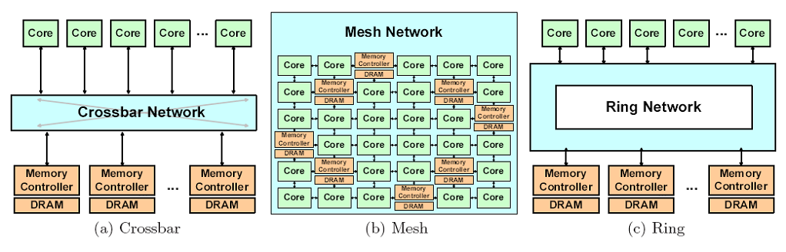
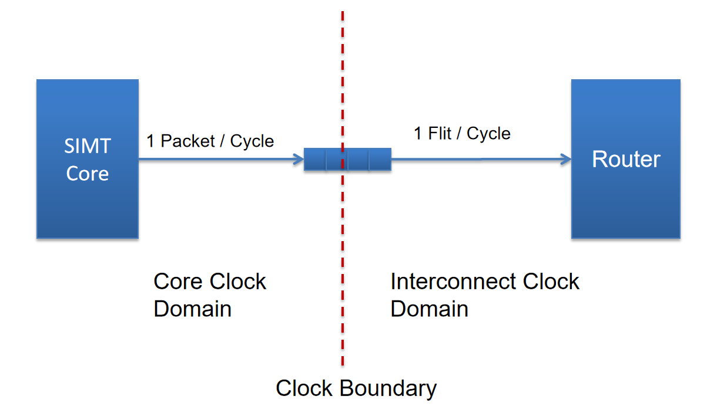

# Interconnect





## Configuration

``` bash
-network_mode 2
-icnt_in_buffer_limit 512
-icnt_out_buffer_limit 512
-icnt_subnets 2
-icnt_arbiter_algo 1
-icnt_flit_size 40

-icnt_verbose 0
-icnt_grant_cycles 1
```

## Function

CreateInterconnect(m_sp_config->n_gpc, m_memory_config->m_n_mem_sub_partition)

创建两个xbar_router()，每个(6，24)
in_buffers = 6 + 24
out_buffer = 6 + 24
