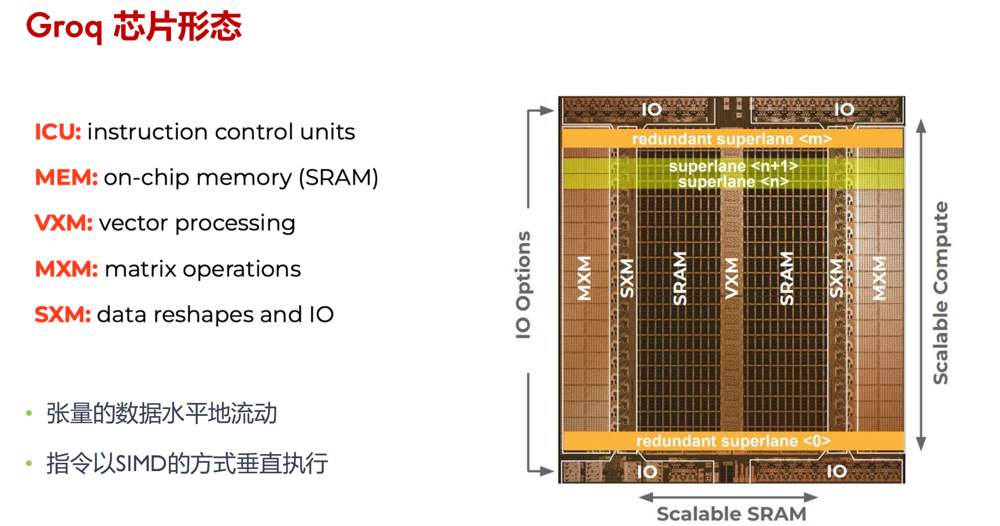
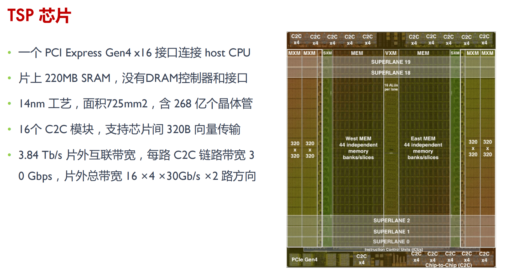
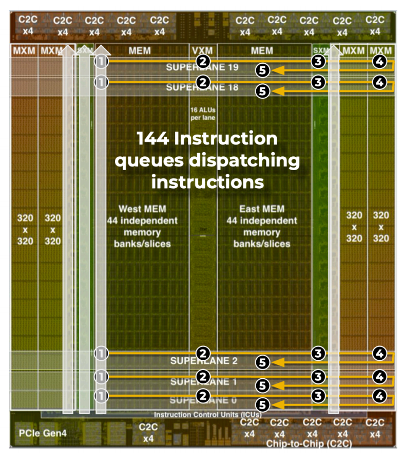
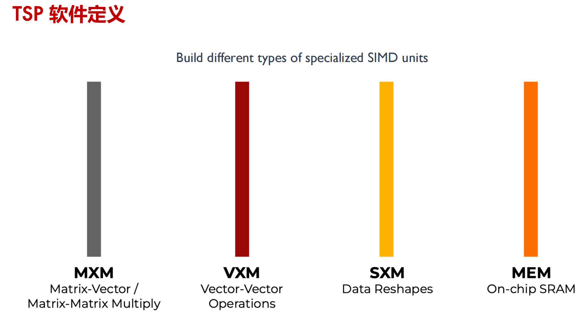
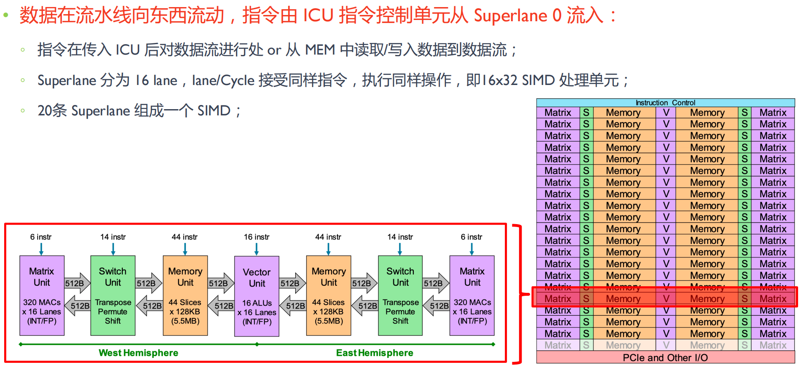
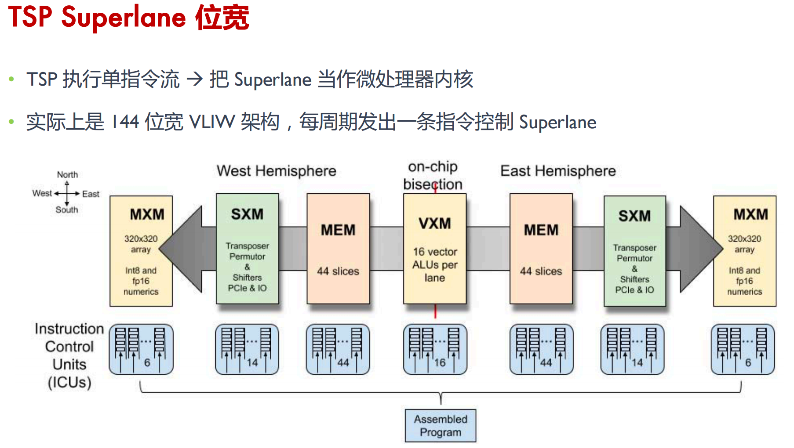
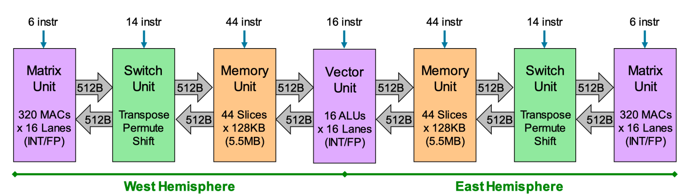
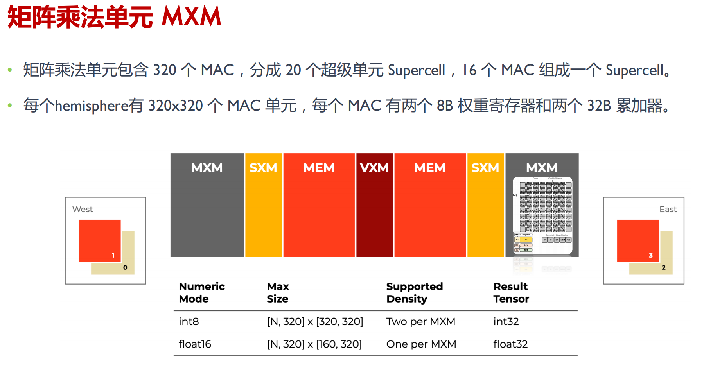
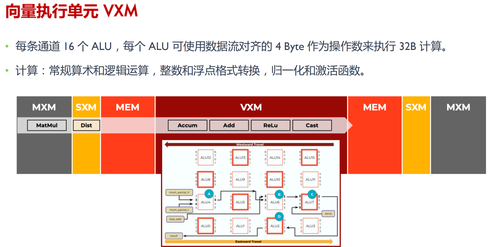
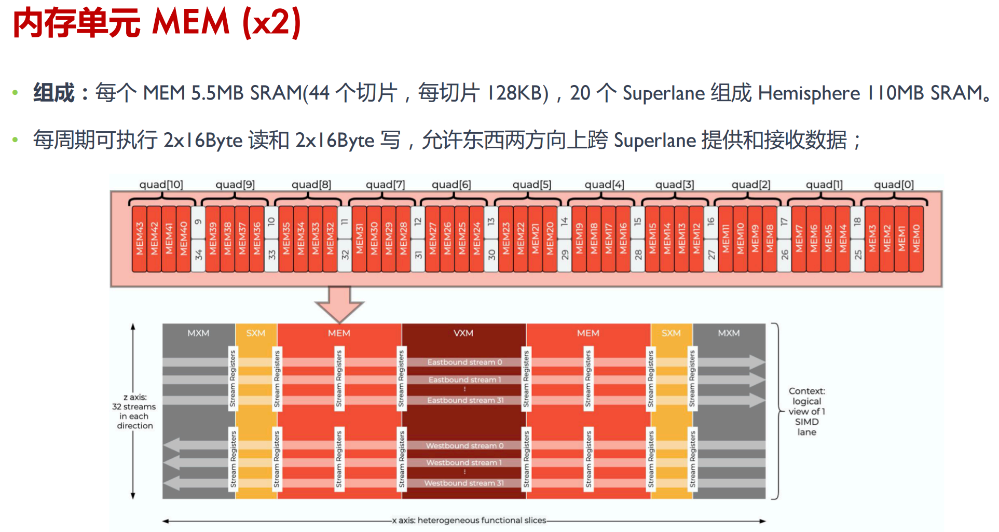

# Groq

## TSP芯片

- 每周期执行 400,000 次整数乘法累加 （MAC）
- 可以处理 FP32/FP16 数据，兼顾推理和训练场景
- 一个冗余 Superlane 提高芯片良率
- 20 个 Superlane 可用
- 存储和计算单元 east、west 左右均匀分布
- 峰值算力是 INT8 750TOPs ， FP16 188 TFLOPs
- VXM（Vector）位于芯片的中间
  - 32-bit computations/cycle or 4xINT8 computations/cycle
- MXM（Matrix）为 320 x 320 features
  - 每个 MXM 单元可以存放 102,400 个 FP16 权重参数
  - 409,600 MACCs (multiply-accumulators)
- TSP（Tensor Streaming Processor）硬件确定性的，实际吞吐量取决于编译器调度
- 编译器必须协调 144 宽 VLIW 执行单元，每个 VLIW 有 320B 的 SIMD

## TSP Superlane

- 由 20 条 Superlane 组成，每条 Superlane 即一条数据处理的流水线
- 提供高带宽的流寄存器（SR）在不同的单元之间流式地传递数据

### MXM

### VXM

### MEM

