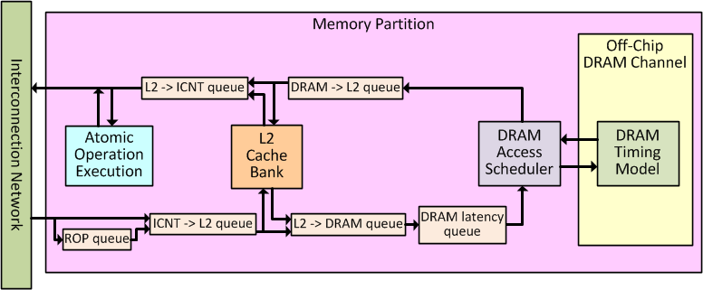
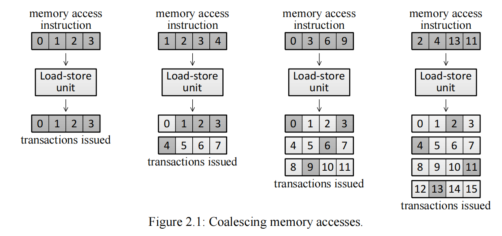
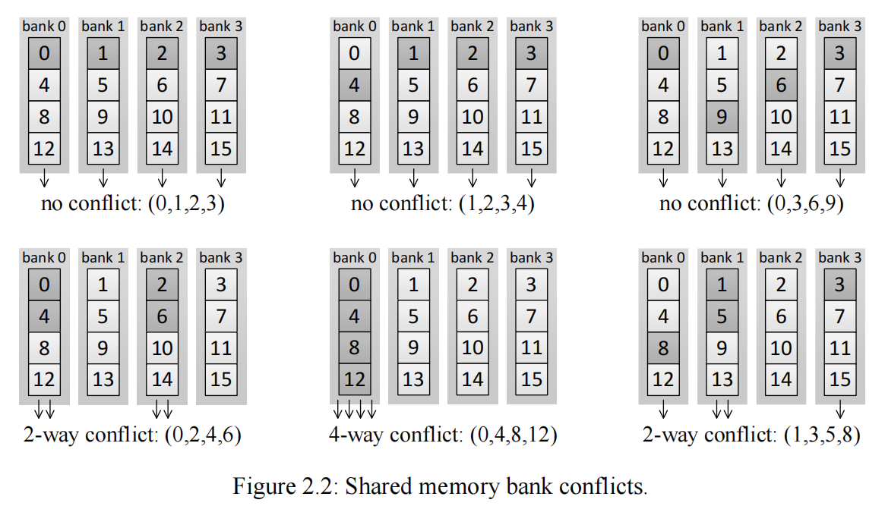
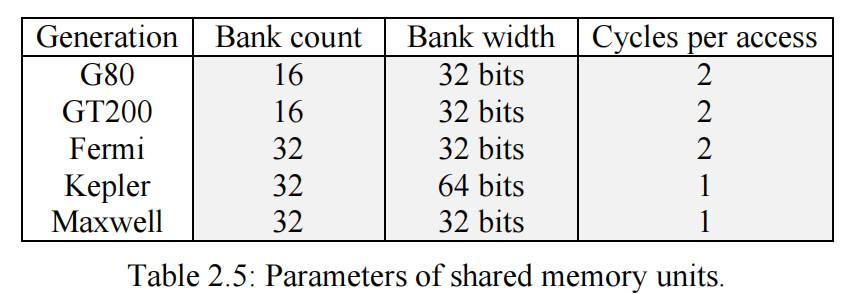
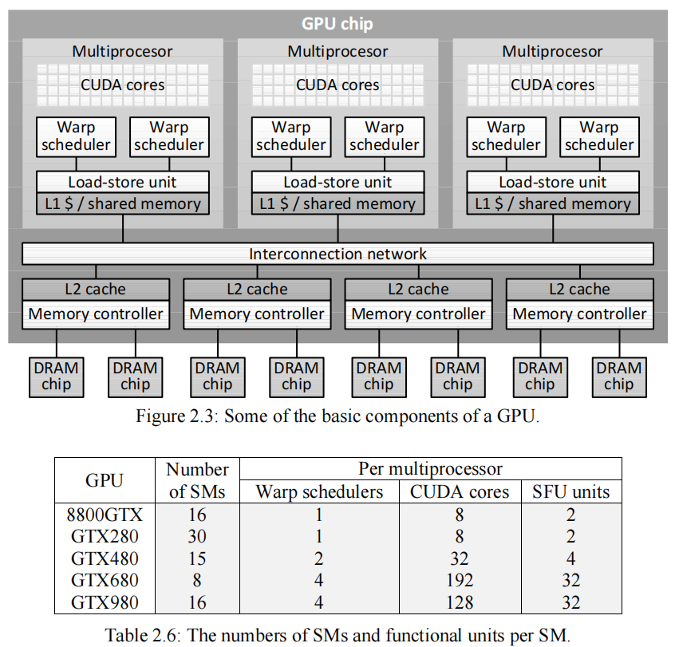

# Memory-system

每个GPU线程独立的访问memory。对于SIMT来说，每条指令独立访问memory请求跟warp的size一致。每个memory访问是一个4字节的数据。在load-store单元中会将memory access进行合并和block对齐，之后创建transaction。

Memory Coalescing is done in load-store units.

Memory coalescing跟warp的access顺序也相关，比如warp access(3,2,1,0) and (1,1,1,1) both allow no coalescing and are both translated to four identical transactions: (0,1,2,3), (0,1,2,3), (0,1,2,3), and (0,1,2,3).

generate_mem_accesses()
memory_coalescing_arch()
memory_coalescing_arch_reduce_and_send()

## LOG接口

shader_cache_access_log()