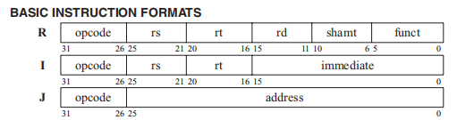
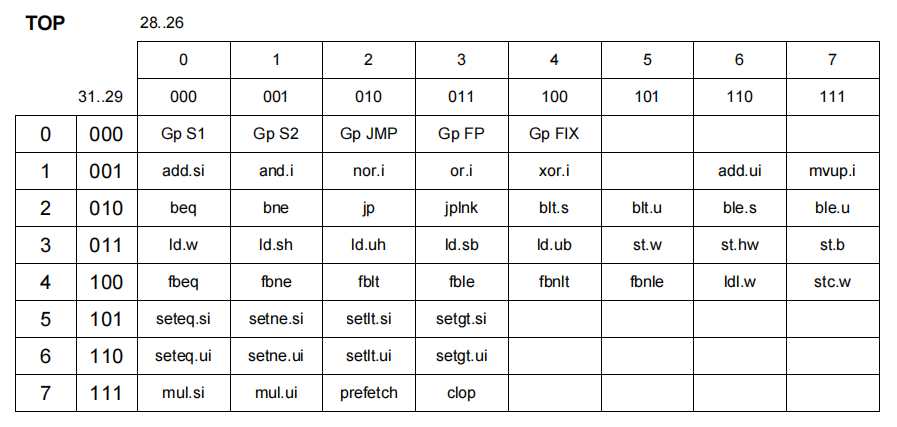

# ISA

## 0. MIPS

### 0.1 ISA Format

1. Basic Instruction Formats

2. Floating Point Instruction Formats

3. Double Precision Formats

## 1. MVP ISA

RV32I

### 1.1 ISA Format

1. Branch and Jump
   1. beq
   2. jp
   3. jplnk
   4. jr

## 2. RISC-V ISA

### 2.1 ISA Format

## 3. How to define a fused MVP ISA to compatible with RISC-V

