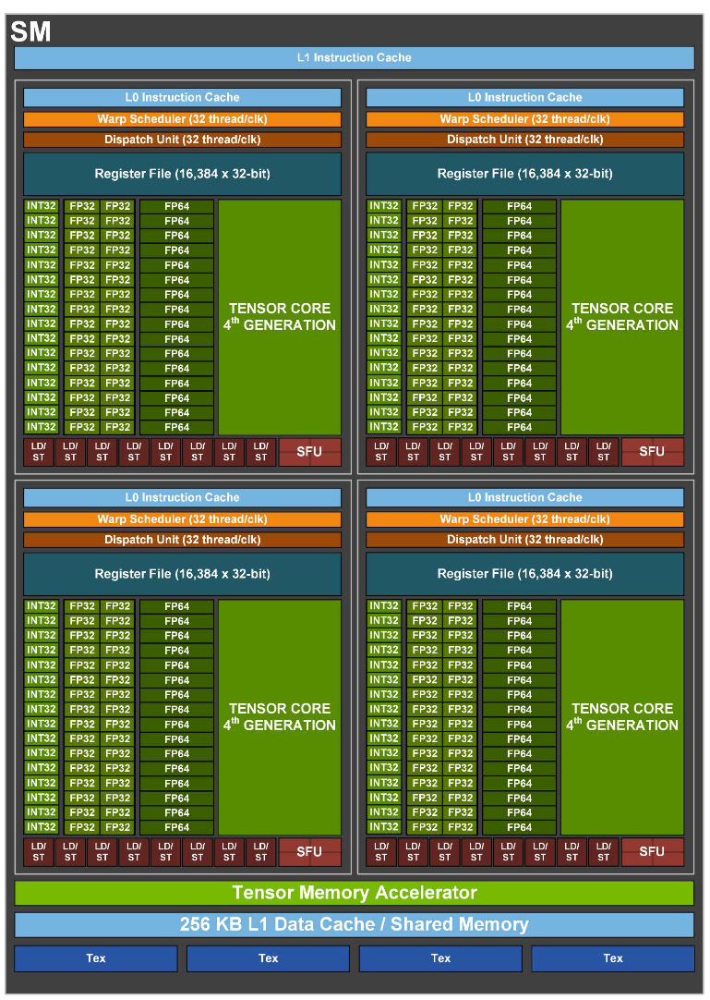

# Hopper H100

## SM Architecture

- New Tensor Memory Accelerator
  - Fully asynchronous data movement
- New Thread Block Cluster
  - Turn locality into efficiency
- New Transformer Engine uses a combination of software and custom Hopper Tensor
Core technology designed specifically to accelerate Transformer model training and
inference.

## HMB3

- Bandwidth 3TB/s
- 5 HBM sites with 80 GB
- New DRAM controller with 2x independent channels

## Accelerating principles for performance

- Data Locality & Cooperative Execution
  - Latency reduction for parallelized computation
  - Higher bandwidth due to localized communication
- Asynchronous Execution & Data Transfer
  - Overlap independent work
  - Keep all units fully utilized

Localized Storage:

- GPU
  - 80 GB HMB3 (Bandwidth 3TB/s)
  - 50 MB L2 Cache (Bandwidth 12TB/s)
- SM
  - 256KB L1 Data/Shared (Bandwidth 33TB/s)
- Thread
  - 1KB RF per thread
  - 64KB per SM Partition
  - 256KB per SM

Spatial Locality:

- Grid
  - GPU
- Cluster of Blocks
  - GPC
  - Up to 16 blocks
- Block of Threads
  - SM
- Threads
  - Lanes

Dedicated SM-to-SM Comunication within Cluster

- Threads can reference another thread Block's shared memory directly
  - Distributed Shared Memory(DSMEM) Programming Model
- Accelerated Sync and Data Exchange

## Accelerating deep learning

- 2x faster clock-for-clock
- accelerate sparse
- TMA: efficient copy of DL tensor memory

## Transformer Engine

Transformer models are the backbone of language models used widely today from BERT to
GPT-3 and require enormous compute resources. Overall, transformer models have been growing much faster than most other AI models at the rate of 275x every two years for the past five years

## ThunderKittens

[斯坦福让“GPU高速运转”的新工具火了，比FlashAttention2更快](https://zhuanlan.zhihu.com/p/702009999?utm_campaign=shareopn&utm_medium=social&utm_psn=1784153434162864128&utm_source=wechat_session)

- 重要的是，所有的计算都发生在流式多处理器中，**大部分计算是在寄存器中**
- **H100的利用率=张量核心活跃周期的百分比 +/- 6%**
- 要充分发挥H100的能力，**关键是保持张量核心持续运算**
- 用于获取数据的内存地址就占用了芯片的大量资源(TMA)
- 雷猫包含四种模板类型
  - 寄存器tiles：在寄存器文件上表示二维张量
  - 寄存器向量：在寄存器文件上表示一维张量
  - 共享tiles：在共享内存中表示二维张量
  - 共享向量：在共享内存中表示一维张量
- 寄存器当然不应该像旧CPU那样32位字。CUDA使用的1024位宽向量寄存器确实是朝着正确方向迈出的一步。但对我们来说，寄存器是16x16的数据tile。我们认为AI需要这样的设计，毕竟，它仍然只是矩阵乘法、归约和重塑
