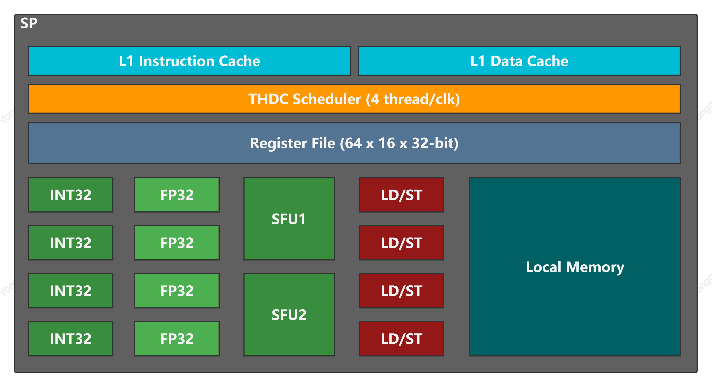
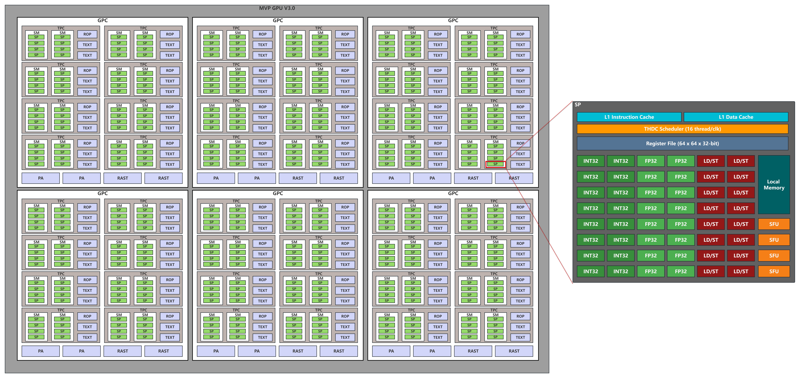
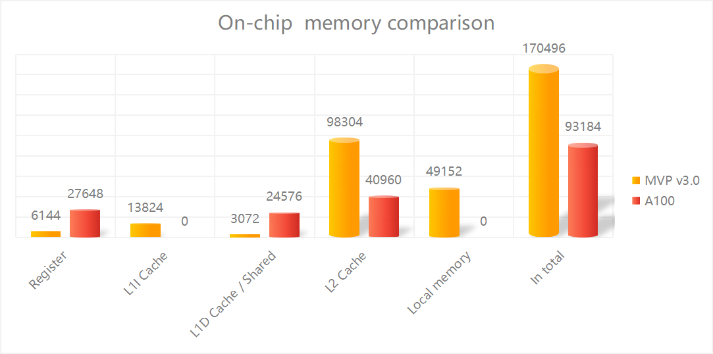
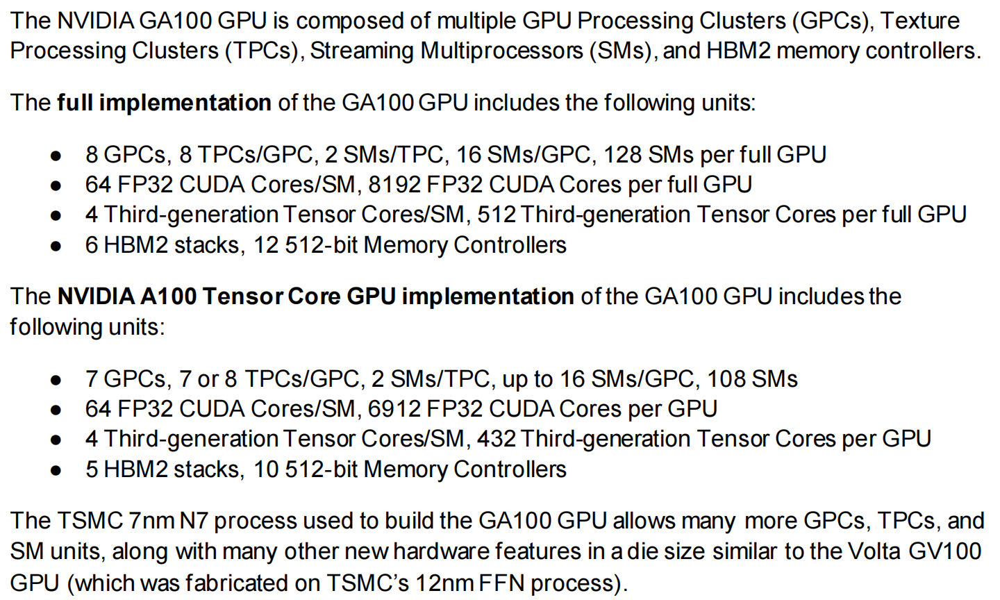
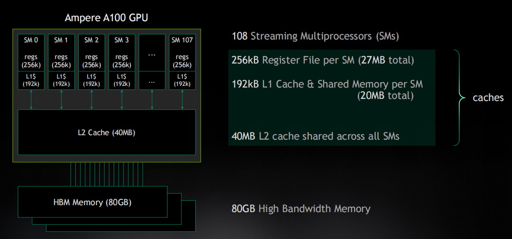
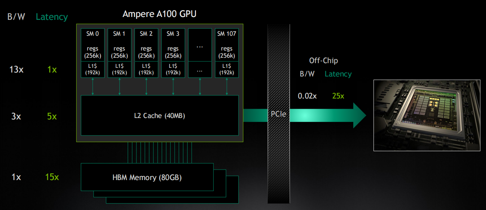
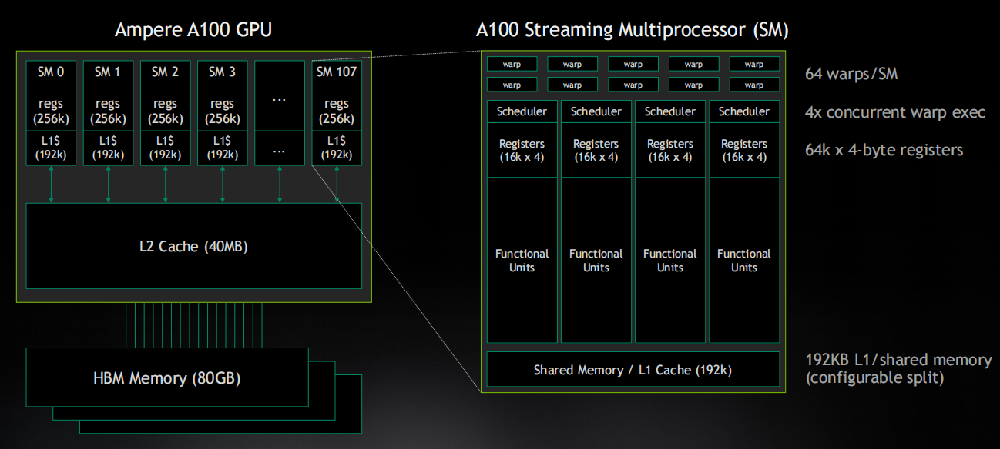

# Architecture design and exploring for MVP v3.0 performance target

This article is used to depict how to get the target performance based on MVP architecture

## Revision history

|    Date    | Version |                   Description                   |    Author    |
| :--------- | :------ | :---------------------------------------------- | :----------- |
| 2023-06-28 | v1.0    | Initial                                         | Liu Yonggang |
| 2023-07-04 | v1.1    | [Thread/warp](#threadswarp-vs-memory-bandwidth) | Liu Yonggang |

## Target Performance

### 10 TFLOPS

Total FLOPs per second = FLOPs per cycle per core * core count

## Current MVP v2.1 Architecture Design

### Architecture

There are 4 TPCs，each TPC has 2 SMs，and each SM has 4 SPs.
|TPCs |SMs  |SPs  |FP32 unit |
|:--  |:--  |:--  |:--       |
|4    |8    |32   |128       |

|PA   |RAST |ROPs |TEXTs     |
|:--  |:--  |:--  |:--       |
|1    |1    |4    |4         |

Each SP contains 4 INT32 units, 4 FP32 units, 4 LD/ST units, and 2 different SFU unit for different special function.

### Performance

|Clock Speed |FP32 Unit   |FP32 Computing power |
|:--         |:--         |:--                  |
|1.0 GHz     |128         |256 GFLOPS           |

FP32 Computing power = Clock x Amount of FP32 Unit x 2 (FMA) = 1.0G x 128 x 2 = 256 Gflops

### Memory

Clock: 800 MHz
DDR: 2 x 2 GByte DDR4
SRAM: 3 MByte
PCIe: 3.0

DDR4
:   DDR controller: 1
    Clock: 800 MHz
    Data bus: 256 bit
    Latency: latency (ns) = clock cycle tim e (ns) x number of clock cycles
    Bandwidth = (800 MHz x 256 bits) / 8 = 25,600 MB/s or 25 GB/s or 6.25 Giga-FP32/s

## Next Gen MVP v3.0 Architecture Design

### Option 1

#### Major changes: Adding GPC and extending SP

- There are 6 GPCs, each GPC has 8 TPCs，each TPC has 2 SMs, and each SM has 4 SPs
- Each SP contains 16 INT32 unit, **16 FP32 unit**, 16 LDST unit and 4 SFUs

Below shows the comparison of MVP v2.0 and MVP v3.0 from high level structure and performance

|        |GPC |TPC |SM |SP  |FP32 unit |FP32 (tflops)|Speedup |
|:--     |:-- |:-- |:--|:-- |:--       |:--          |:--     |
|MVP v3.0|6   |48  |96 |384 |6144      |12.288       |48x     |
|MVP v2.0|0   |4   |8  |32  |128       |0.256        |-       |

Below shows the memory related comparison in total

|Memory           |MVP v2.0 |MVP v3.0  |Comments   |
|:--              |:--      |:--       |:--        |
|Thread           |2048     |98304     |TBD        |
|Register file(KB)|128      |6144      |TBD        |
|L1 Inst Cache(KB)|288      |13824     |TBD        |
|L1 Data Cache(KB)|64       |3072      |TBD        |
|Local memory(KB) |1024     |49152     |TBD        |
|L2 Cache(KB)     |2048     |98304     |TBD        |
|DRAM             |DDR4     |HBM2      |TBD        |
|Memory Interface (bit) |256  |4096    |16x256 DDR4|
|Memory Data Rate (MHz) |800  |1000    |           |
|Memory Bandwidth (GB/s)|51.2 |1024    |           |
|Memory Size (GB)       |4    |32      |16x2  DDR4 |

#### SP Design

|                  | 优点    | 缺点   |
|:---              |:---     |:---   |
|SMT               |         |       |
|SMT + SIMT        |         |       |
|SMT + SIMT + SIMD |         |       |
|SIMT              |         |       |
|SMT + SIMD        |         |       |

##### SMT

- 保持当前的SMT设计，扩展为16个ALU/SP，即16个独立PC。
- 进行流水线的优化，添加ibuffer, operand_collector，支持2-issue，降低stall概率，提升并行性

##### SMT + SIMT/SIMD

- 保持当前SMT设计的基础上，每个PC对应支持4个ALU，即4个ALU共享同一个PC，该4个ALU按SIMT模式允许
- 在该设计下，保持了SMT的灵活性，同时增加了吞吐率，4 SMT X 4 SIMT = 16

##### SIMT

- 将当前的SMT模式改为SIMT模式，即每个SP只有一个PC，16个ALU共享同一个PC

#### PipeLine

1. FE阶段

#### Threads/warp vs Memory bandwidths

Assumption: 16 threads/warp, so if 16 threads with different address from the same warp, that means 16 x 32 bit = 512 bit. Because now bus bandwidth is 256 bit, so bus utilization is 100 %, but needs 2 cycles to finish data transaction at least.

**Could bus bandwidth be improved to 512 bit?**

### Option 2

#### Major changes: Adding GPC and extending TPC

- There are 20 GPCs, each GPU has 4 TPCs, **each TPC has 4 SMs**, and each SM has 4 SPs
- SP has no change

|    |GPC |TPC |SM  |SP   |FP32 unit |FP32 (tflops)|Speedup |
|:-- |:-- |:-- |:-- |:--  |:--       |:--          |:--     |
|v3.0|20  |80  |320 |1280 |5120      |10.24        |40x     |
|v2.0|0   |4   |8   |32   |128       |0.256        |-       |

|Memory           |MVP v2.0 |MVP v3.0  |Comments   |
|:--              |:--      |:--       |:--        |
|Thread           |2048     |81920     |           |
|Register file(KB)|128      |5120      |           |
|L1 Inst Cache(KB)|288      |11520     |           |
|L1 Data Cache(KB)|64       |2560      |           |
|Local memory(KB) |1024     |40960     |           |
|L2 Cache(KB)     |2048     |81920     |           |
|DRAM             |DDR4     |HBM2      |           |

### Summary

|Solution |Clock  |FP32 unit |FP32 (tflops) |Onchip Memory |Thread |
|:--      |:--    |:--       |:--           |:--           |:--    |
|Option 1 |1.0GHz |6144      |12.288        |170496        |98304  |
|Option 2 |1.0GHz |5120      |10.24         |142080        |81920  |

## What simulator need to figure out

- Register file size
- L1 Instruction Cache size
- L1 Data Cache size
- Local memory size and if it is necessary
- L2 Cache size
- Evaluating L3 Cache which shared by all GPCs
- Bus bandwidth
- DRAM
- The number of fixed pipeline
- Area
- Power

## Conclusion

Option 1 is the better choice as the next generation MVP architecture

## Open Issues

- Dual issue: Simultaneous execution of FP32 and INT32 operations, fmac and mac instruction
  Current MAC in SP support floating-point and integer operations, this will limit multi-issue
- L2 Cache shared by all SMs
- Adding L3 Cache shared by all GPC instead of local memory
- Async copy and barrier
- Shared Cache Residency control

## Reference

1. A100
    |           |Clock speed |CUDA core     |FP32 (tflops) |
    |:--        |:--         |:--           |:--           |
    |A100       |1410 MHz    |6912(108x64)  |19.5          |
    |GA100      |1410 MHz    |8192(128x64)  |23.1          |

    A100 FP32: 19.5 TFLOPS =   8192 x 2 x 1410 MHz
    
    
    
    
    
2. DDR
   - DDR4
    Clock: 3200 MHz
    Bus Width: 64 bits
    Formula: Bandwidth = (Data Rate x Bus Width) / 8
    Bandwidth = (3200 MHz x 64 bits) / 8 = 25,600 MB/s or 25 GB/s or 6.25 Giga-FP32/s
3. HBM
    - HBM2
    Clock: 1.6 Gbps
    Bus width: 1024 bits
    Memory Channels: 8
    Formula: Bandwidth = (Data Rate x Data Bus Width x Memory Channels) / 8
    Bandwidth = (1.6 Gbps x 1024 bits x 8) / 8 = 204.8 GB/s or 51.2 Giga-FP32/s
4. Cache Mapping and Bandwidth Comparison
   |    |MVP          |Ampere         |MVP          |Ampere         |
   |:-- |:--          |:--            |:---         |:---           |
   |SP  |L1 Inst/Data |L0 Inst        |             |               |
   |SM  |L2           |L1 Data/Shared |             |               |
   |GPU |-            |L2             |             |5120 Bytes/clk[^1] |
   |DRAM|DDR4         |HBM2           |             |               |

[^1]: 2 x 40 slices, 5 x 8 x 512 KB, 2 x 5 = 10, 10 x 512 Bytes/clk
