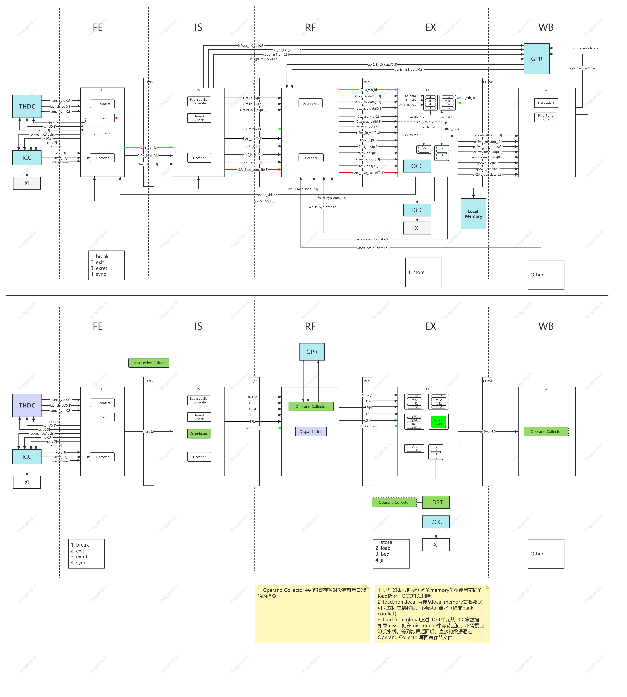

# MVPGPU-Sim Performance Analysis and Modeling for MVP V3.0

## Tasks Backlog

- [x] Architecture
  - [ ] GPUC
  - [ ] GPC
  - [ ] TPC
  - [ ] SM
  - [ ] SP
    - [ ] Pipeline
    - [ ] LDST Unit
- [ ] Memory
  - [ ] Register file size
  - [ ] L1 Instruction Cache size
  - [ ] L1 Data Cache size
  - [ ] Local memory size
  - [ ] L2 Cache size
  - [ ] Evaluating L3 Cache which shared by all GPCs
  - [ ] Bus bandwidth
  - [ ] DRAM
- [ ] Graphics
  - [ ] VF
  - [ ] PA
  - [ ] CLIP
  - [ ] TPG
  - [ ] RAST
  - [ ] ROP
  - [ ] TEXT
  - [ ] RT Core
- [ ] Tensor Core
- [ ] SMD
- [ ] Area
- [ ] Power

## Open Issues

- Dual issue: Simultaneous execution of FP32 and INT32 operations, fmac and mac instruction
  Current MAC in SP support floating-point and integer operations, this will limit multi-issue
- Adding L3 Cache shared by all SMs instead of local memory
- Async copy and barrier
- Shared Cache Residency control

## Schedule Overview

## MVP V3.0 Architecture Modeling

### 1. GPC/TPC/SM/SP

Now Perf-simulator is able to create 6 GPCs, 48 TPCs, 96 SMs and 384 SPs according to the mvpgpusim.config file. And tried to launch 98300 threads which is successed. The computed result also is correct.

32 threads/warp, and there are 32 warps per block. And a SP only has one block.

Big Picture of mvp v3.0 architecture

1. The input assembler collects geometric primitive(points, lines, triangles) and fetches associated vertex input attribute data. It has peak rates of one primitive per clock and eight scalar attributes per clock at the GPU core clock, which is typically 600 MHz. (from Tesla)

|Product  |MVP V3.0  |MVP V2.1  |
|:--      |:--   |:--   |
|GPCs|||
|TPCs|||
|SMs |||
|SPs |||
|INT32 Units / SP  |||
|INT32 Units / GPU |||
|FP32 Units / SP   |||
|FP32 Units / GPU  |||
|FP64 Units / SP   |||
|FP64 Units / GPU  |||
|Tensor Cores / SP   |||
|Tensor Cores / GPU  |||
|GPU Boost Clock   |||
|Peak FP32 TFLOPS  |||
|Peak FP64 TFLOPS  |||
|Peak Tensor Core TFLOPS  |NA |NA |
|Texture Units  |NA |NA |
|Memory Interface  |4096-bit HBM2 |NA |
|Memory Size       |16 GB         |NA |
|L2 Cache Size     |6144 KB       |NA |
|L1 Cache Size     |6144 KB       |NA |
|Shared Memory Size / SP  |Configurable up to 96 KB      |NA |
|Shared Memory Size / GPU |Configurable up to 96 KB      |NA |
|Register File Size / SP  |256KB       |NA |
|Register File Size / GPU |20480 KB       |NA |
|TDP               |300 Watts     |NA |

#### 1.1 GPC

#### 1.2 TPC

#### 1.3 SM

#### 1.4 SP

从Nvidia资料看，the amount of thread / warp size = 16，该比例可能是最合理的

- 所有指令都应该进入SP进行译码，也就意味着只要有指令触发的功能单元都应该在SP内
- MIO queue (volta has this unit for load/store/TEX)
  sends MIO instructions to the MIO instruction queue for later scheduling

#### 1.5 Computing power curve

(the number of FP32 operations) * frequency / cycle

In theorical, there 6144 FP32 units

#### 1.6 Frequency

Frequency (MHz)
|Core |Icnt |L2   |Dram |PA   |ROP  |Raster |Texture |
|:--  |:--  |:--  |:--  |:--  |:--  |:--    |:--     |
|1000 |1000 |1000 |800  |1000 |1000 |1000   |1000    |

#### 1.7 Issues

- [x]  Don't support multiple ldst unit, only one now , [fixed]
- [ ] MSHR
- [ ] Scheduler
  - [ ] 将Inst cache中的load指令存入一个队列，只要ldst单元空闲就执行该队列中的load指令，从而达到预取数据的目的，提升程序效率
- [ ] 每一个ALU按照warp_size去运行，而非一个ALU执行一个线程，跟当前硬件不一致，即SIMT的模式，而非SMT （m_warp_active_mask）
- [ ] 取指可否取的更多以提升性能，帮助完成预取，当前是取4条
- [ ] 根据当前MVP设计，在FE, EX和WB均有指令完成
- [ ] warp size

### 2. Pipeline

目前的设计中，在FE\IS\RF阶段都有Decoder。

- 流水线中支持的V线程（Warp数）需要跟流水级数确定，否则在前后指令有数据依赖时会有流水线stall的情况

#### 2.1 FE Stage

当前设计中，如果stall了，FE阶段不会取指，但是如果添加一个ibuffer，用来缓存FE取到的指令，那么FE就不会stall，每个cycle都可以取指并放入ibufferz中。IS阶段直接从ibuffer中选择指令。从而提高流水线的并发性，提升性能。

按照当前设计，如下指令在FE阶段完成并退出流水线

- break
- exit
- exret
- sync

#### 2.2 IS Stage

添加scoreboard来记录需要写入的目的寄存器，以支持乱序发射。从ibuffer中取出的指令，如果其源寄存器或目的寄存器不在scoreboard中，那么该指令不依赖前一条指令，可以继续执行进入RF阶段，否则该指令不能进入RF阶段。同时做相关的结构冲突检测。

为了提升ILP，并提高FU的占用率，可以使用双发射或者多发射。从调度器选择的warp中取出连续的、不存在数据相关性的指令，同时发射到FU上执行。存在相关性的指令或者第一天指令为分支跳转指令的情况还是禁止双发射。

##### Dynamic Scheduling

1. 运行为一个流水线编译的代码高效的运行在不同的流水线上
2. 能够处理一些编译时未知依赖的情况，比如memory reference or a data-dependent branch
3. 允许处理器容忍不可预知的延迟，比如cache miss时通过运行其他代码来解决等待miss的情况

:memo: 能否实现一个简单的Dynamic Schedule既能降低硬件复杂度，也能提升FU利用率。比如只要前后指令之间没有依赖，就多发射，如果有依赖就单发射

##### Register Renaming

Solve WAR and WAW

#### 2.3 RF Stage

进入RF阶段的指令需要从寄存器文件中获取源寄存器的值，但由于寄存器文件的结构可能会出现bank冲突，因此可以增加Operand_Collector以缓存暂时由于Register File Bank冲突导致的暂时无法进入EX阶段的指令。当前的设计是由IS阶段将寄存器id传递给Register File，在RF阶段直接取数据，而且每次只发送4条指令，没有寄存器冲突。

从RF中正常拿到源寄存器值的指令进入EX阶段。

#### 2.4 EX Stage

1. ALU指令进行运算，但计算的结果在WB阶段写会寄存器文件。如果IS阶段的scoreboard中有指令依赖该目的寄存器，可以先解除依赖，因为(正常情况下)下一个cycle该目的寄存器会被写入。

2. store指令直接写入cache中，结束指令。load指令可能会由于cache miss而导致该线程被换出。load指令最终需要到WB阶段将数据写入目的寄存器。

3. 当前ldst单元是属于流水线的一部分，会stall流水线。可以考虑增加一个属于memory系统的ldst单元。将load、store指令直接送入该ldst单元，不stall流水线。load指令在ldst单元中等待cache返回，在未返回前，stall该线程。

4. 同时也可以考虑ldst单元直接回写寄存器，load指令的回写操作不需要进入WB阶段。

5. 增加MSHR，来保存miss的memory request。当有新的memory request时，可以先检查是否会被miss的request包含，如果是则该新的请求就不在下发，避免浪费memory bandwidth。

6. 基于目前模拟器的结构，Tensor Core较容易支持在SP内部

7. Dispatch unit负责分派指令到相应的执行单元，消耗1个cycle

按照当前设计，如下指令在FE阶段完成并退出流水线

- store指令在EX的第一个Cycle计算地址，第二个Cycle写入cache
- load指令在EX的第一个Cycle计算地址，第二个Cycle可能发生miss

#### 2.5 WB Stage

执行回写寄存器的操作，回写操作可能也会出现寄存器bank冲突。因此也可以交给Operand_Collector。同时有Operand_Collector更新Scoreboard。

按照当前设计，如下指令在FE阶段完成并退出流水线

- 所有需要写目的寄存器的指令

### 3. Register file

Now MVP v2.1 is based on 16-register per thread

- Size
  根据每个线程预分配的寄存器数量及每个SP支持多少个线程，可以确定寄存器文件大小
- Design
  并发线程数量变多之后，Register File也需要考虑设计问题，因为大量并发的寄存器访问可能会出现conflict，从而会影响指令的latency。Nvidia是引入了Operand Collector机制来解决
  - 寄存器堆的简单实现要求每周期、每条被发射的指令、每个操作数都拥有一个端口
  - 减少寄存器堆面积的一种方法是使用多个单端口内存bank来模拟大量端口
  - 编译器优先使用寄存器存参数，其次使用栈

### 4. L1 Instruction Cache size

- Structure(Full/Set)
- Size(GPC/TPC/SM/SP, and in total)
- Occupancy(average/maximum)
- Timeserices(Occupancy)

### 5. L1 Data Cache size

在ldst下面创建的L1D Cache

- Cache size需要跟warp_size及SP内的线程数量，还有THDC调度机制相配合

- ISA
  - 访问不同存储类型的数据，使用不同的load指令，比如ldg, ldl, lds
    - ldg (load from global memory)
    - ldl (load from local memory)
    - lds (load from shared memory)

### 6. Local memory size

### 7. L2 Cache

| L2 Cache  |  |
|--         |--|
| Capacity  |  |
| Structure |  |
| Latency   |  |
| Bandwidth |  |

现在，L2 Cache是在ICNT和DRAM之间

Reference

|Production|Latency|Bandwidth|
|--|--|--|
|Apple M2 Pro iGPU|          |1034 GB/s|

### 8. Bus bandwidth

共有 6144个MAC单元，因此峰值数据量为6144*3*4Bytes=73728Bytes=72KB=576Kbits

以当前256bits的带宽来算，需要2304个DDR

### 9. DRAM

The A100 GPU includes 40 GB of fast HBM2 DRAM memory. The memory is organized as five active HBM2 stacks with eight memory dies per stack. With a 1215 MHz (DDR) data rate the A100 HBM2 delivers 1555 GB/sec memory bandwidth.

1555GB/sec / 1215 MHz = 1289B

DRAM Timing Options:
nbk                                    16 # number of banks
CCD                                     4 # column to column delay
RRD                                    10 # minimal delay between activation of rows in different banks
RCD                                    20 # row to column delay
RAS                                    50 # time needed to activate row
RP                                     20 # time needed to precharge (deactivate) row
RC                                     62 # row cycle time
CDLR                                    9 # switching from write to read (changes tWTR)
WR                                     20 # last data-in to row precharge
CL                                     20 # CAS latency
WL                                      8 # Write latency
nbkgrp                                  4 # number of bank groups
CCDL                                    4 # column to column delay between accesses to different bank groups
RTPL                                    4 # read to precharge delay between accesses to different bank groups

### 10. Graphics Pipeline

#### 10.0 Overall Process

#### 10.1 PA

#### 10.2 RAST

#### 10.3 TEX

定义子模块或接口(能够开放给后续的建模评估)
1. 

#### 10.4 ROP

the raster operations processor blends it with the pixel color at its assigned (x, y) pixel position and writes the final color to memory

## Reference

- <https://doc.weixin.qq.com/doc/w3_AfoA2QaaAFEERecDBfLRC2aUzV8Mb?scode=ANAA3Qc1AAYQNba6fKAfoA2QaaAFE>
- <https://dando18.github.io/posts/2020/04/02/roofline-model>