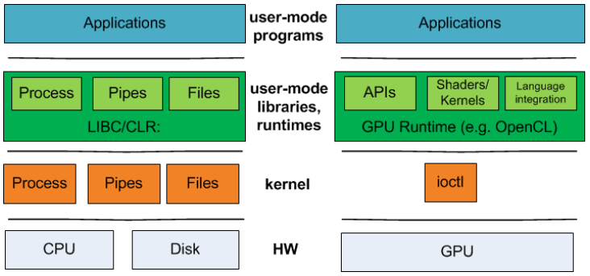
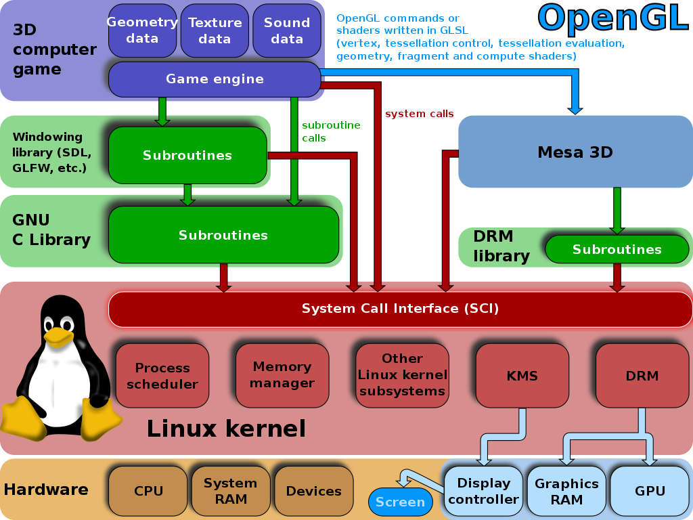
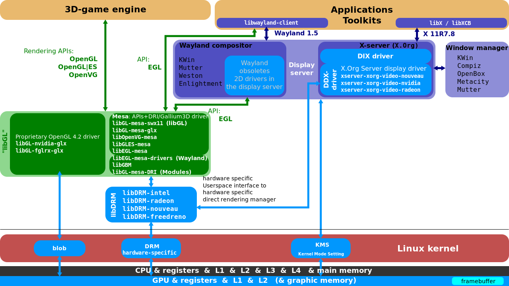
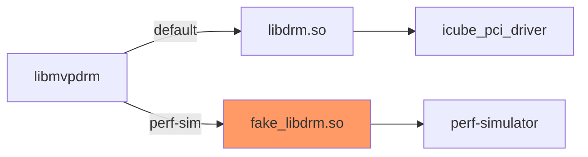
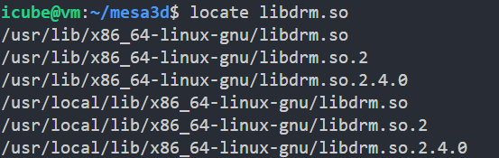
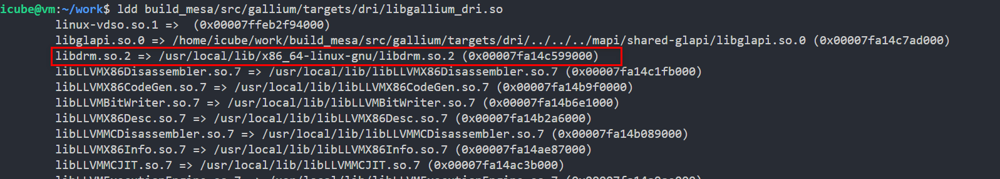
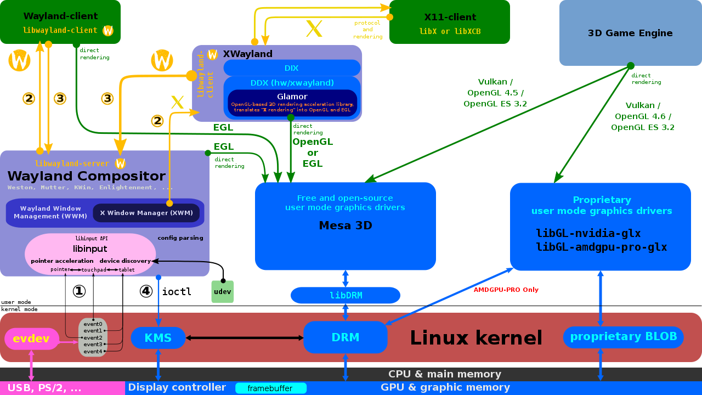
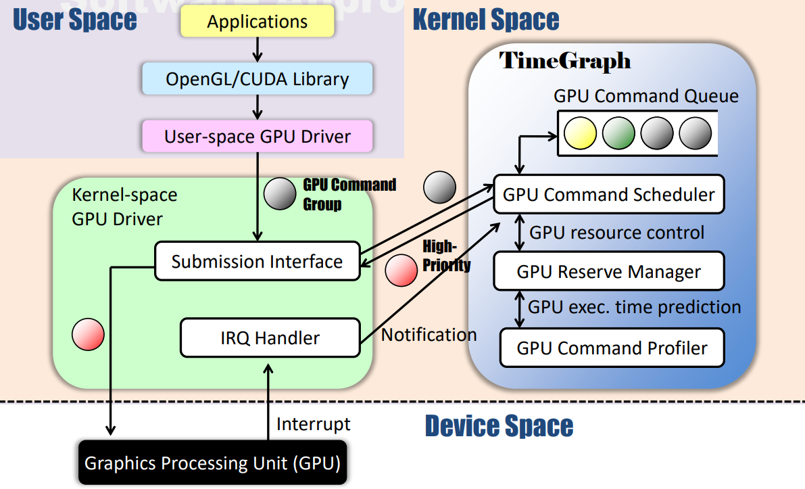

# How perf-simulator to support mesa stack

This is a simple example that used to explain the relationship between UMD and KMD



## User mode

``` c
#include <stdio.h>
#include <fcntl.h>
#include <unistd.h>

#define CHR_DEV_NAME "/dev/chr_dev"

int main(int argc, char** argv) {
    int ret = 0;
    char buf[100] = {0};
    char from_kernel_msg[] = "oooo, i come in.";
    int  fd = open(CHR_DEV_NAME, O_RDWR | O_NONBLOCK);
    if (fd < 0){
        printf("open file %s failed!\n", CHR_DEV_NAME);
        return -1;
    } 

    read(fd, buf, sizeof(buf)); // read from kernel 
    printf("buf = %s\n", buf);

    write(fd, from_kernel_msg, sizeof(from_kernel_msg)); //write to kernel

    close(fd);

    return 0;
}
```

## Kernel mode

```c
#include <linux/module.h>
#include <linux/kernel.h>
#include <linux/fs.h>
#include <linux/cdev.h>
#include <linux/uaccess.h>
#include <linux/device.h>

static struct cdev chr_dev; //define a char device
static dev_t ndev; //char device node's device number

struct file_operations chr_ops = {
    .owner = THIS_MODULE,
    .open  = chr_open,
    .read  = chr_read,
    .write = chr_write,
};

static int chr_open(struct inode *nd, struct file *file){
    int major = MAJOR(nd->i_rdev);
    int minor = MINOR(nd->i_rdev);
    printk("chr_open, major=%d, minor=%d\n", major, minor);
    return 0;
}

static ssize_t chr_read(struct file *fl, char __user *u, size_t sz, loff_t *off){
    printk("In the chr_read() function!\n");
    if (copy_to_user(u, "I am from kernel driver.\n", 26)){
        printk("copy_to_user maybe happened fault!\n");
        return -EINVAL;
    }

    return 0;
}

static ssize_t chr_write(struct file *fl, const char __user *u, size_t sz, loff_t *off){
    char buf[130] = {0};

    printk("In the chr_write() function!\n");
    if (copy_from_user(buf, u, sz)){
        printk("copy_from_user maybe happened fault!\n");
        return -EINVAL;
    }
    printk("\"%s\" am from user space\n ",buf);
    return 0;
}

static int demo_init(void){
    int ret = 0;
    cdev_init(&chr_dev, &chr_ops); //initial char device object
    if ((ret = alloc_chrdev_region(&ndev, 0, 1, "chr_dev")) < 0){ //alloc device number
        return ret;
    }

    printk("demo_init() : major=%d, minor=%d\n", MAJOR(ndev), MINOR(ndev));
    if ((ret = cdev_add(&chr_dev, ndev, 1)) <0){ //register char device into system
        return ret;
    }

    return 0;
}

static void demo_exit(void){
    printk("Removing chr_dev module...\n");
    cdev_del(&chr_dev); //del char device from system
    unregister_chrdev_region(ndev, 1); //release device number
}

module_init(demo_init);
module_exit(demo_exit);

MODULE_LICENSE("GPL");
MODULE_AUTHOR("GGang.liu@LinuxFGL");
MODULE_DESCRIPTION("A char device driver as an example");
```

How to build .ko file

```makefile
obj-m := demo_chr_dev.o
KERNELDIR := /lib/modules/$(shell uname -r)/build
PWD := $(shell pwd)

default:
    $(MAKE) -C $(KERNELDIR) M=$(PWD) modules

clean:
    rm -f *.o *.ko *.mod.c
```

## How to hijack file operation in UMD



Linux Graphics Stack:


### libmvpdrm

This lib is a self-definition library which depend on libdrm

```jl
libmvpdrm = static_library(
  'mvpdrm',
  'mvp_drm_winsys.c',
  include_directories : [inc_include, inc_src, inc_mapi, inc_mesa, inc_gallium, inc_gallium_aux, inc_gallium_drivers],
  dependencies : [dep_libdrm, dep_libmvpcommon, idep_nir_headers,idep_mesautil],
  gnu_symbol_visibility : 'hidden',
)
```

Key function `drmIoctl` in /usr/local/include/xf86drm.h

```c
extern int drmIoctl(int fd, unsigned long request, void *arg);
```

### libdrm

[xf86drm.c line:624](https://android.googlesource.com/platform/external/libdrm/+/refs/heads/master/xf86drm.c)

```c
drm_public int drmIoctl(int fd, unsigned long request, void *arg)
{
    int ret;
    do {
        ret = ioctl(fd, request, arg);
    } while (ret == -1 && (errno == EINTR || errno == EAGAIN));
    return ret;
}
```

### The real implementation of icube driver in KMD which will be compiled as kernel object file

/home/icube/kmd/src/icube_drv.c

```c
static int __init icube_drv_init(void)
{
    return pci_register_driver(&icube_pci_driver);
}


static void __exit icube_drv_exit(void)
{
    pci_unregister_driver(&icube_pci_driver);
}

module_init(icube_drv_init);
module_exit(icube_drv_exit);

MODULE_AUTHOR(DRIVER_AUTHOR);
MODULE_DESCRIPTION(DRIVER_DESC);
MODULE_LICENSE("GPL and additional rights");

static struct pci_driver icube_pci_driver = {
    .name = DRIVER_NAME,
    .id_table = icube_pciidlist,
    .probe = icube_pci_probe,
    .remove = icube_pci_remove,
    .shutdown = icube_pci_shutdown,
    .driver = {
        .name = "icubegpu",
#ifdef CONFIG_PM
        .pm = &icube_pm_ops,
#endif
    },
};

struct drm_driver icube_drm_driver = {
    .driver_features = DRIVER_RENDER | DRIVER_GEM | DRIVER_SYNCOBJ | DRIVER_MODESET | DRIVER_ATOMIC,
    .name = DRIVER_NAME,
    .desc = DRIVER_DESC,
    .date = DRIVER_DATE,
    .major = DRIVER_MAJOR,
    .minor = DRIVER_MINOR,
    .patchlevel = DRIVER_PATCHLEVEL,

    .open = icube_drm_open,
    .postclose = icube_drm_postclose,
    .release = icube_drm_release,
    .ioctls = icube_drm_ioctls,
    .num_ioctls = ARRAY_SIZE(icube_drm_ioctls),
    .fops = &icube_drm_fops,

    .prime_handle_to_fd = drm_gem_prime_handle_to_fd,
    .prime_fd_to_handle = drm_gem_prime_fd_to_handle,

    .dumb_create = icube_gem_dumb_create,
    .dumb_map_offset = icube_gem_mmap_offset,
    .dumb_destroy = drm_gem_dumb_destroy,

    .gem_prime_import_sg_table = icube_gem_prime_import_sg_table,
    .gem_prime_mmap = icube_gem_prime_mmap,
};
```

### Solution

Based on current flow:



So here we can implement a self-defined libdrm to instead of standard libdrm. And still using the way of changing `LD_LIBRARY_PATH` env variable to active the self-defined **fake_libdrm.so**.


/etc/ld.so.conf

### Question

Here is a question, which type library is using now? If dynamic library is used, it's fine. Otherwise, we should consider to use dynamic library rather than static library.

/usr/lib/x86_64-linux-gnu/libdrm.a
/usr/local/lib/x86_64-linux-gnu/libdrm.so


## Reference

[Creating a shared and static library with the Meson build system](https://renenyffenegger.ch/notes/development/languages/C-C-plus-plus/GCC/create-libraries/Meson/index)




