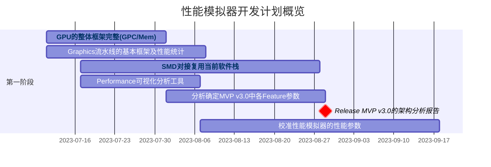

# GGangLiu Doc

## Overall Project Schedule

## Release

> Vx.x   means that this is a new feature release version
> Vx.x.x means that this a bug fix version which based on the Vx.x version

- [MVPGPU-SIM V1.0](/release/) [[Download]](/release/)
  - [x] Support OpenCL API v1.2
  - [x] Support OpenCL CTS
- MVPGPU-SIM V1.1 [[Download]](/release/)
  - Support Pytorch based on OpenCL
- MVPGPU-SIM V1.2 [[Download]](/release/)
  - Support Graphics rendering
  - Support Graphics pipeline
- MVPGPU-SIM V1.3 [[Download]](/release/)
  - Support OpenGL API v3.3
  - Support OpenGL "hello world"
- MVPGPU-SIM V1.4 [[Download]](/release/)
  - Support OpenGL CTS
- MVPGPU-SIM V1.5
  - Support MVP-libs
- MVPGPU-SIM V1.6
  - Performance Tool
  - Pipeline visualization
- MVPGPU-SIM V1.7
  - Power evaluation
- MVPGPU-SIM V1.8
  - Tensor Core
- MVPGPU-SIM V1.9
  - Ray tracing

## Directory structure

- **images** folder is used for storing all pictures docs needed
- **[ebook](/ebook/)** some ebooks
- **[release](/release/)** archive formal released version files

## Doc index

- [MVPGPU-Sim Architecture Manual](MVPGPU-Sim-Architecture-Manual.md)
- [MVPGPU-Sim User Guide](MVPGPU-Sim-User-Guide.md)
- [How to clone and commit code](how-to-clone-and-commit-code.md)
- [Project/Feature Development Flow](project-feature-development-flow.md)
- [MVPGPU-Sim Architecture Refactoring Design Principles](MVPGPU-SIM-Architecture-Refactoring-Design.md)
- OpenCL
  - [OpenCL API]mvp_notes/opencl/opencl_api.md)
  - [OpenCL CTS](mvp_notes/opencl/)
- OpenGL
  - [Graphics Support Approach](MVPGPU-SIM-Graphic-Support-Approach.md)
  - [OpenGL FS/VS Shader Program Compiling Flow](mvp_notes/opengl/shader-program-compiling-flow.md)
- Ebook
  - [Ebook list](/ebook/)

## Markdown guide

Here you are able to find out lots of intereting things about markdown

- <https://www.markdownguide.org/getting-started/>
- <https://daringfireball.net/projects/markdown/>
- <https://www.markdowntutorial.com/>
