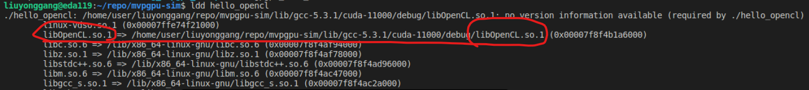
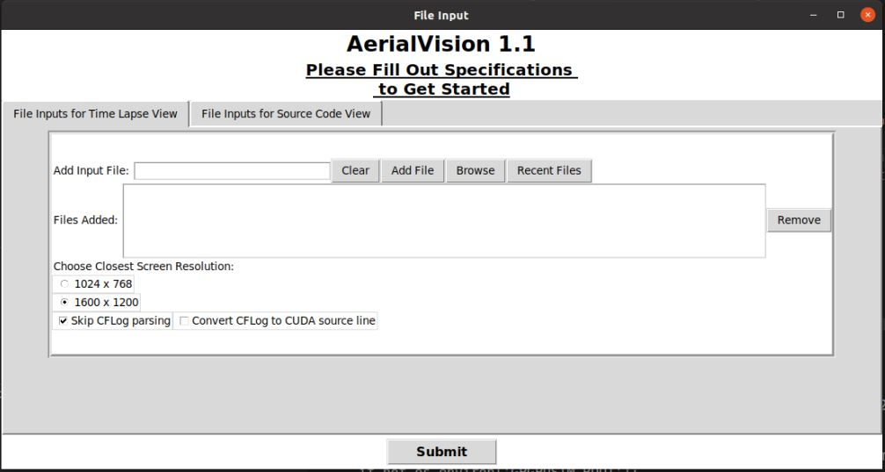
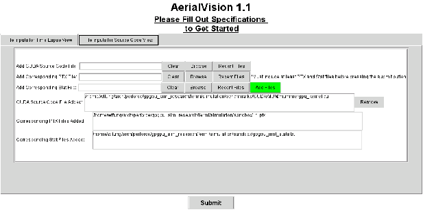
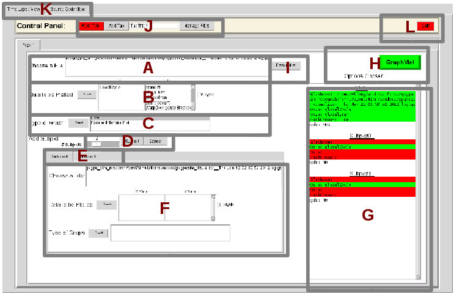
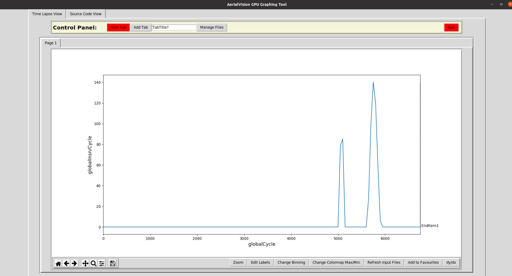
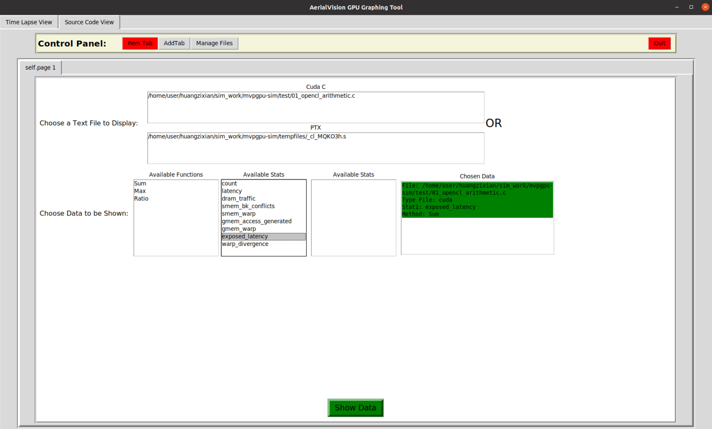

# MVPGPU-Sim User Guide

This guide is only for how new developer to run application based on MVPGPU-Sim

## Table of content

- [MVPGPU-Sim User Guide](#mvpgpu-sim-user-guide)
  - [Table of content](#table-of-content)
  - [How to compile OpenCL application](#how-to-compile-opencl-application)
    - [Host compiling](#host-compiling)
    - [Kernel built-in function lib](#kernel-built-in-function-lib)
    - [Kernel compiling](#kernel-compiling)
  - [How to compile Graphic application](#how-to-compile-graphic-application)
  - [How to run application based on MVPGPU-Sim](#how-to-run-application-based-on-mvpgpu-sim)
  - [How to build and run OpenCL CTS](#how-to-build-and-run-opencl-cts)
  - [setup\_environment](#setup_environment)
  - [Git](#git)
  - [Code Commit Flow](#code-commit-flow)
  - [Gerrit](#gerrit)
  - [Aerialvision](#aerialvision)

## How to compile OpenCL application

### Host compiling

If want to build OpenCL file, first to build MVPGPU-SIM to build OpenCL libraries.

``` bash
source setup_environment debug | release
make
```

Then compile application file as below.

``` bash
clang-7 -g -lOpenCL -DCL_TARGET_OPENCL_VERSION=120 -I /usr/local/cuda/include -L ../lib/  hello.c -o hello
```

### Kernel built-in function lib

Because kernel built-in functions will be used only by kernel, so this lib should be compiled as .bc file by MVP compiler. Then using *llvm-link* link against it with shader bitcode file to produce a new bitcode file which contains all functions, final *llc* convert it as assemble file.

``` bash
$
$ cd api/libopencl
$ clang-7 -x cl -emit-llvm -S -cl-std=CL1.2 -Xclang -finclude-default-header opencl_built_in_api.c -o ../../lib/opencl_built_in_api.bc
```

### Kernel compiling

> llvm-link just link files, don't remove the unused functions

``` bash
$
$ clang-7 -x cl -emit-llvm -S -cl-std=CL1.2 -Xclang -finclude-default-header _cl_Rasterizer -o _cl_Rasterizer.bc
$ llvm-link -only-needed _cl_Rasterizer.bc ../lib/opencl_built_in_api.bc -o _cl_Rasterizer.bc
$ llc -march=mvp _cl_Rasterizer.bc -o _cl_Rasterizer.s
```

## How to compile Graphic application

Kernel compiling

``` bash
clang-7 -emit-llvm -S -std=c++17 -I /usr/local/include/opencv4 -I ${GPGPUSIM_ROOT}/gpu/graphics/include -I ${GPGPUSIM_ROOT}/gpu/graphics/texture fs_shader.cpp -o fs_shader.bc

-L ${GPGPUSIM_ROOT}/lib

llc -march=mvp fs_shader.bc -o fs_shader.s
```

## How to run application based on MVPGPU-Sim

- source setup_environment debug
- make
- ldd *application* to check if link against MVPGPU-Sim\'s xxx.so file

- ./hello_opencl

## How to build and run OpenCL CTS

- Building

  ``` bash
  $
  $ cd test/OpenCL-CTS
  $ mkdir build
  $ cmake -B ./build -DCL_INCLUDE_DIR=$PWD/OpenCL-Headers -DCL_LIB_DIR=/home/user/liuyonggang/repo/mvpgpu-sim/lib -DOPENCL_LIBRARIES=OpenCL
  $ cmake --build ./build --config Debug
  $ cd build
  $ make
  ```

- Running test cases

  ``` bash
  $
  $ cd ~/repo/mvpgpu-sim
  $ ./test/OpenCL-CTS/build/test_conformance/basic/test_basic -h
  $ ./test/OpenCL-CTS/build/test_conformance/api/test_api -h
  ```

- How to debug

  launch.json file content as below.

  ```json
  {
      "version": "0.2.0",
      "configurations": [
          {
              "name": "(gdb) ????",
              "type": "cppdbg",
              "request": "launch",
              "program": "${workspaceFolder}/test/OpenCL-CTS/build/test_conformance/api/test_api", //smoke_test/01_opencl_arithmetic opencl: hello_opencl/vectorAdd cuda:cuadd cts:test_api get_device_info
              "args": ["load_single_kernel"], //This is case name
              "stopAtEntry": true,
              "preLaunchTask": "",
              "cwd": "${workspaceFolder}",
              "environment": [],
              "externalConsole": false,
              "MIMode": "gdb",
              "setupCommands": [
                  {
                      "description": "?? gdb ????????????",
                      "text": "-enable-pretty-printing",
                      "ignoreFailures": true
                  },
                  {
                      "description":  "?????????????????? Intel",
                      "text": "-gdb-set disassembly-flavor intel",
                      "ignoreFailures": true
                  }
              ]
          }
      ]
  }
  ```

## setup_environment

|Env Variables |Meaning |Comments|
|:--|:--|:--|
|MVPGPUSIM_CONFIG_FILE_PATH |mvpgpu-sim.config's folder path|

## Git

- Create branch

  ``` #!/bash/sh
  git push origin new-branch-name:new-branch-name
  ```

- Delete branch

  ``` #!/bash/sh
  git push origin --delete delete-branch-name
  ```
  
  For example, The meaning of *remotes/origin/test* is that you have a branch called test in the remote server origin. So the command would be
  
  ``` bash
  git fetch --prune
  git branch -r
  git push origin --delete test
  ```

- Tag

  ``` #!/bash/sh
  git tag //列出所有的标签名
  git show <tag_name> //显示标签对应提交记录的具体信息
  git ls-remote --tags origin  //显示远端的tag

  git tag <tag_name>   //当前分支所在的提交上打上轻量标签
  git tag <tag_name> <commit hash value> //为某次具体的提交打上轻量标签
  git tag -a <anotated_name> -m <tag_message> //为当前分支所在提交打上附注标签
  git push origin <tag_name>  //推送某个标签到远程仓库
  git push origin --tags //推送所有标签到远程仓库

  git tag -d <tag_name>  //删除某个标签
  git ls-remote --tags origin //找出要删除的远端标签，类似于ref/tags/<tag_name>的格式 
  git push origin :refs/tags/<tag_name> //删除远程仓库某个标签
  ```

## Code Commit Flow

1. Update to the latest commit by `git pull` before commit code modification, and fix conflict if there are
2. Finish smoke test, and **code can not be commited if smoke test fails**
3. Commit code by `git commit` and **must modify relate items of commit message**
4. Push the change to gerrit for review by `git push origin HEAD:refs/for/developing`
5. Add reviewer in gerrit link
6. Resolve all comments or issues, and **all patches should be commited from local rather than online fixes unless you are sure it's no problem**

## Gerrit

- How to restart (Executing the following bat by root user or **wangyuwei@icubecorp.cn**)

  ```bat
  /home/gerrit/review-site/bin/gerrit.sh restart
  ```

- How to add new user (New user should be added to related group by adminstrator or **zhongwei@icubecorp.cn**)

  ```bat
  [liuyonggang@eda mvpgpu-doc]$ groups
  hw soc system
  ```

## Aerialvision
- How to start AerialVision
  ```python
  cd ~/mvpgpu-sim/
  source setup_environment # + debug/release
  cd ~/mvpgpu-sim/tool/
  python3 aerialvision_main.py
  ```
- Launch Page

Here we need to upload all the files that are required here. These files are by default in the form gpgpusim_visualizer__*.log.gz. We submit files by clicking the `Browse` button (if you've submitted the file before you can click on the Recent Files button), and then clicking `Add File` once the file’s path is in the Add Input File text field. Notice that you can submit numerous files for visualizing into this tab; however, for the purposes of this walkthrough we have limited it to one.

Now click on the File Inputs for Source Code View tab. In this tab we submit files that present statistics corresponding to each line of PTX or CUDA/OpenCL source. Before clicking the `Add Files` button, it is necessary to insert the file paths to three distinct files required by this part of AerialVision. The file that goes in the Add CUDA/OpenCL Source Code File text field is the appropriate CUDA/OpenCL kernel source code file(.cu/.c).\
\
The file that goes in the `Add Corresponding PTX File` text field is the appropriate PTX file generated.\
\
Finally, the file that goes in the `Add Corresponding Stat File` is generated by the GPGPU-Sim and is by default named gpgpu_inst_stats.txt.\
\
Once you have filled the three text fields, click the green Add Files button.\
\
You can now launch AerialVision by clicking the `Submit` button at the bottom. It should be noted that for your own purposes, it is not necessary to fill both the File Inputs for Time Lapse View and File Inputs for Source Code View tabs as both parts of AerialVision can be used independently of the other.
- Time Lapse View
  
  We first need to Choose a File by double clicking on the trace file that we want to extra data from. Double clicking on one of the files should turn the appropriate section of the `‘Options Chosen’` list green.\
  \
  In B and C, we can choose which data to plot and their config such as with derivative or not and plot with line or Parallel Intensity Plot. `THIS IS DEPEND ON THE STAT TO SHOW. YOU CAN FIND THE CONFIG IN ANOTHER TABLE.`\
  \
  You may now press the green `GraphMe!` button. If you have followed this walkthrough correctly, all of the fields in the Option Chosen list should be green.
  
  After clicking the green `GraphMe!` button, your screen should now look something like figure above.

- Source Code View
  
  First we must choose the appropriate CUDA/OpenCL source file by clicking the appropriate file under the `Cuda C` header. This should turn the File: under Chosen Data from red to green. Next, we will need to choose the appropriate PTX statistic aggregation method from under `Available Functions` as well as A`vailable Stats`. Finally, click the green `Show Data` button at the bottom.
