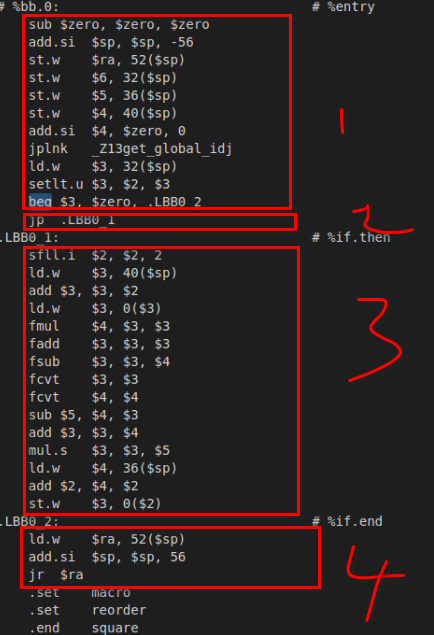

# Debug basic_block issue

## create basic block

首先以标签为分割，创建基本块

## connect basic block

```ini
connect_basic_blocks()
```

取代码块的最后一条指令，进行链接，插入predecessor和successor基本块的id
根据最后一条指令的操作码

- 退出类指令： 后继插入exit_bb->bb_id
- 跳转类指令： beq


