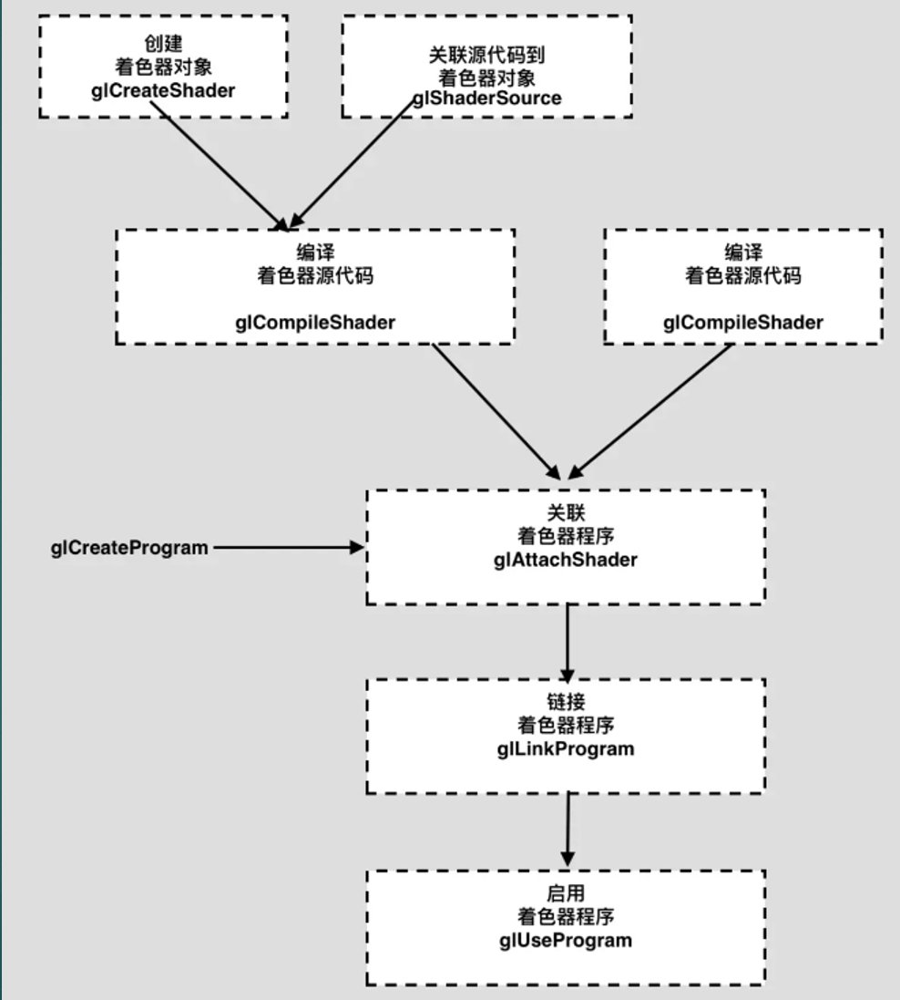
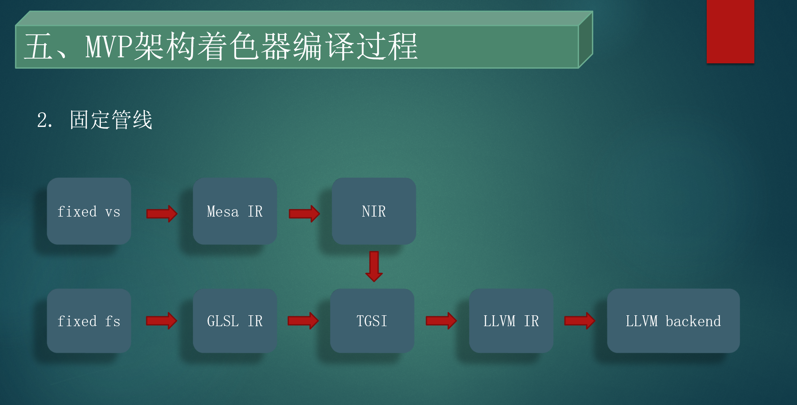
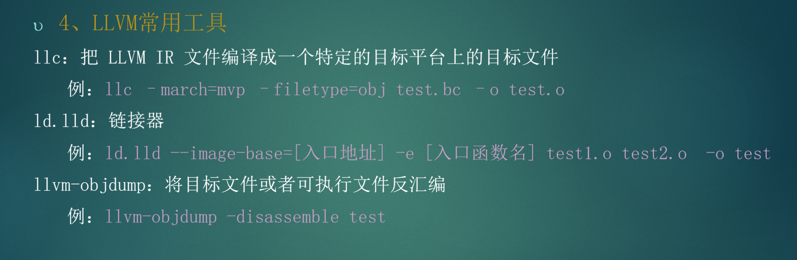
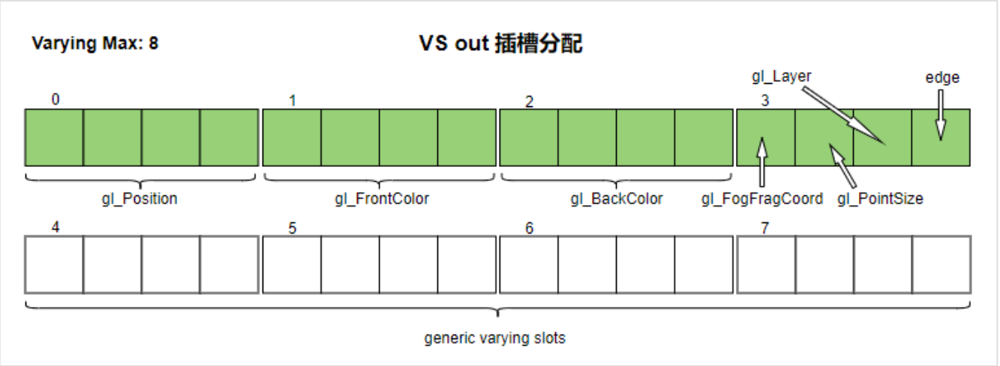
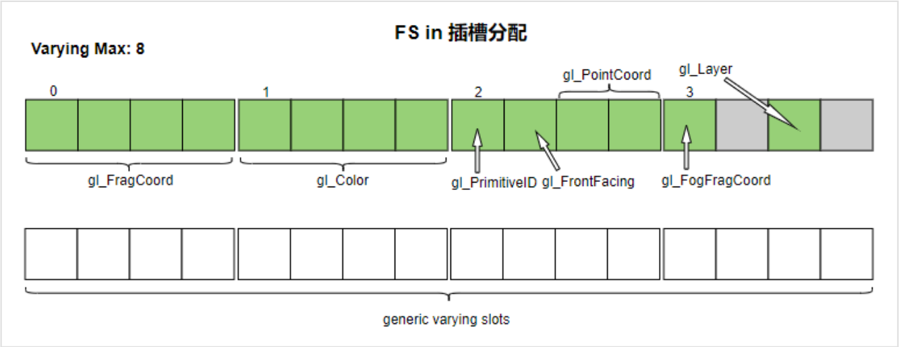
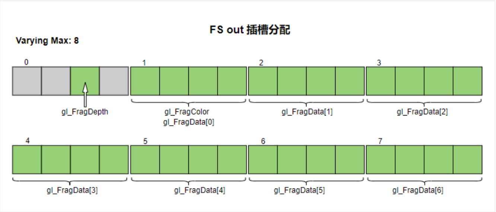

# OpenGL FS/VS Shader Program Compiling Flow

> 由于GLSL的跨平台性，所以OpenGL没有编译器，由显卡驱动来完成着色器的编译工作

## Related API

```c
GLuint fs = glCreateShader(GL_FRAGMENT_SHADER);
glShaderSource(fs, 1, fs_source, NULL);
glCompileShader(fs);
```



|OpenGL API      |gl3w              |    |
|:--             |:--               |:-- |
|glCreateShader  | gl3wCreateShader | _mesa_CreateShader  |
|glShaderSource  | gl3wShaderSource | _mesa_ShaderSource  |
|glCompileShader | gl3wCompileShader| _mesa_CompileShader |

## Compiling flow




## LLVM IR -> MVP Assemble



## Source code

/home/icube/mesa3d/src/gallium/drivers/mvp/mvp_shader_lib

## Understanding OpenGL Shader Compiling Flow

### GLSL330内置类型分布

- Vertex Shader

    |sys in(in stack)|attr in(13 slot)|attr out(18 slot)|
    |:--             |:--             |:--              |
    |int gl_VertexID <br>int gl_InstanceID | vec4  gl_Color  <br>vec4  gl_SecondaryColor <br>vec4  gl_Normal <br>vec4  gl_Vertex     <br>vec4  gl_MultiTexCoord0 <br>vec4  gl_MultiTexCoord1 <br>vec4  gl_MultiTexCoord2 <br>vec4  gl_MultiTexCoord3 <br> vec4  gl_MultiTexCoord4 <br>vec4  gl_MultiTexCoord5 <br>vec4  gl_MultiTexCoord6 <br> vec4  gl_MultiTexCoord7 <br>float gl_FogCoord    |vec4  gl_Position <br>vec4  gl_FrontColor <br>vec4  gl_BackColor <br>float gl_FogFragCoord <br>float gl_PointSize <br>int   gl_Layer <br> ... |

    对于VS attr in，插槽不做固定分配，按照定义顺序逐一分配，直到插槽上限
    

- Fragment Shader

    |sys in(1 slot)|attr in(15 slot)|attr out(10 slot)|
    |:--             |:--             |:--              |
    | int  gl_SampleID <br> vec2 gl_SamplePosition <br> int  gl_SampleMaskIn | vec4 gl_FragCoord <br> vec4  gl_Color<br>int   gl_PrimitiveID <br>bool  gl_FrontFacing <br> vec2  gl_PointCoord <br> float gl_FogFragCoord <br>int   gl_Layer | float gl_FragDepth <br> vec4  gl_FragColor <br> vec4  gl_FragData[gl_MaxDrawBuffers] ... |

    
    

下面是shader编译过程中用到的一些自定义库函数，这些函数在shader执行之前帮助完成了相关的数据准备工作。

### VS

shader.vs

```GLSL
#version 330 core
layout (location = 0) in vec3 aPos;
layout (location = 1) in vec3 aColor;

out vec3 ourColor;

void main()
{
    gl_Position = vec4(aPos, 1.0);
    ourColor = aColor;
}
```

```c
#define CORE_REG_TID		0xc2600c84
#define CORE_REG_CMD		0xc2600c88
#define CORE_REG_VTX_DONE	0xc2601000
#define IC1000_IO_BASE      0xC2600000

// attribute count + draw_start index + 8 * (attribute stride + addr)
#define ATTRIBUTE_SIZE          ((1 + 1 + 8 * 2) * 4)
// save misc info address /* attributes addr + vs_constant_buffer addr + ps_constant_buffer addr */
#define IC1000_CORE_REGS_GP     (1024*3 + 0x30 + IC1000_IO_BASE)
#define MVP_LM_BASE             0xC2000000

#define ATTR_FORMAT_VEC1	0
#define ATTR_FORMAT_VEC2	1
#define ATTR_FORMAT_VEC3	2
#define ATTR_FORMAT_VEC4	3

extern void vs_main(float* gl_in, float* gl_out, float* gl_const, unsigned int index, unsigned int instance_id);

void calc_in_out(float** gl_in, float** gl_out, unsigned int* vtxIndex, unsigned int *instanceId)
{
    unsigned int lm_base = MVP_LM_BASE;
    unsigned int lm_size = 1024;

    unsigned int tid = *( unsigned int *)(CORE_REG_TID);
    unsigned int cmd = *( unsigned int *)(CORE_REG_CMD);
    unsigned int bid = (cmd >> 28) & 1;
    unsigned int varying_num = 8;
    *gl_in = *gl_out = (float *)(lm_base + (tid * lm_size) + bid * varying_num * 16);
    *vtxIndex = *(unsigned int *)(*gl_in);
    *instanceId = *((unsigned int *)(*gl_in) + 4);
}

void load_attributes(float* gl_in, unsigned int index) 
{
    unsigned int* misc_info = (unsigned int *)(*( unsigned int*)(IC1000_CORE_REGS_GP));
    unsigned int* attr_header = (unsigned int *)(*misc_info);
    unsigned int attr_count = attr_header[0];
    index  = attr_header[1] + index;
    unsigned int attr_stride = 0;
    unsigned int attr_format = ATTR_FORMAT_VEC4;
    unsigned int attr_vbo_base = 0;
    float *attr_data_base; 
    unsigned int i = 0;
    for(i = 0; i < attr_count; i++){
        attr_stride = attr_header[ 2 + i*2] & 0x0000ffff;
        attr_format = (attr_header[ 2 + i*2] >> 16) & 0x0000ffff;
        attr_vbo_base = attr_header[ 2 + i*2 + 1];
        attr_data_base = (float *)(attr_vbo_base + index * attr_stride);
        //here just load (4 * float) bytes for one attribute, compiler/mesa will handle the case that attibute is not fvec4 type
        if (attr_format == ATTR_FORMAT_VEC1){
            *(gl_in + i * 4 + 0) = *( attr_data_base + 0);
            *(gl_in + i * 4 + 1) = 0;
            *(gl_in + i * 4 + 2) = 0;
            *(gl_in + i * 4 + 3) = 1;
        }else if(attr_format == ATTR_FORMAT_VEC2){
            *(gl_in + i * 4 + 0) = *( attr_data_base + 0);
            *(gl_in + i * 4 + 1) = *( attr_data_base + 1);
            *(gl_in + i * 4 + 2) = 0;
            *(gl_in + i * 4 + 3) = 1;
        }else if(attr_format == ATTR_FORMAT_VEC3){
            *(gl_in + i * 4 + 0) = *( attr_data_base + 0);
            *(gl_in + i * 4 + 1) = *( attr_data_base + 1);
            *(gl_in + i * 4 + 2) = *( attr_data_base + 2);
            *(gl_in + i * 4 + 3) = 1;
        }else { // ATTR_FORMAT_VEC4
            *(gl_in + i * 4 + 0) = *( attr_data_base + 0);
            *(gl_in + i * 4 + 1) = *( attr_data_base + 1);
            *(gl_in + i * 4 + 2) = *( attr_data_base + 2);
            *(gl_in + i * 4 + 3) = *( attr_data_base + 3);
        }
    }
}

void wrapper_vs(void)
{
    float *gl_in, *gl_out;
    unsigned int index = 0;
    unsigned int instance_id = 0;
    unsigned int *misc_info = (unsigned int *)(*( unsigned int *)(IC1000_CORE_REGS_GP));
    unsigned int gl_const = *(misc_info + 1);
    calc_in_out(&gl_in, &gl_out, &index, &instance_id);

    load_attributes(gl_in, index);

    vs_main(gl_in, gl_out, (float *)gl_const, index, instance_id);
        
    *(unsigned int *)(CORE_REG_VTX_DONE) = index;
}

```

### FS

shader.fs

```GLSL
#version 330 core
out vec4 FragColor;

in vec3 ourColor;

void main()
{
    FragColor = vec4(ourColor, 1.0f);
}
```

```cpp
#define CORE_REG_TID		0xc2600c84
#define CORE_REG_CMD		0xc2600c88
#define CORE_REG_VTX_DONE	0xc2601000
#define MVP_LM_BASE             0xC2000000
#define IC1000_IO_BASE          0xC2600000
// attribute count + draw_start index + 8 * (attribute stride + addr)
#define ATTRIBUTE_SIZE          ((1 + 1 + 8 * 2) * 4)
// save misc info address /* attributes + vs_constant_buffer addr + ps_constant_buffer addr */
#define IC1000_CORE_REGS_GP     (1024*3 + 0x30 + IC1000_IO_BASE)

extern void ps_main(float* gl_in, float* gl_out, float* gl_const);

void calc_in_out(float** gl_in, float** gl_out, unsigned int* vtxIndex)
{
    unsigned int lm_base = MVP_LM_BASE;
    unsigned int lm_size = 1024;

    unsigned int tid = *(volatile unsigned int*)(CORE_REG_TID);
    unsigned int cmd = *(volatile unsigned int*)(CORE_REG_CMD);
    unsigned int bid = (cmd >> 28) & 1;
    unsigned int varying_num = 8;
    *gl_in = *gl_out = (float*)(lm_base + (tid*lm_size) + bid*varying_num*16);
}

void wrapper_ps(void)
{
    float *gl_in, *gl_out;
    unsigned int* misc_info = (unsigned int *)(*( unsigned int*)(IC1000_CORE_REGS_GP));
    unsigned int gl_const = *(misc_info + 2);
    calc_in_out(&gl_in, &gl_out, (void*)0);
    ps_main(gl_in, gl_out, (float*)gl_const);
}
```

mvp_llvm_create_func()
mvp_create_function()
create_function()
mvp_compile_tgsi_main()
mvp_compile_tgsi_shader()
mvp_shader_create()
mvp_build_shader_variant()
mvp_build_shader_variant_low_priority()

## Reference

- [GLSL着色器编译-2023.3.19.pptx](/opengl/GLSL着色器编译-2023.3.19.pptx)
