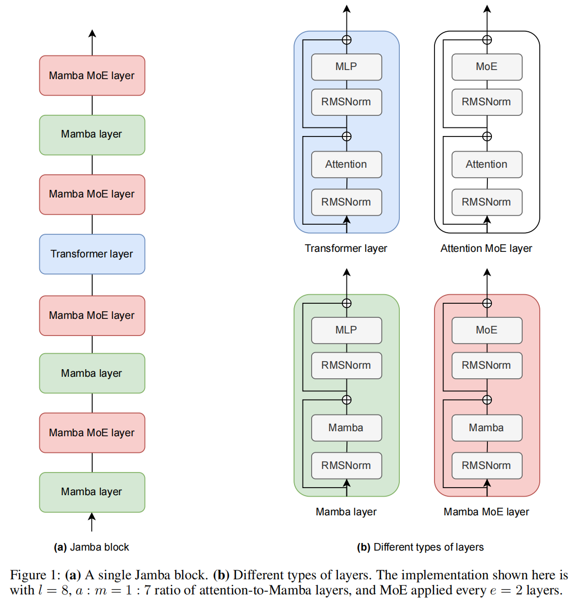
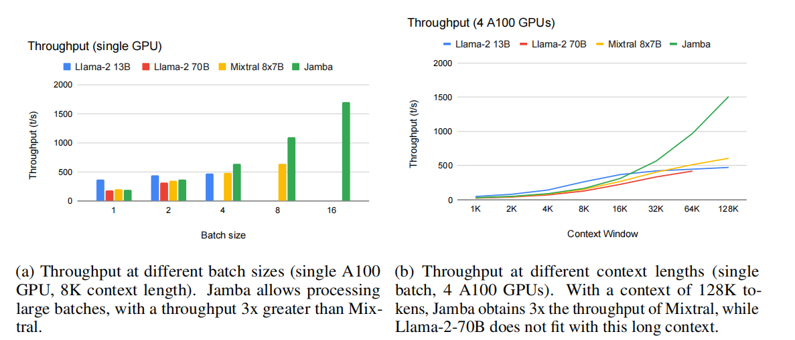
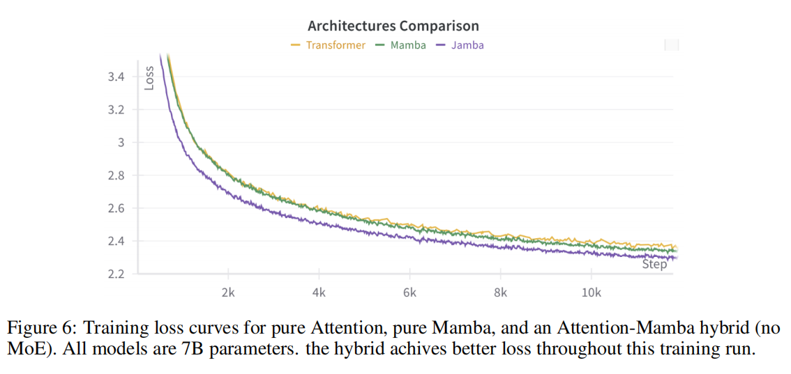
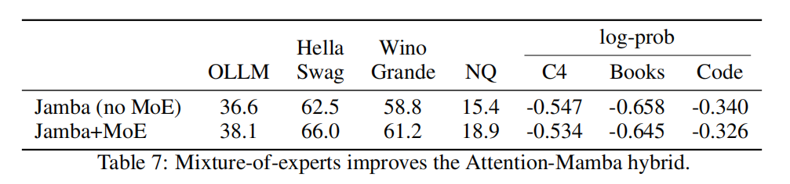

# Jamba

Jamba is a state-of-the-art, hybrid SSM-Transformer LLM. Jamba is the first production-scale Mamba implementation, which opens up interesting research and application opportunities.

This model card is for the base version of Jamba. It’s a pretrained, mixture-of-experts (MoE) generative text model, with 12B active parameters and a total of 52B parameters across all experts. It supports a 256K context length, and can fit up to 140K tokens on a single 80GB GPU.

## Paper

[Jamba:A Hybrid Transformer-Mamba Language Model](https://arxiv.org/pdf/2403.19887.pdf)

Model: <https://huggingface.co/ai21labs/Jamba-v0.1>

- we end up with a powerful model that fits in a single 80GB GPU
- the model presents strong results for up to 256K tokens context length

- Taking advantage of both model families, Jamba combines Transformer and Mamba layers, at a certain ratio. Varying the ratio of Transformer/Mamba layers allows balancing memory usage, efficient training, and long context capabilities.

### Model Architecture

Jamba is a hybrid decoder architecture


1. the KV cache – the memory required to store the attention keys and values in the context. When scaling Transformer models to long contexts, the KV cache becomes a limiting factor. Trading off attention layers for Mamba layers reduces the total size of the KV cache.

Our architecture aims to provide not only a small number of active parameters but also an 8x smaller KV cache compared to a vanilla Transformer.


### Reaping the Benefits

#### Jamba Implementation for a Single 80GB GPU

Jamba Implementation for a Single 80GB GPU. In our implementation we have a sequence of 4 Jamba blocks. Each Jamba block has the following configuration:

- l = 8: The number of layers.
- a : m = 1 : 7: ratio attention-to-Mamba layers.
- e = 2: how often to use MoE instead of a single MLP.
- n = 16: total number of experts.
- K = 2: number of top experts used at each token


Overall, our Jamba implementation was successfully trained on context lengths of up to 1M tokens. The released model supports lengths of up to 256K tokens.

#### Throughput Analysis



### Training Infrastructure and Dataset

The model was trained on NVIDIA H100 GPUs.

### Evaluation

#### Academic Benchmarks


In summary, Jamba demostrates the ability of hybrid architectures to reach the performance of state-of-the-art Transformer based models of the same size class, while having the benefits of anSSM.

#### Long-Context Evaluations

We have successfully trained Jamba models with context lengths of up to 1M tokens.

### Ablations and Insights

we found useful: explicit positional information is not needed in Jamba, and
Mamba layers necessitate special normalization to stabilize training at large scale.




#### The Effect of Mixture-of-Experts (MoE)



#### Stabilizing Mamba at large scale


#### Jamba does not Require Explicit Positional Information


## Intallation

``` sh
pip install git+https://github.com/huggingface/transformers
```

Install from local source

``` sh
git clone https://github.com/huggingface/transformers.git
cd transformers
pip install -e .
```

Jamba requires you use transformers version 4.39.0 or higher:

``` sh
pip install mamba-ssm causal-conv1d>=1.2.0
pip install transformers>=4.39.0
```


<https://huggingface.co/ai21labs/Jamba-v0.1>