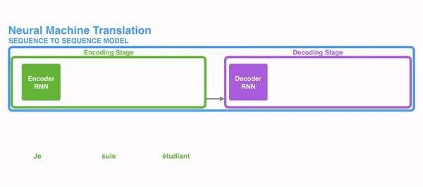
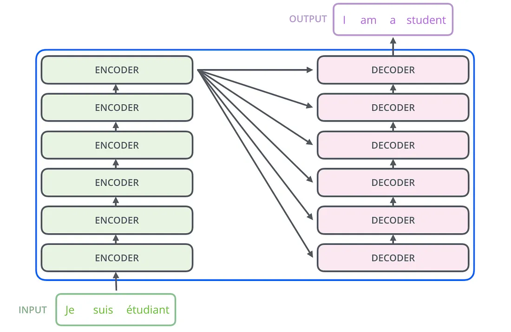

# Recurrent Neural Networks

The following picture shows how usually a sequence to sequence model works using Recurrent Neural Networks. Each word is processed separately, and the resulting sentence is generated by passing a hidden state to the decoding stage that, then, generates the output.

## The problem of long-term dependencies

RNNs become very ineffective when the gap between the relevant information and the point where it is needed become very large. That is due to the fact that the information is passed at each step and the longer the chain is, the more probable the information is lost along the chain.

In theory, RNNs could learn this long-term dependencies. In practice, they don’t seem to learn them. LSTM, a special type of RNN, tries to solve this kind of problem.

## Long-Short Term Memory (LSTM)

LSTMs make small modifications to the information by multiplications and additions. With LSTMs, the information flows through a mechanism known as cell states. In this way, LSTMs can selectively remember or forget things that are important and not so important.

Each cell takes as inputs x_t (a word in the case of a sentence to sentence translation), the previous cell state and the output of the previous cell. It manipulates these inputs and based on them, it generates a new cell state, and an output.

## The problem with LSTMs

The same problem that happens to RNNs generally, happen with LSTMs, i.e. when sentences are too long LSTMs still don’t do too well. he reason for that is that the probability of keeping the context from a word that is far away from the current word being processed decreases exponentially with the distance from it.

That means that when sentences are long, the model often forgets the content of distant positions in the sequence. Another problem with RNNs, and LSTMs, is that it’s hard to parallelize the work for processing sentences, since you are have to process word by word. To summarize, LSTMs and RNNs present 3 problems:

- Sequential computation inhibits parallelization
- No explicit modeling of long and short range dependencies
- “Distance” between positions is linear

## Attention

To solve these problems, Attention is a technique that is used in a neural network. 

For attention to be brought to RNNs in sequence transduction, we divide the encoding and decoding into 2 main steps. One step is represented in green and the other in purple. The green step is called the encoding stage and the purple step is the decoding stage.

But some of the problems that we discussed, still are not solved with RNNs using attention. For example, processing inputs (words) in parallel is not possible. For a large corpus of text, this increases the time spent translating the text.

## Convolutional Neural Networks

Convolutional Neural Networks help solve these problems. 

The reason why Convolutional Neural Networks can work in parallel, is that each word on the input can be processed at the same time and does not necessarily depend on the previous words to be translated.

The problem is that Convolutional Neural Networks do not necessarily help with the problem of figuring out the problem of dependencies when translating sentences. That’s why Transformers were created, they are a combination of both CNNs with attention.

## Transformer

To solve the problem of parallelization, Transformers try to solve the problem by using encoders and decoders together with attention models. Attention boosts the speed of how fast the model can translate from one sequence to another.

Internally, the Transformer has a similar kind of architecture as the previous models above. But the Transformer consists of six encoders and six decoders.

Each encoder consists of two layers: **Self-attention** and **a feed Forward Neural Network**.

The encoder’s inputs first flow through a self-attention layer. It helps the encoder look at other words in the input sentence as it encodes a specific word. The decoder has both those layers, but between them is an attention layer that helps the decoder focus on relevant parts of the input sentence.

## Self-Attention

As is the case in NLP applications in general, we begin by turning each input word into a vector using an embedding algorithm. Each word is embedded into a vector of size 512.

### Self-Attention Layer

Let’s first look at how to calculate self-attention using vectors, then proceed to look at how it’s actually implemented — using matrices.

The **first step** in calculating self-attention is to create three vectors from each of the encoder’s input vectors (in this case, the embedding of each word). So for each word, we create a Query vector, a Key vector, and a Value vector. These vectors are created by multiplying the embedding by three matrices that we trained during the training process.

Multiplying x1 by the WQ weight matrix produces q1, the “query” vector associated with that word. We end up creating a “query”, a “key”, and a “value” projection of each word in the input sentence.

What are the “query”, “key”, and “value” vectors?

The **second step** in calculating self-attention is to calculate a score. The score is calculated by taking the dot product of the query vector with the key vector of the respective word we’re scoring.

The **third and forth steps** are to divide the scores by 8 (the square root of the dimension of the key vectors used in the paper — 64. This leads to having more stable gradients. There could be other possible values here, but this is the default), then pass the result through a softmax operation. Softmax normalizes the scores so they’re all positive and add up to 1.

The **fifth step** is to multiply each value vector by the softmax score (in preparation to sum them up).

The **sixth step** is to sum up the weighted value vectors. This produces the output of the self-attention layer at this position (for the first word).

### Multihead attention

The idea behind it is that whenever you are translating a word, you may pay different attention to each word based on the type of question that you are asking. 

### Positional Encoding

Another important step on the Transformer is to add positional encoding when encoding each word. Encoding the position of each word is relevant, since the position of each word is relevant to the translation.

## Reference

- <https://towardsdatascience.com/transformers-141e32e69591>