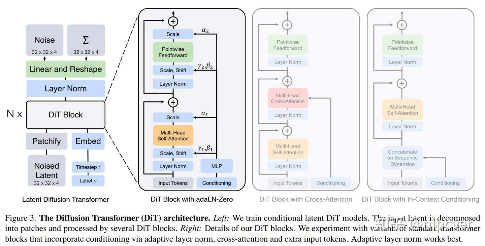
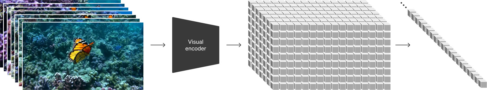
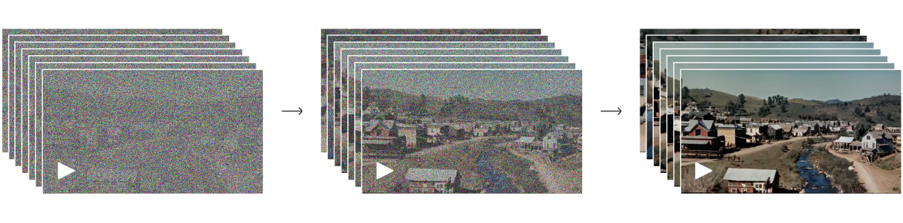

# Sora

Sora是一个先进的AI模型，它能够将文本描述转化为相应的视频内容。Sora是一个先进的AI模型，它能够将文本描述转化为相应的视频内容。用一句话概括Sora扩散模型的实现过程：将原视频训练素材压缩后给Sora学习，学习如何将压缩后的视频内容还原和生成新的视频

## Transformer结构

Transformer结构是一种深度学习模型的架构，最初是为了改进机器翻译任务而设计的。

1. Token或patch化
   对于文本，tokens是单词或字的部分
   对于图像，tokens是图像的一部分，如图像块
   对于视频，tokens是连续帧的一部分
2. 嵌入层(Embedding Layter)
   tokens会通过嵌入式层，其作用是将每个tokens转换成模型可以处理的固定大小的向量
3. 自注意力机制(Self-attention)
   自注意力是Transfomer的核心。这个机制使模型能够权衡每个token与序列中其他tokens之间的重要性。这意味着模型可以学习每个token如何与其他tokens相关联，从而更好的理解整个序列
4. 多头注意力(Multi-Head Attention)
   在这个阶段，模型同时从多个不同的角度进行学习输入tokens之间的关系
5. 位置编码(Positional Encoding)
   由于Transfomer本身不像循环神经网络那些具有处理序列的顺序信息的能力，因此需要添加位置编码来提供序列中每个token的位置信息，这确保了模型能够考虑到tokens的顺序
6. 编码器-解码器结构
   编码器负责处理输入tokens，而解码器则基于编码器的输出产生相应的输出。输入和输出都是序列数据。

## 扩散模型

扩散模型是一种先进的生成模型，其设计灵感来源于物理中的扩散过程。这种模型通过向数据中逐步引入噪声并再逆向去除这些噪声，最终能够生成高质量的数据，如图像或音频。这个过程包括两个关键阶段：一个是“正向过程”，在这个阶段中，模型逐步向数据中添加噪声；另一个是“逆向过程”，模型在这个阶段中逐渐去除噪声，恢复数据到其原始状态。

## Transformer结构的扩散模型

### 扩散模型基础

前向过程是一个T步逐渐加噪的马尔科夫链。

Encoder就是将原视频进行压缩，压缩至一个低维度的空间，压缩后视频充满了噪点，Sora就是学习压缩后的数据。

Decoder就是将压缩后的视频进行还原或创造，恢复至高清的像素空间。

