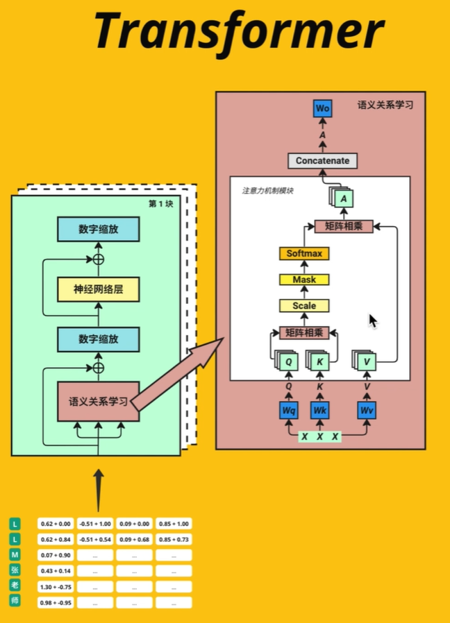
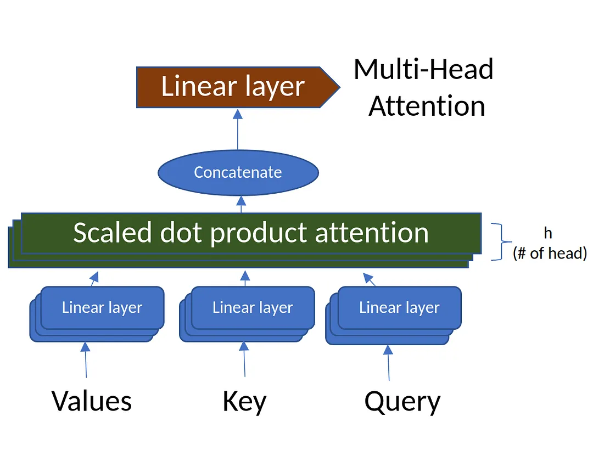
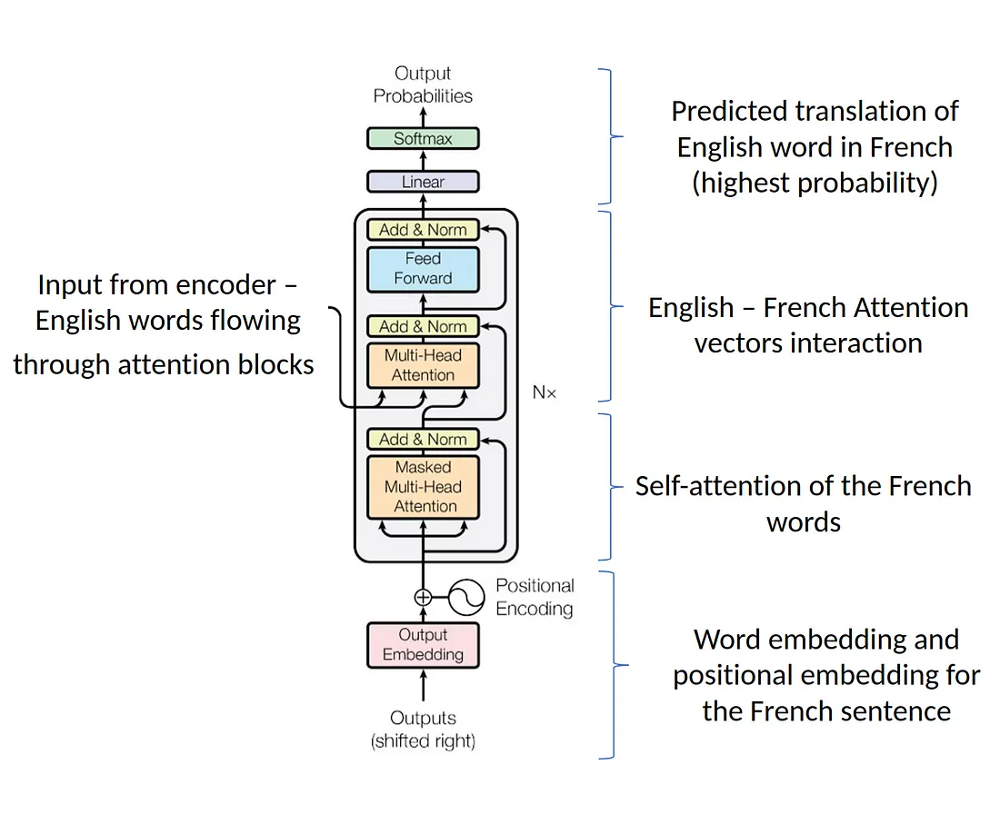
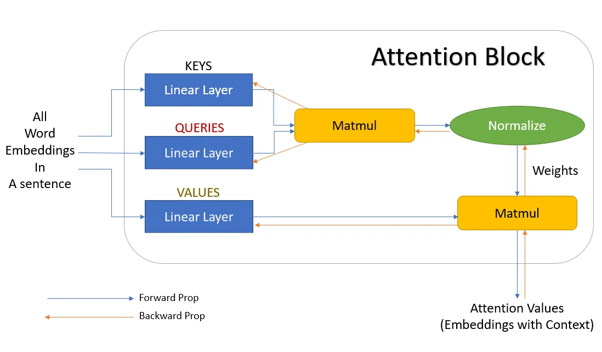
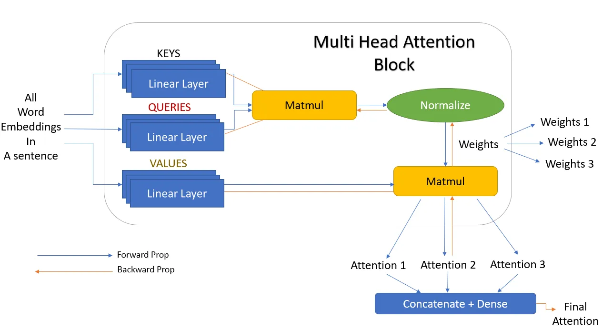

# Transformer

<https://jalammar.github.io/illustrated-transformer/>
<https://github.com/tensorflow/tensor2tensor>

Transformers is the new simple yet powerful neural network architecture introduced by Google Brain in 2017 with their famous research paper “Attention is all you need.” It is based on the attention mechanism instead of the sequential computation as we might observe in recurrent networks.

## RNN

- Suffers issues with long-range dependencies. RNNs do not work well with long text documents.
- Suffers from gradient vanishing and gradient explosion.
- RNNs need larger training steps to reach a local/global minima.
- RNNs do not allow parallel computation.

## CNN

## Transformer Architecture

### Encoder

``` code
Stage1_out = Embedding512 + TokenPositionEncoding512
Stage2_out = layer_normalization(multihead_attention(Stage1_out) + Stage1_out)
Stage3_out = layer_normalization(FFN(Stage2_out) + Stage2_out)

out_enc = Stage3_out
```

### Decoder

``` code
Stage1_out = OutputEmbedding512 + TokenPositionEncoding512

Stage2_Mask = masked_multihead_attention(Stage1_out)
Stage2_Norm1 = layer_normalization(Stage2_Mask) + Stage1_out
Stage2_Multi = multihead_attention(Stage2_Norm1 + out_enc) +  Stage2_Norm1
Stage2_Norm2 = layer_normalization(Stage2_Multi) + Stage2_Multi

Stage3_FNN = FNN(Stage2_Norm2)
Stage3_Norm = layer_normalization(Stage3_FNN) + Stage2_Norm2

out_dec = Stage3_Norm
```

## Attention

Attention between encoder and decoder is crucial in NMT. An attention function can be described as mapping a query and a set of key-value pairs to an output, where the query, keys, values, and output are all vectors. The output is computed as a weighted sum of the values, where the weight assigned to each value is computed by a compatibility function of the query with the corresponding key.

### Scaled Dot-Product Attention

In terms of encoder-decoder, the query is usually the hidden state of the decoder. Whereas key, is the hidden state of the encoder, and the corresponding value is normalized weight, representing how much attention a key gets. Output is calculated as a wighted sum – here the dot product of query and key is used to get a value.

```python
def attention(Q, K, V):
        num = np.dot(Q, K.T)
        denum = np.sqrt(K.shape[0])
        return np.dot(softmax(num / denum), V)
```

### Multi-head attention

Transformer reduces the number of operations required to relate (especially distant) positions in input and output sequence to a $O(1)$.

Transformer use multi-head ($d_{model}/h$ parallel attention functions) attention instead of single ($d_{model}$-dimensional) attention function.

### Self-Attention

In encoder, self-attention layers process input $queries, keys$ and $values$ that comes form same place i.e. the output of previous layer in encoder. Each position in encoder can attend to all positions from previous layer of the encoder

In decoder, self-attention layer enable each position to attend to all previous positions in the decoder, including the current position. To preserve auto-regressive property, the leftward information flow is presented inside the dot-product attention by masking out (set to $- \infty$) all $values$ that are input for softmax which correspond to this illegal connections.


In encoder phase (shown in the Figure 1.), transformer first generates initial representation/embedding for each word in input sentence (empty circle). Next, for each word, self-attention aggregates information form all other words in context of sentence, and creates new representation (filled circles). The process is repeated for each word in sentence. Successively building new representations, based on previous ones is repeated multiple times and in parallel for each word (next layers of filled circles).

Decoder acts similarly generating one word at a time in a left-to-right-pattern. It attends to previously generated words of decoder and final representation of encoder.

## Practices

What are the main components of transformers?


1. Input Embedding
   Token 将文本转换为数字，每个token一个向量(1, 512)
   Inputs = "我爱你"
   "我" = [1, 0, 0, ..., 0](1, 10000)
   "爱" = [0, 1, 0, ..., 0](1, 10000)
   "你" = [0, 0, 1, ..., 0](1, 10000)
   Embedd Space = (10000, 512)
   

2. Positional Encoding
   给文字加位置信息(不同语境下的语义信息)
   1. 每个单词的token都能包含它的位置信息，奇数sin偶数cos
   2. 模型可以看到文字之间的"距离"
   3. 模型可以看懂并学习到位置编码的规则
   4. 

3. Multi-Head Attention
   不同类型的相关度，语义关系学习
   "Bark is very cute and he is a dog".
   Here, if we take the word ‘dog’, the dog’s name is Bark, it is a male dog, and that he is a cute dog.
   
   1. Linear 将nx512拆分为multi-head nx8x64 => 8xnx64

   
   X = [batch_size, ctx_length, d_model]
   Wq = [d_model, d_model] => Q = X @ Wq = [batch_size, ctx_length, d_model]
   Wk = [d_model, d_model] => K = X @ Wk =
   Wv = [d_model, d_model] => V = X @ Wv =
   

   **切分multi-head Self-attention**

   Different types of relevance 不同类型的相关度

   
   [batch_size, ctx_length, num_heads, d_model/num_heads] => [batch_size, num_heads, ctx_length, d_model/num_heads]

   Q @ Kt = [batch_size, num_head, ctx_length, d_model/num_heads] @ [batch_size, num_head, d_model/num_heads, ctx_length]

4. Add & Norm

5. Feed Forward 全连接的前馈网络
6. Softmax
   Q @ K = [ctx_length, ctx_length]

   **Mask**

   QK [4, 4, 16, 16] @ V [batch_siz, num_head, ctx_length, 128] = A [4, 4, 16, 128]

   **Output**
   Wo [d_model, d_model]

   A @ Wo = Output [batch_size, ctx_length, d_model]




BERT (Bidirectional Encoder Representations from Transformers)
GPT (General Purpose Transformer)

## Mamba

## Reference

- <https://huggingface.co/docs/transformers/index>
- <https://www.datacamp.com/tutorial/an-introduction-to-using-transformers-and-hugging-face>
- <https://www.datacamp.com/tutorial/building-a-transformer-with-py-torch>
- <https://speech.ee.ntu.edu.tw/~hylee/ml/2023-spring.php>
- <https://towardsdatascience.com/build-your-own-transformer-from-scratch-using-pytorch-84c850470dcb>
- <https://jalammar.github.io/illustrated-transformer/>
- <https://github.com/karpathy/ng-video-lecture>

Example:

- <https://github.com/P3n9W31/transformer-pytorch>





