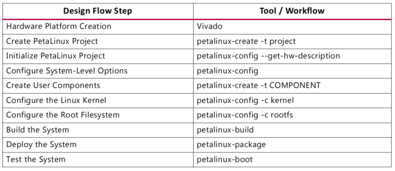
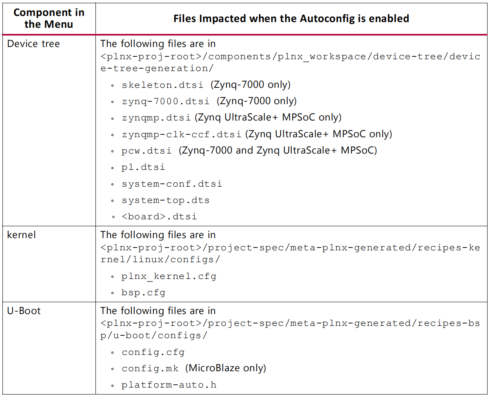

# Xilinx Petalinux Workflow

## Boot Pre-build Images from SD Card

## Boot Pre-built Images with JTAG

1. Power off
2. Connect the JTAG port
3. Connect the serial port
4. Connect the Ethernet port
5. Power on
6. petalinux-boot --jtag --prebuilt 3

## Test Pre-build PetaLinux Image with QEMU

1. petalinux-boot --qemu --prebuilt 3
   - `--prebuilt 1` performs FPGA bitstream
   - `--prebuilt 2` performs U-boot
   - `--prebuild 3` performs pre-build Linux image
2. Login to PetaLinux with default user name `root` and password `root`

> To exit QEMU, press Ctrl + A

## Testing the Re-build PetaLinux Images

### Testing the Re-built Image on Hardware

1. petalinux-boot --jtag --u-boot --fpga --bitstream < Bit-stream >
2. petalinux-boot --jtag --kernel --fpga --bitstream < Bit-stream >

### Testing the Re-build Image with QEMU

1. petalinux-boot --qemu --kernel
2. login as `root` with password `root`

## Working with a petalinux Project

### Creating a new project

petalinux-create --type prject --template < CPU_TYPE > --name < PROJECT >

### Import Hardware Description

petalinux-config --get-hw-description=< path-to-directory-which-contains-hardware-description-file >

### Configure Project Components

petalinux-config
petalinux-config -c kernel
petalinux-config -c rootfs

### Boot the default Linux Kernel Image

petalinux-boot --qemu --kernel

### Boot a Specific Linux Image

petalinux-boot --qemu --image < path-to-linux-iamge-file >

### Boot a linux image with a specific DTB

petalinux-boot --qemu --image ./images/linux/zImage --dtb ./images/linux/system.dtb

## Building a bootable system image

### Generate boot image for zynq device

petalinux-package --boot --format BIN --fsbl < FSBL image > --fpga < FPGA bitstream > --u-boot

## Internal Architecture of Petalinux Projects

