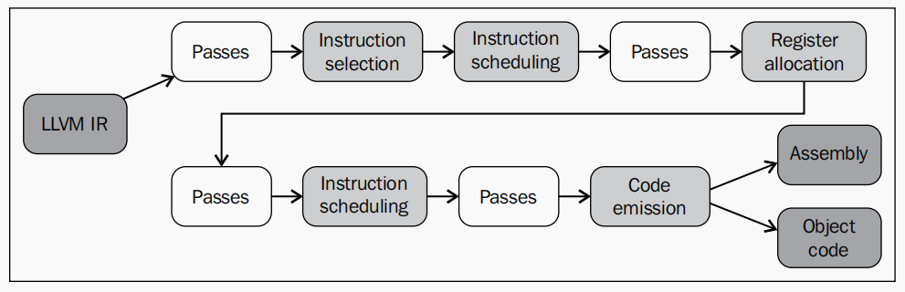

# LLVM Backend

- Code generation analysis and transform passes that converts the LLVM IR into object code(or assembly)  
- All backends share a common interface, which is part of the target-indpendent code generator, abstracting away the backend tasks by means of a generic API
- Each target must specialize the code generator generic classes to implement target-specific behavior

## Overview of LLVM backend

The following diagram shows an overview of the neccessary steps to go from LLVM IR to object code or assembly


- **Instruction Selection** converts the in-memory IR representation into target-specific *SelectionDAG* nodes. This phase converts the three-address structure of the LLVM IR to a **Directed Acyclic Graph(DAG)** form

- After instruction selection, **Instruction scheduling**, also called **Pre-register Allocation(RA) Scheduling**, orders the instructions while trying to explore instruction-level parallelism as much as possible. The instructions are then converted to the *MachineInstr* three-address representation

- LLVM IR has an infinite set of registers until we reach **Register Allocation**, which transforms an infinite set of virtual register into a finite set of target-specific registers

- The second instance of **Instruction Scheduling**, also called **Post-register Allocation(RA) Scheduling**. Since real register information is now avaliable at this point, extra hazards and delays associated with certain type of register can be used to improve instruction order

- **Code Emission** converts instructions from the *MachineInstr* representation to *MCInst* instances. In this representation, which is more suitable for assembler and linker, two options: to emit assembly code or a specific binary object code format

Backend pipeline: in-memory LLVM IR -> SelectionDAG nodes -> MachineInstr -> MCInst

> :memo: **Note:** IR has target-dependent aspects despite being designed as a common language for all backends. Since C/C++ languages have target-dependent attributes

``` sh
llc sum.bc -o sum.s
lcc sum.bc -filetype=obj -o sum.o
lcc -march=mips -filetype=obj sum.bc -o sum.o
```

### backend code structure

- **CodeGen** directory contains implementation files and headers for all generic code generation algorithm: instruction selection, scheduler, register allocation, and all analysises needed for them
- **MC** directory contains the implementation of low-level functionality for the assembler, disassembler, and specific object file such as ELF, COFF and so on
- **TableGen** directory holds the complete implementation of the TableGen tool, which is used to generate C++ code based on high-level target descriptions found in .td files
- **Target** is implemented in a different subfolder under the Target folder(for example, Target/Mips) with several .cpp, .h, and .td files

|Filenames |Description |
|:---------|:-----------|
|tools/llc/llc.cpp |llc |
|Target/Sparc/Sparc.td |Definition of machine features, CPU variations, and extension features |
|Target/Sparc/SparcInstrInfo.td </br> Target/Sparc/SparcInstrFormats.td |Instruction and format definitions |
|Target/Sparc/SparcRegisterInfo.td |Registers and register classes definitions |
|Target/Sparc/SparcISelDAGToDAG.cpp |Instruction selection |
|Target/Sparc/SparcAsmPrinter.cpp | Assembly code emission |
|Target/Sparc/SparcCallingConv.td |ABI-defined calling conventions |

The tareget-independent code generator libraries are the following
|Libraries   |Description |
|:-----------|:-----------|
|AsmParser.a |This library contains code to parse assembly text and implement an assembler |
|AsmPrinter.a | |
|CodeGen.a | |
|MC.a | |
|MCDisassembler.a ||
|MCJIT.a ||
|MCParser.a ||
|SelectionDAG.a ||
|Target.a ||

The target-specific libraries
|Filenames |Description |
|:---------|:-----------|
|\<Target\>AsmParser.a |This library contains the target-specific part of the AsmParser library, responsible for implementing an assembler for the target machine |
|\<Target\>AsmPrinter.a ||
|\<Target\>CodeGen.a||
|\<Target\>Desc.a||
|\<Target\>Disassembler.a||
|\<Target\>Info.a||

## TableGen files that describe a backend

The idea was to declare machine aspects in a single location.Nowadays, TableGen is used to describe all kinds of target-specific information, such as instrution formats, instructions, registers, pattern-matching DAGs, instruction selection matching order, calling conventions, and target CPU properties(supported ISA features and processors families)

### TableGen Language

insns.td

``` C++
class Insn<bits <4> MajOpc, bit MinOpc> {
    bits<32> insnEncoding;
    let insnEncoding{15-12} = MajOpc;
    let insnEncoding{11} = MinOpc;
}

multiclass RegAndImmInsn<bits <4> opcode> {
    def rr: Insn<opcode, 0>;
    def ri: Insn<opcode, 1>;
}

def SUB: Insn<0x00, 0>;
defm ADD: RegAndImmInsn<0x01>;
```

``` sh
llvm-tblgen -print-records insns.td
>>
------------- Classes -----------------
class Insn<bits<4> Insn:MajOpc = { ?, ?, ?, ? }, bit Insn:MinOpc = ?> {
  bits<32> insnEncoding = { ?, ?, ?, ?, ?, ?, ?, ?, ?, ?, ?, ?, ?, ?, ?, ?, Insn:MajOpc{3}, Insn:MajOpc{2}, Insn:MajOpc{1}, Insn:MajOpc{0}, Insn:MinOpc, ?, ?, ?, ?, ?, ?, ?, ?, ?, ?, ? };
}
------------- Defs -----------------
def ADDri {     // Insn
  bits<32> insnEncoding = { ?, ?, ?, ?, ?, ?, ?, ?, ?, ?, ?, ?, ?, ?, ?, ?, 0, 0, 0, 1, 1, ?, ?, ?, ?, ?, ?, ?, ?, ?, ?, ? };
}
def ADDrr {     // Insn
  bits<32> insnEncoding = { ?, ?, ?, ?, ?, ?, ?, ?, ?, ?, ?, ?, ?, ?, ?, ?, 0, 0, 0, 1, 0, ?, ?, ?, ?, ?, ?, ?, ?, ?, ?, ? };
}
def SUB {       // Insn
  bits<32> insnEncoding = { ?, ?, ?, ?, ?, ?, ?, ?, ?, ?, ?, ?, ?, ?, ?, ?, 0, 0, 0, 0, 0, ?, ?, ?, ?, ?, ?, ?, ?, ?, ?, ? };
}
```

## Instruction selection

[llvm_backend_instruction_selection](llvm_backend_instruction_selection.md)

## Instruction scheduling and register allocation

## Code emission

## How to write your own backend pass
