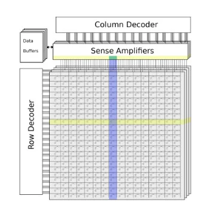

# DRAM

The data is stored in the DRAM devices, which are implemented as separate chips. Access to these devices is managed by memory controllers.

## What Is DRAM

Memory is fundamental in the operation of a computer. When combined with a CPU, the ability to run sets of instructions (programs) and store working data becomes possible. Random-access memory (RAM) is a well-known type of memory and is so-called because of its ability to access any location in memory with roughly the same time delay.

## How does DRAM work?

DRAM works much differently than other types of memory. The fundamental storage cell within DRAM is composed of two elements: a transistor and a capacitor.

When a bit needs to be put in memory, the transistor is used to charge or discharge the capacitor. A charged capacitor represents a logic high, or '1', while a discharged capacitor represents a logic low, or '0'. The charging/discharging is done via the wordline and bitline, shown in below.

ually problematic is the fact that the capacitors leak charge over time. Therefore, to maintain the data stored in memory the capacitors must be refreshed periodically. Refreshing works just like a read and ensures data is never lost. This is where DRAM gets the “Dynamic” moniker from—the charge on a DRAM cell is dynamically refreshed every so often. Contrast this with SRAM (Static RAM) which retains its state without needing to be refreshed.

## How Is DRAM Organized?

The rank of a DRAM module is the highest level of organization within a DIMM. Below that, each chip is organized into a number of banks and memory arrays containing rows and columns. Figure 3 shows a DRAM chip with four banks.

Each bank operates independently of the others. This means that reading, writing, and precharging can all be done on one bank without impacting the other.

### Rank, Bank, Row, and Column

As mentioned earlier, the rank of a DRAM is a set of separately addressable DRAM chips. Each DRAM chip is further organized into a number of banks that contain a set of memory arrays. The number of memory arrays per bank is equal to the size of the output width. Therefore in a x4 DRAM chip, the internal banks would each have four memory arrays. Figure 4 shows an example of a single x4 bank.

The gray section is the memory array designed as a grid of rows and columns. A set of decoders are used to access the rows and columns, selecting a single intersection within the memory array. It is at this intersection that a small capacitor stores a charge representing the data being accessed.

Sense amplifiers perform precharge operations on capacitors and generate logic-level outputs for a number of data buffers that store the data until it can be retrieved by a memory controller or CPU.

## Executing Commands in Memory: DRAM Commands

How does a processor or memory controller tell the DRAM to return or store specific data in a specific location?

To execute a command, a memory controller will write values to a set of inputs within the DRAM. These inputs belong to the DRAM's command decoder. This decoder has a 4-bit input where, depending on the combination of bits, a different command gets requested.

These active-low inputs all have names and are typically defined as CS, CAS, RAS, and WE:

- CS: chip select (enables or disables the command decoder)
- RAS: row address strobe
- CAS: column address strobe
- WE: write enable

### Command Inhibit

To use the command, the CS input is brought high (and other inputs are disregarded, i.e., “don't care”). As mentioned earlier, CS stands for chip select and disables the command decoder.

### Activate

Activate is essentially the row access command. Meaning, it opens up a row and moves the charge from the capacitors into the sense amplifiers. Accessing a row is always done before a column in DRAM. This command is paired with inputs to a bank address register (that selects the current bank) and a row address register (that selects the desired row).

### Precharge

Precharge deactivates the row currently open in a bank. When issued a precharge command, the DRAM is told to restore the values read from the row of capacitors. This is done by the sense amplifiers and when completed prepares the bank for another row access. Precharge is performed by pulling CS, RAS, and WE low and leaving CAS high.

### Read

The read command can also be thought of as a column read command. When combined with a proper bank address and column address, the data recently moved into the sense amplifiers from an activate command (row access) is now pushed onto the data bus.

DRAMs often include a “Read and Auto-Precharge” command that performs the column read and then closes/precharges the row.

### Write

A write command is virtually the same as a read, except for the direction of the data. During a write command, data is pulled off of the data bus and put into the selected bank, row, and column. Auto-precharging can be performed much like a read and closes the currently activated row when the write is done. To perform a write, CS, CAS, and WE are pulled low, while RAS is held high.

Below shows an activate command (row access) in yellow, with a subsequent read/write command (column access) in blue. The data at the intersection of the row and column, shown in green, is moved between the sense amplifiers and data buffers.

### Refresh

What differentiates DRAM from other kinds of random access memory is the fact that the capacitors used for memory storage will leak charge over time. Thus, DRAM is dynamic because it needs to be periodically refreshed. One important aspect of refreshing is that any active banks should be precharged before the command is issued. Most DRAMs will perform 8192 refresh cycles every 64 ms.

### Other Commands

## Conclusion

Since a single DRAM cell is composed of only two components—a transistor and a capacitor—DRAM can be made in high densities, and it is inexpensive compared to other types of memory.

## Reference

- <https://www.allaboutcircuits.com/technical-articles/executing-commands-memory-dram-commands/>
- <https://www.allaboutcircuits.com/technical-articles/introduction-to-dram-dynamic-random-access-memory/>
