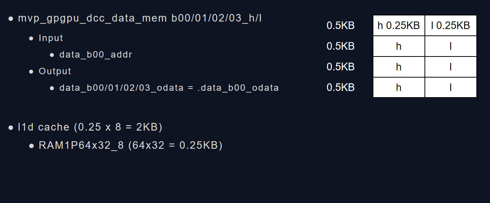

# L1 Data Cache

## L1 Data Cache Size

L1 Data Cache是一个直接映射类型的缓存。每个Block的大小是32bit，一共有512个Block，总大小是2KB. 这里为了提升Cache的性能增加cache bandwidth，采用了multibanked cache技术，将cache拆分为8个bank。当前实现中记录32个miss。

L1D的主要作用是为SP上运行的线程缓存数据。当前的设计，data_mem内部有4个h和4个l的ram块。每个块的含有64个32bit的数据项。h和l根据数据地址的[0]bit来决定，0表示h,1表示l。L1D的数据来自于XI，OCC或RBUS。XI进来的数据每个时钟周期只有32bit，

Entries: 64 => 6-bit

-gpgpu_cache:dl1 m_L1D_config.m_config_string

 1路组相连，Block=32bit, 512个Block，8个Bank
gpgpu_cache:dl1 N:512:32:1,L:R:f:N:L,S:2:48,4 

N:512:32:1 (ct, m_nset, m_line_sz, m_assoc)
:    ct:N-Normal
    m_nset: 512
    m_line_sz: 32
    m_assoc: 1

L:R:f:N:L (rp, wp, ap, wap, sif)
:   rp:L-LRU
    wp:R-read only B-write back T-write through E-write evict 
    ap:
    wap:
    sif:

S:2:48 (mshr_type, m_mshr_entries, m_mshr_max_merge)
:   mshr_type:S-SECTOR_ASSOC A-ASSOC

miss    (m_miss_queue_size, m_result_fifo_entries)
:   m_miss_queue_size

4   (m_data_port_width)
:   m_data_port_width

load $3, 3($sp)
    - 4 Byte 32 Byte muid=273
    - muid=305 orig = 273
    - print(L1D content)