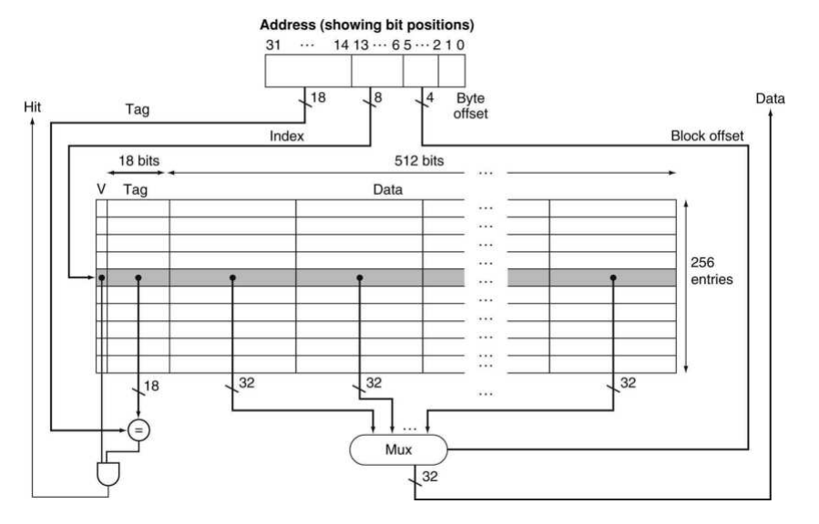

# Data Access Process

## L1I Cache Access Process

### Inst Access

- fetch()
- m_L1I->access() -> m_miss_queue -> m_memport = m_inct
- m_inct = shader_memory_interface(m_gpc)
  - icnt_inject_request_packet()
    - ::icnt_push()

### Inst Response

- icnt_cycle()
  - accept_fetch_response()
    - m_L1I->fill(mf)

## L1D Cache Access Process

### Data Access

- execute()
- 

### Data Response

- icnt_cycle()
  - accept_ldst_unit_response()
  - m_ldst_unit->fill(mf)
    - m_response_fifo
- execute()->m_fu[ldst]-cycle()
  - L1D->fill()
