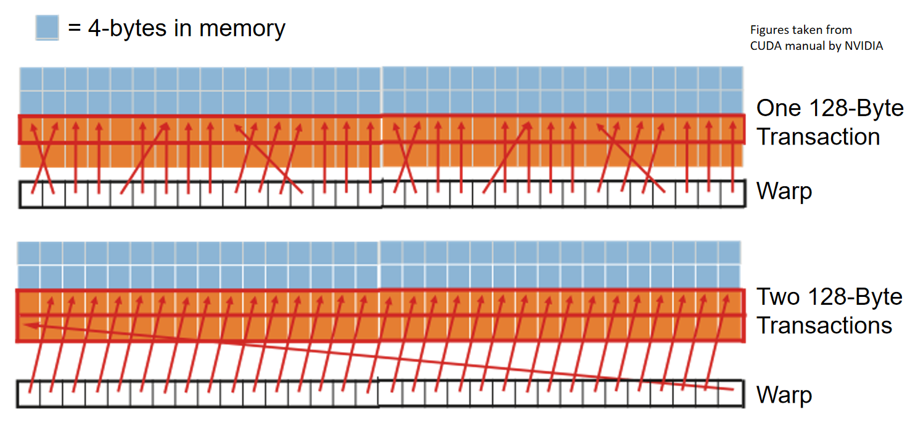

# LDST unit

GPU memory system starts with load-store units. These units process memory access instructions and emit the necessary memory transactions.

在Exec阶段，生成load、store的mem_fetch的流程如下：

1. stream_processor::cycle()
2. stream_processor::execute()
3. ldst_unit::cycle()
4. ldst_unit::memory_cycle()
5. ldst_unit::process_memory_access_queue_l1cache()
6. l1_latency_queue[bank_id][m_config->m_L1D_config.l1_latency - 1] = mf;

在Exec阶段，会执行load和store指令，进而从DRAM中拉取或存储数据，具体调用流程如下

1. stream_processor::cycle()
2. stream_processor::execute()
3. ldst_unit::cycle()
4. ldst_unit::L1_latency_queue_cycle()
5. l1_cache::access()
6. data_cache::access()
   1. m_tag_array->probe(block_addr, cache_index, mf, true)
   2. data_cache::process_tag_probe()
      1. data_cache::rd_miss_base()
         1. baseline_cache::send_read_request()
7. m_miss_queue.push_back(mf)

## ldst_unit::cycle()

1. 如果m_response_fifo不为空，则从中取出返回的mf请求
2. m_L1D

### ldst_unit::memory_cycle()

#### ldst_unit::process_memory_access_queue_l1cache()

## Coalescing

- Combining memory accesses made by threads in a warp into fewer transactions
- This reduces the number of transactions between SIMT cores and DRAM

### Coalescing example

- m_pending_writes--
process_cache_access()
L1_latency_queue_cycle()
memory_cycle()
write_back()
- m_pending_writes--
ldst_unit::issue()