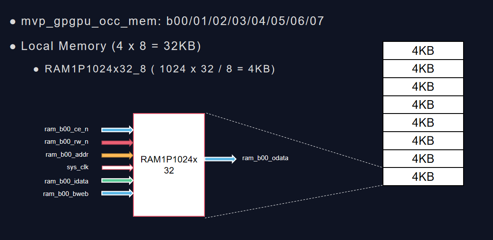

# Local Memory


32KB = 4KB x 8 bank
4KB = 1024 x 32 /8

按照当前RTL的设计，每个线程的栈大小为1KB，那么意味着一个Bank内有4个线程的栈

## How to generate bank id ?

> bank id = (addr / 4) % number_local_memory_bank

由于线程的栈是存在local memory中，每个栈的大小是1KB。所以bank_id应该用需要访问的栈的地址来除以bank的size，具体如下
> bank id = (addr / 4096) % number_local_memory_bank

### 线程栈的分配策略

这样就衍生出一个问题，线程栈的分配策略问题。不同的策略将对性能有不一样的影响。

1. 如果按顺序线程0，1，2，3在bank0中分配，那么线程0123将会在访问栈时由bank冲突
2. 如果按照bank0分配线程0，bank1分配线程1，bank2分配线程2，bank3分配线程3的策略，在并发访问栈时将没有bank冲突，性能更好

## Example

以32个浮点数的平方及32个线程为例来理解Local Memory的运作方式

```asm
 PC=0x0010 (_cl_hello.s:15) st.w$ra, 52($sp)
 PC=0x0018 (_cl_hello.s:16) st.w$6, 36($sp)
 PC=0x0020 (_cl_hello.s:17) st.w$5, 32($sp)
 PC=0x0028 (_cl_hello.s:18) st.w$4, 40($sp)
```

当前线程栈的大小是1024Byte，而每个bank的大小是4KB，也就是每个Bank只有4个线程栈，根据此配置，Local Memory中的内容如下：

|bank0|bank1|bank2|bank3|bank4|bank5|bank6|bank7|
|:--  |:--  |:--|:--|:--|:--|:--|:--|
|0    |4    |8  |12 |||||
|1    |5    |9  ||||||
|2    |6    |10 ||||||
|3    |7    |11 ||||||
