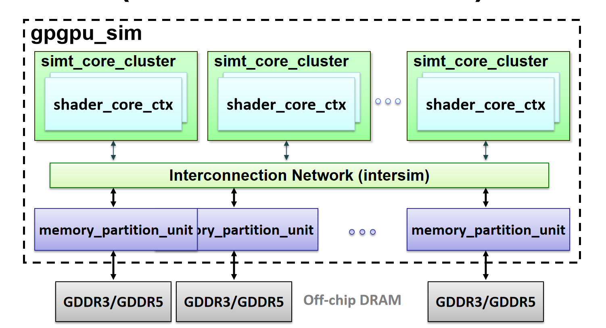

# Memory note

## Shared Memory Mapping

|   |Nvidia       |AMD              |Intel              |OpenCL      |
|:--|:--          |:--              |:--                |:--         |
|   |L1 Cache & Shared Memory|Local Data Share |Shared Local Memory|local memory|

Shared Memory is faster than L1 cache access because it doesn’t require tag comparisons and status checks to make sure there’s a hit.

mem_fetch allocation as following：

- mem_fetch *mf = new mem_fetch() at fetch stage
- m_mem_fetch_allocator at ldst_unit()
  mem_fetch *mf = m_mf_allocator->alloc()
  done &= memory_cycle(pipe_reg, rc_fail, type)
- mem_fetch *partition_mf_allocator::alloc() in memory_sub_partition
  m_mf_allocator = new partition_mf_allocator(config);
- wr_miss_wa_naive
  mem_fetch *n_mf = new mem_fetch()
- wr_miss_wa_fetch_on_write
  mem_fetch *n_mf = new mem_fetch()
- rd_miss_base
  mem_fetch *wb = m_memfetch_creator->alloc()  

mem_fetch接口：
mem_fetch_interface

### mem_fetch

- m_access: 访问的类型
- m_inst: warp指令
- m_request_uid：请求的id，全局唯一编号
- m_sid: sp_id
- m_tpcid
- m_gpcid
- m_wid: warp id
- m_raw_addr: raw physical address, 比如decoded DRAM, chip-row-bank-column address, 从access.get_addr()转换而来
- m_partition_addr：从access.get_addr()转换而来
- m_type：访问的类型，读或者写请求
- m_timestamp：时间戳，等于cycle
- original_mf: = m_original_mf  在进入interconnect的时候是0，但从interconnection到memory_partition_unit的时候会重新生成一个
- original_wr_mf: m_original_wr_mf

#### What mem_fetch go through

1. if (clock_mask & L2) m_memory_sub_partition[i]->push(mf, gpu_sim_cycle + gpu_tot_sim_cycle)
2. reqs = breakdown_request_to_sector_requests(m_req)
3. mem_fetch *n_mf = new mem_fetch(*ma, NULL, mf->get_ctrl_size(), mf->get_wid(), mf->get_sid(), mf->get_tpc(), mf->get_gpc(), mf->get_mem_config(), m_gpu->gpu_tot_sim_cycle + m_gpu->gpu_sim_cycle, mf)
4. result.push_back(n_mf)

初始化微架构的时候，创建如下memory

1. 内存分区单元(Memory partition unit)包含所有与一个DRAM通道相关联的单元。它在多个子分区之间仲裁DRAM通道。
m_memory_partition_unit = new memory_partition_unit *[m_memory_config->m_n_mem];

1. 每个channel的子分区
m_memory_sub_partition = new memory_sub_partition *[m_memory_config->m_n_mem_sub_partition];

-mvpgpu_n_mem 12
-mvpgpu_n_sub_partition_per_mchannel 2

### memory partition latency config

-gpgpu_l2_rop_latency 160
-dram_latency 100

## 该接口想互联网络请求memory

### icnt_inject_request_packet

从GPC到Interconnection，所以net是0
icnt_push(m_gpc_id, m_sp_config->mem2device(destination), (void *)mf, mf->get_ctrl_size())
从DRAM到Interconnection，所以net是1
::icnt_push(m_sp_config->mem2device(i), mf->get_gpc(), mf, response_size);

void LocalInterconnect::Push(unsigned input_deviceID, unsigned output_deviceID, void* data, unsigned int size)

### icnt_ejection_request_packet

从Interconnect到DRAM
mem_fetch *mf = (mem_fetch *)icnt_pop(m_sp_config->mem2device(i));
从Interconnect到GPC
mem_fetch *mf = (mem_fetch *)::icnt_pop(m_gpc_id)

[Bug]

1. gpu_uarch.cc::1028

## Reference

- <https://chipsandcheese.com/2023/07/02/nvidias-h100-funny-l2-and-tons-of-bandwidth/?utm_source=mailpoet&utm_medium=email&utm_campaign=new-post-from-chips-and-cheese>
