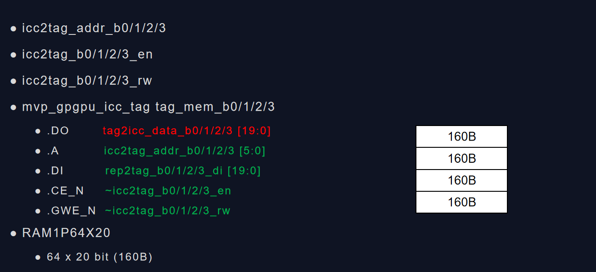
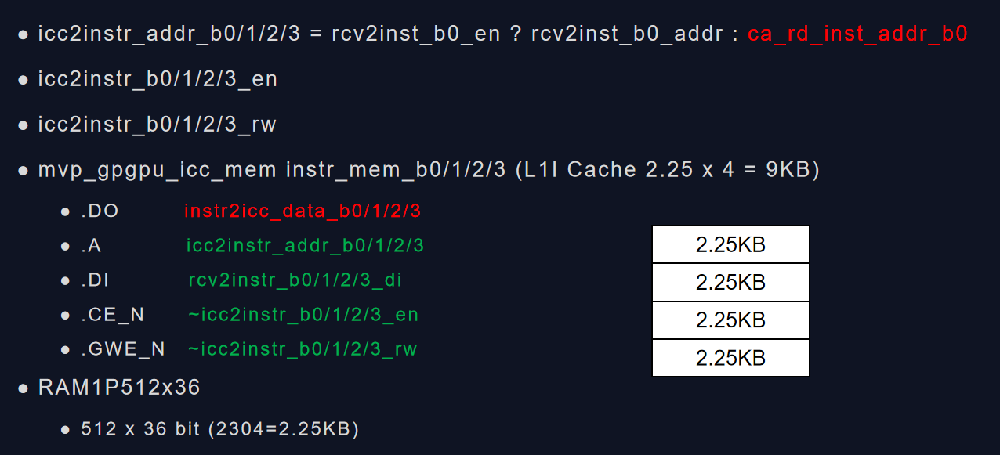
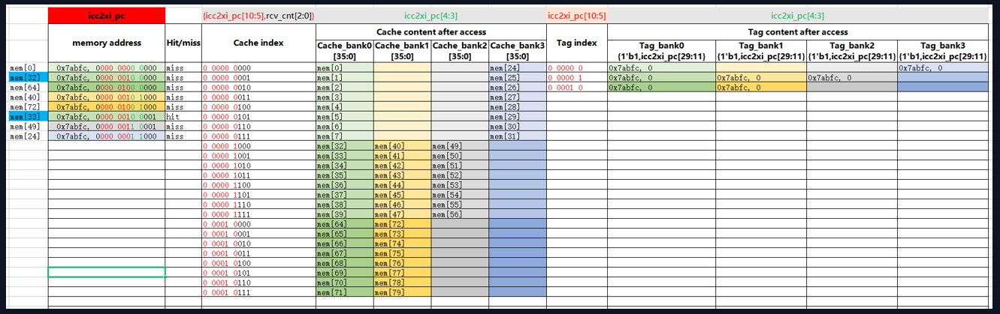
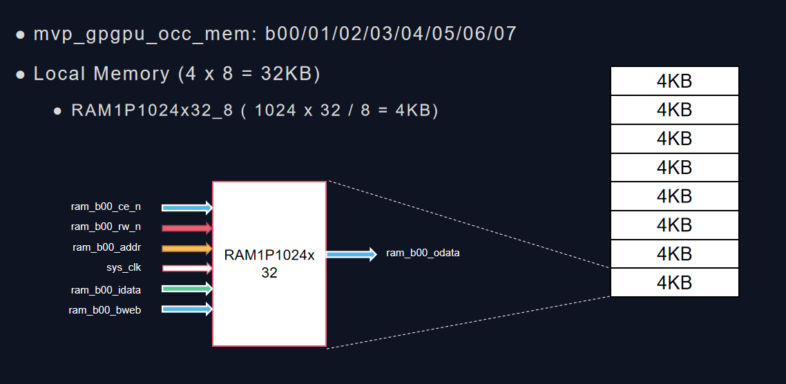

# Memory subsystem notes

> 本文的目标是Profiling存储子系统的各单元在MVP v3.0设计中的大小

## MVP Memory subsystem

MVP Memory subsystem简图如下：


对Memory的访问应该有如下几条路径：

- FE阶段从L1 Instruction Cache中取指令
- RF阶段从寄存器中读取数据
- EX阶段，如果指令是st/ld指令，则需要访问L1 Data Cache或者Local Memory

下面针对上述几条路径，分别进行解析

- FE

- RF

- EX

- func_exec_inst函数在EX阶段用来产生memory访问请求

SP通过该函数调用warp指令的generate_mem_access函数来处理访存操作

## Register File Size

寄存器文件的大小跟编译器和线程数量相关，如果每线程占用的寄存器数量扩大一倍，也将间接影响local memory的大小。这部分需要编译器一起进行分析确认

### Regisrer File Cache

?

## L1 Inst Cache Size

L1 Inst Cache是一个直接映射类型的缓存。每个Block的大小是32bit（但实际占用36bit），一共有2048个Block，总大小是9KB. 这里为了提升Cache的性能增加cache bandwidth，采用了multibanked cache技术，将cache拆分为4个bank。

L1I Cache主要是为了缓存SP上线程指令，提升流水线运行效率，避免stall。SP中L1I设计为9KB总容量，data mem和tag mem分别有4个bank，mem每个bank有512个blocks，tag每个bank有64个tag。每个tag对应在mem中有8个32bits的数据。miss的情况下会从XI读取数据，一个地址一次会取8个32bits数据。hit的情况下直接从data mem取指令。





Bank: 4 => 2-bit
Cache entries: 512 => 9-bit
Cache index:   6-bit + 3-bit
Data: 32-bit

miss后DRAM的访问请求能够取回256-bit的数据，填充8个entries，每个32bit.

Tag: 20-bit
Tag entries: 64 = > 6-bit
Tag index: 6-bit
tag content: 20-bit

``` sh
{<nsets>:<bsize>:<assoc>,<rep>:<wr>:<alloc>:<wr_alloc>,<mshr>:<N>:<merge>,<mq>}
```

<font color='#00f'> 1路组相连，Block=32bit, 2048个Block，4个Bank 
gpgpu_cache:il1 N:2048:36:1,L:R:f:N:L,S:2:48,4 </font>

-gpgpu_cache:il1 m_L1I_config.m_config_string

-gpgpu_inst_fetch_throughput 4
-gpgpu_cache:il1 N:64:128:16,L:R:f:N:L,S:2:48,4

N:64:128:16,  L:R:f:N:L,      S:2:48,   10:10,  4
"%c:%u:%u:%u, %c:%c:%c:%c:%c, %c:%u:%u, %u:%u,  %u",
&ct, &m_nset, &m_line_sz, &m_assoc,
&rp, &wp, &ap, &wap, &sif,
&mshr_type, &m_mshr_entries, &m_mshr_max_merge,
&m_miss_queue_size, &m_result_fifo_entries, &m_data_port_width);

ct=N
m_nset=64
m_line_sz=128
m_assoc=16

rp = L
wp = R
ap = f
wap = N
sif = L

mshr_type = S
m_mshr_entries = 2
m_assoc = 48

m_miss_queue_size = 10
m_result_fifo_entries = 10

m_data_port_width = 4

所有只读cache的配置都使用cache_config来定义
mutable cache_config m_L1I_config

- `<rep>` L,F       m_replacement_policy
- `<wr>`  R,B,T,E,L m_write_policy
- `<alloc>` m,f,s   m_alloc_policy
- `<wr_alloc>`

### L1 Inst Cache初始化流程


gpgpu_n_mem_read_global = 6144
gpgpu_n_mem_write_global = 12288
gpgpu_n_load_insn  = 589824
gpgpu_n_store_insn = 491520

traffic_breakdown_coretomem[GLOBAL_ACC_R] = 49152 {8:6144,}
traffic_breakdown_coretomem[GLOBAL_ACC_W] = 491520 {40:12288,}
traffic_breakdown_coretomem[INST_ACC_R] = 6144 {8:768,}
traffic_breakdown_memtocore[GLOBAL_ACC_R] = 983040 {40:24576,}
traffic_breakdown_memtocore[GLOBAL_ACC_W] = 98304 {8:12288,}
traffic_breakdown_memtocore[INST_ACC_R] = 122880 {40:3072,}

### What is stream cache

Refer to [^1]

### Optimization

编译器能否插入特定指令帮助处理器提前预取数据，来提升cache的命中率？

## L1 Data Cache Size

L1 Data Cache是一个直接映射类型的缓存。每个Block的大小是32bit，一共有512个Block，总大小是2KB. 这里为了提升Cache的性能增加cache bandwidth，采用了multibanked cache技术，将cache拆分为8个bank。当前实现中记录32个miss。

L1D的主要作用是为SP上运行的线程缓存数据。当前的设计，data_mem内部有4个h和4个l的ram块。每个块的含有64个32bit的数据项。h和l根据数据地址的[0]bit来决定，0表示h,1表示l。L1D的数据来自于XI，OCC或RBUS。XI进来的数据每个时钟周期只有32bit，


Entries: 64 => 6-bit

-gpgpu_cache:dl1 m_L1D_config.m_config_string

<font color='#00f'> 1路组相连，Block=32bit, 512个Block，8个Bank
gpgpu_cache:dl1 N:512:32:1,L:R:f:N:L,S:2:48,4 </font>

gpgpu_n_load_insn  = 589824 589824/98304=6

gpgpu_n_store_insn = 491520 491520/98304=5

gpgpu_stall_shd_mem[global_mem][resource_stall] = 18432
gpgpu_stall_shd_mem[local_mem][resource_stall] = 459056

## Local Memory Size


32KB = 4KB x 8 bank
4KB = 1024 x 32 /8

## L2 Cache Size

## DRAM

### dram model config

-gpgpu_l2_rop_latency 160
-dram_latency 100

-gpgpu_dram_partition_queues 64:64:64:64
-gpgpu_perf_sim_memcpy 1
-gpgpu_memory_partition_indexing 0

-gpgpu_dram_scheduler 1
-gpgpu_frfcfs_dram_sched_queue_size 64
-gpgpu_dram_return_queue_size 192

m_memory_partition_unit
m_memory_sub_partition

### GDDR6

-gpgpu_n_mem_per_ctrlr 1
-gpgpu_dram_buswidth 2
-gpgpu_dram_burst_length 16
-dram_data_command_freq_ratio 4
-gpgpu_mem_address_mask 1
-gpgpu_mem_addr_mapping dramid@8;00000000.00000000.00000000.00000000.0000RRRR.RRRRRRRR.RBBBCCCC.BCCSSSSS

//Use the same GDDR5 timing, scaled to 3500MHZ
-gpgpu_dram_timing_opt "nbk=16:CCD=4:RRD=10:RCD=20:RAS=50:RP=20:RC=62:
                        CL=20:WL=8:CDLR=9:WR=20:nbkgrp=4:CCDL=4:RTPL=4"

//select lower bits for bnkgrp to increase bnkgrp parallelism
-dram_bnk_indexing_policy 0
-dram_bnkgrp_indexing_policy 1

//-dram_seperate_write_queue_enable 1
//-dram_write_queue_size 64:56:32

## Reference

[^1]: <https://www.cl.cam.ac.uk/research/srg/projects/fairisle/bluebook/12/scache/node2.html>
