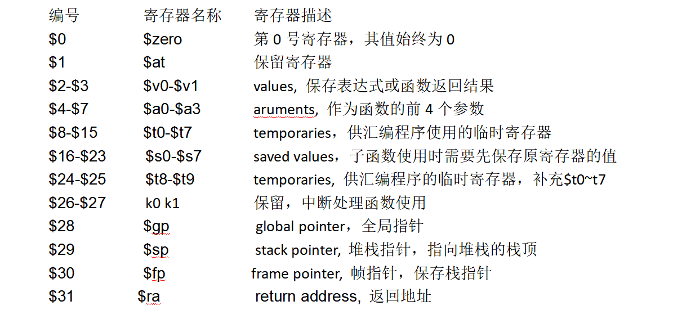

# Scoreboard

定义在Scoreboard类中，只有寄存器状态表和长操作状态表（从代码看目前load操作认为是长操作）。

```c
class Scoreboard {
 public:
  Scoreboard(unsigned sid, unsigned n_warps, class gpgpu_t *gpu);

  void reserveRegisters(const warp_inst_t *inst);
  void releaseRegisters(const warp_inst_t *inst);
  void releaseRegister(unsigned wid, unsigned regnum);

  bool checkCollision(unsigned wid, const inst_t *inst) const;
  bool pendingWrites(unsigned wid) const;
  void printContents() const;
  const bool islongop(unsigned warp_id, unsigned regnum);

 private:
  void reserveRegister(unsigned wid, unsigned regnum);
  int get_sid() const { return m_sid; }

  unsigned m_sid;

  // keeps track of pending writes to registers
  // indexed by warp id, reg_id => pending write count
  std::vector<std::set<unsigned> > reg_table;
  // Register that depend on a long operation (global, local or tex memory)
  std::vector<std::set<unsigned> > longopregs;

  class gpgpu_t *m_gpu;
};
```

## 冲突检测

Scoreboard::checkCollision(unsigned wid, const class inst_t* inst)函数实现冲突检测。基本原理是根据warpid检查当前指令中的寄存器有没有出现在reg_table中，如果在该寄存器表中，就表示冲突，否则不冲突。这里并未区分目的寄存器和源寄存器。

## Issue stage 会将发射指令的寄存器记录在reg_table中

stream_processor::issue_warp()调用Scoreboard::reserveRegisters(const class warp_inst_t* inst)

在该函数ptx_instruction::pre_decode()中初始化out[]/in[]，以及arch_reg.src/arch_reg.dst



## [Question]

目前发现reg_table中有6和8，而next指令需要用8，所以冲突检测失败

1. 4个TPC中第一个tpc完成，其余4个tpc都没有完成

Scoreboard的分析过程，发现可能就是因为慢


