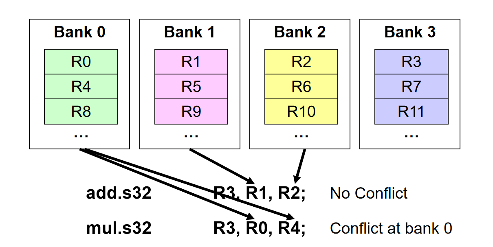
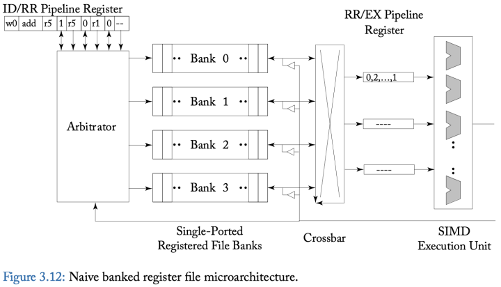
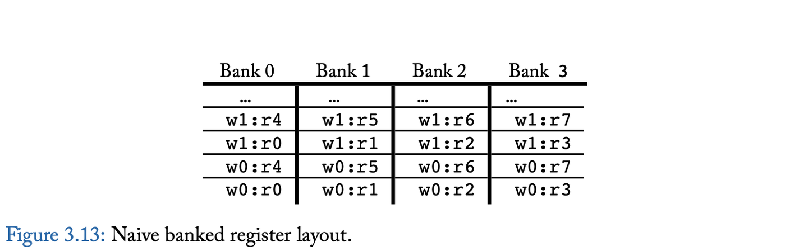
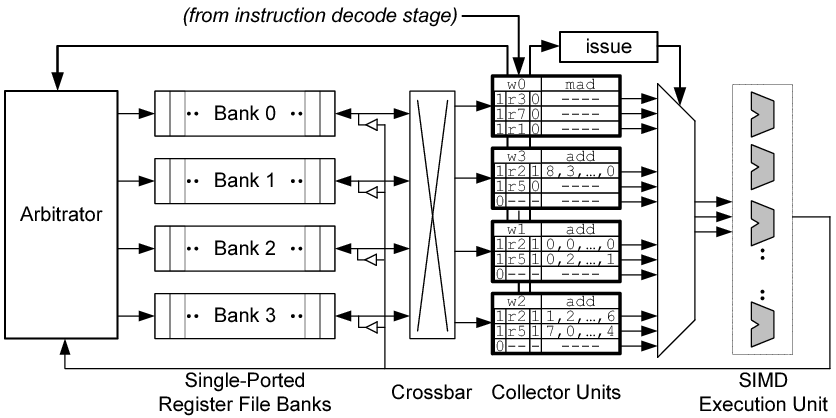
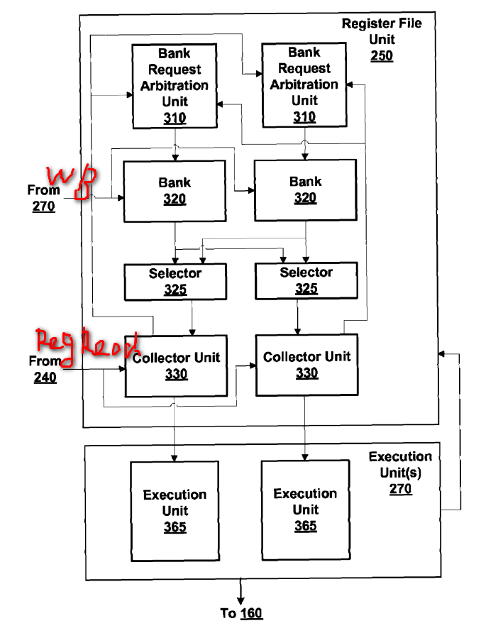

# Understanding Operand Collector

如下图基本展示了Operand Collector的工作机制：指令从OC的Bank中取寄存器，然后用于Execution uint进行计算。Execution unit可以是一个SIMD或SIMT的执行单元。



为了更好的理解操作数收集器解决的问题，下图显示了一个简单的微架构，用于提供增加寄存器堆带宽。此图显示了GPU指令流水线的寄存器读取阶段，其中寄存器堆由4个单口逻辑寄存器bank组成。实践中，由于寄存器堆非常大，每个逻辑bank又可以进一步分解为更多的物理bank。逻辑bank通过crossbar连接到流水线寄存器，这些pipeline寄存器在将源操作数传递给执行单元之前对其进行缓冲。仲裁器控制对各个bank的访问，并通过crossbar将结果路由到适当的pipeline寄存器。



下图显示了每个warp的寄存器到逻辑bank的简单布局。在该图中，warp 0 (w0) 中的寄存器 r0 存储在 Bank 0 的第一个位置，warp 0 中的寄存器 r1 存储在 Bank 1 的第一个位置，依此类推。如果计算所需的寄存器数量大于逻辑 bank 的数量，则分配回绕 (wrap around)。例如，warp 0 的寄存器 r4 存储在 Bank 0 的第二个位置。

1. 将同一个warp内的寄存器放入各个不同的逻辑Banks中，如图所示
2. 下图给出OC中Bank的基本工作机制

## Operand Collector uArchitecture

操作数收集器微架构如图所示，关键变化是流水线寄存器被收集器单元代替。每条指令在进入寄存器读取阶段时都会分配一个收集器单元。有多个收集器单元，因此多个指令可以同时读取源操作数，这有助于在各个指令的源操作数之间存在bank冲突的情况下提高吞吐量。每个收集器单元包含执行指令所需的所有源操作数的缓冲空间。由于多条指令的源操作数数量较多，仲裁器更有可能实现增加bank级的并行性，以允许并行访问多个寄存器bank。

当Bank冲突的时候，操作数收集器使用调度来容忍它。所有这里就有一个如何减少bank冲突的问题。

如果来自同一 warp 的两条指令存在于操作数收集器中，并且第一条指令读取第二条指令将写入的寄存器，则可能会发生这种情况。如果第一条指令的源操作数访问遇到重复的 bank 冲突，则可以想象第二条指令可能在第一条寄存器读取（正确的）旧值之前将新值写入寄存器。防止这种 WAR 冒险的一种方法是简单地要求来自同一 warp 的指令按照程序顺序将操作数收集器留给执行单元。



## 代码实现

从代码实现的角度理解Operand Collector。

```c
in_ports  [IS_RF]
out_ports [RF_EX]
m_cus <6>  //每个类型的流水线对应一个cu_sets
m_cu //存所有的collector unit

Operand_Collector.add_port() {
    m_in_ports(in_ports, out_ports, cu_sets)
}


```

1. 根据流水线阶段创建流水线寄存器m_pipeline_reg,比如FE_IS的宽度为4的情况，m_pipeline_reg[FE_IS] = {regs[0], regs[1], regs[2], regs[3]}
2. 对应上面图示的Operand_collector结构，主要有Register bank和Collector Units, 由于OC处于IS和EX之间，所以OC的输入端口in_port连接到IS_RF流水线寄存器，而输出端out_ports连接到RF_EX流水线寄存器

- opndcoll_rfu_t::allocate_cu()用于将warp_inst_t分配到operand collector集合中的空闲operand collector. 同时也将源操作数的读请求添加到仲裁器中相应的bank队列
- opndcoll_rfu_t::allocate_reads(...) 处理没有冲突的读请求，也就是不同寄存器 bank 中并且没有进入同一个 operand collector 的读请求将从仲裁器队列中出队。写请求总是优先于读请求
- opndcoll_rfu_t::dispatch_ready_cu() 会 dispatch ready operand collectors 的操作数寄存器到执行阶段
- opndcoll_rfu_t::writeback( const warp_inst_t &inst ) 在内存流水线的写回阶段被调用。用于分配写请求

## 专利US7834881




## Reference

- [Nvidia Operand Collector Patent](/ebook/US7834881.pdf)
- General Purpose Graphics Processor Architecture P38
