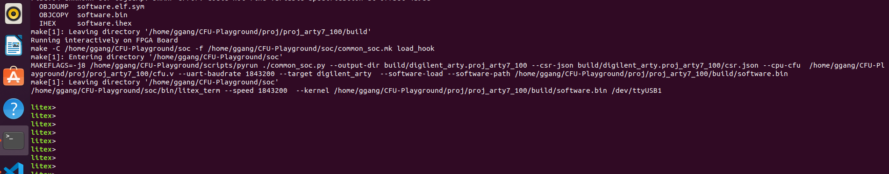

# CFU-Playground

一共支持3种运行环境，分别是Arty A7, Renode和Verilator simulation

- To run on Arty
  
  ``` bash
  $ make prog //builds and program gateware
  $ make prog TARGET=digilent_arty USE_SYMBIFLOW=1
  $ make load //builds and load C program (BIOS)
  ```

  make load成功后会进入串口界面，如下图所示：
  
  也可以用其他串口工具(比如Putty)，默认波特率是1843200(在proj.mk中定义)
  

- To run on renode

  ``` bash
  $ make renode
  ```

- To run in simulation

  ``` bash
  $ make load PLATFORM=sim
  ```

## Build Flow

- proj/proj.mk
- soc/common_soc.mk
  - CONFIG_CPU_PERF_CSRS

## Profiling

CONFIG_CPU_PERF_CSRS

- 怎么使能profiler counter
  EXTRA_LITEX_ARGS="--cpu-variant=perf+cfu"

## 串口

- [Minicom](https://wiki.emacinc.com/wiki/Getting_Started_With_Minicom)
  
- Tera Term

## Accelerator

MobileNetV2

1x1xN 2D convolution operation accelerator for TfLM on an FPGA that increase performance by 100x.


- 63% 1x1 2D Convolution
- 22.5% Depthwise convolution
- 11% 3x3 2D Convolution

CFU_MACC_RUN Design

