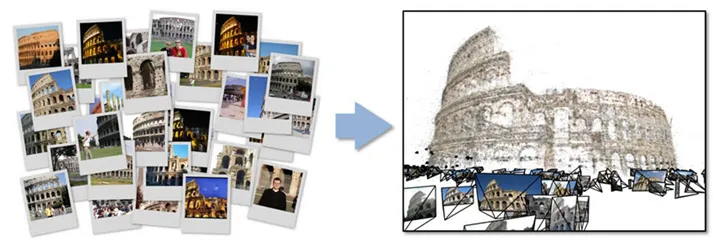
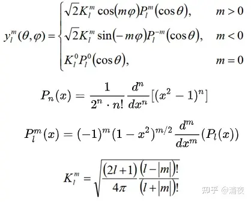

# 3D Guassian Splatting


上图为整个系统的示意图，系统首先对SfM点云进行初始化，得到3D高斯，然后借助相机外参将点投影到图像平面上（即Splatting），接着用可微光栅化，渲染得到图像。得到渲染图像Image后，将其与Ground Truth图像比较求loss，并沿蓝色箭头反向传播。蓝色箭头向上，更新3D高斯中的参数，向下送入自适应密度控制中，更新点云。

## 什么是3D高斯点染

每个高斯图像可由以下参数来描述:

- 位置: 所在位置 (XYZ)
- 协方差: 缩放程度 (3x3 矩阵)
- 颜色: 颜色 (RGB)
- Alpha: 透明度 (α)


3DGS是一个非常厉害的技术，为了先有一个笼统的认知，我们可以简单将其概括为如下几步：

- 录一段视频或者拍一组不同角度的照片，用一些技术（例如SfM）估计点云。或者直接随机初始化一组点云。
- 点云中的每一个点，代表着一个三维的高斯分布，所以除了点的位置（均值）以外，还有协方差，以及不透明度，以及颜色（球谐系数）。直观可以理解为一个”椭球体“。
- 将这些椭球体沿着特定的角度投影到对应位姿所在的投影平面上，这一步也叫“splatting“，一个椭球体投影到平面上会得到一个椭圆（代码实现时其实是以长轴为直径的圆），然后通过计算待求解像素和椭圆中心的距离，我们可以得到不透明度（离的越近，说明越不透明）。每个椭球体又各自代表自己的颜色，这是距离无关的。于是就可以进行alpha compositing，来合成颜色。然后快速的对所有像素做这样的计算，这被称作”快速可微光栅化“。
- 于是可以得到整个图片，再和ground truth比较，得到损失，然后梯度反传，随机梯度下降，进行优化。


### SFM

<https://colmap.github.io/index.html>
<https://github.com/colmap/colmap>

### 3D Gaussian

Gaussian
    : 1D 高斯
    
    3D 高斯
    
    

各向异性（anisotropic）
    : 指的是从各个方向上看过去，物体的外观表现都不同。

抛雪球（splatting）
    : 一种计算机图形学中用三维点进行渲染的方法，该方法将三维点视作雪球往图像平面上抛，雪球在图像平面上会留下扩散痕迹，这些点的扩散痕迹叠加在一起就构成了最后的图像，是一种针对点云的渲染方法。

Structure-from-Motion（SfM）
    : COLMAP stands for “Structure from Motion” (SfM), which is an algorithm used to reconstruct the 3D structure of objects and camera poses from multi-view images of the same object taken from different angles.
    
    Incremental Structure-from-Motion pipline
    
    <https://demuc.de/papers/schoenberger2016sfm.pdf>

协方差
    : 协方差（covariance）是两个变量的相关性度量，可以用来描述两个变量是否存在线性关系。方差是用来度量单个随机变量的离散程度，而协方差则一般用来刻画两个随机变量的相似程度，其中，方差的计算公式为
    
    其中，n 表示样本量，符号 \bar{x} 表示观测样本的均值，这个定义在初中阶段就已经开始接触了。
    在此基础上，协方差的计算公式被定义为

球谐函数(Spherical Harmonics)
    : 在机器学习中，球谐函数可以用来表示球面上的特征，可以用于训练机器学习模型。协方差可以用来描述两个特征之间的相关性，可以用于选择特征、评估模型等
    
    
    当SH的系数用的越多，那么表达能力就越强，跟原始的函数就越接近
    
    
    
    
    


## Repo

- <https://github.com/graphdeco-inria/gaussian-splatting>

- <https://github.com/alyssaq/3Dreconstruction>

- <https://github.com/WangFeng18/3d-gaussian-splatting>

- [gaussian-splatting-Windows](https://github.com/jonstephens85/gaussian-splatting-Windows)

## Installation

[Cuda Download](https://developer.nvidia.com/cuda-11-8-0-download-archive?target_os=Windows&target_arch=x86_64&target_version=11&target_type=exe_local)
[Visual Studio 2019 with Desktop C++](.)
[Anconda](.)

``` bash
conda env list
conda info --envs
conda config --show channels
conda config --add channels pytorch
conda config --add channels nvidia
conda config --add channels conda-forge
conda remove -n gaussian_splatting --all

SET DISTUTILS_USE_SDK=1 # Windows only
conda create --name gaussian_splatting python=3.11.5
conda activate gaussian_splatting
conda install pip=22.3.1
conda install tqdm
conda install plyfile=0.8.1
pip install torch-2.0.0+cu118-cp311-cp311-win_amd64.whl
pip install torchaudio-2.0.1+cu118-cp311-cp311-win_amd64.whl
pip install torchvision-0.15.1+cu118-cp311-cp311-win_amd64.whl

pip install ninja
pip install .\submodules\diff-gaussian-rasterization\

conda deactivate
```

## Prepare Images

ffmpeg -i {video} -vf fps={fps} %05d.jpg

python.exe .\convert.py -s .\datasets\truck\ --colmap_executable .\tool\COLMAP-3.8-windows-cuda\COLMAP.bat

python.exe .\train.py -s .\datasets\truck\ -m .\datasets\trained-model\

python.exe .\train.py -s .\datasets\truck\ -m .\datasets\trained-model\ --data_device cpu --debug_from 0 --densify_from_iter 0 --densification_interal 1

## Reference

- <https://segmentfault.com/a/1190000044505300>
- <https://huggingface.co/blog/gaussian-splatting>
- <https://zhuanlan.zhihu.com/p/666465701>
- <https://www.thomasantony.com/posts/gaussian-splatting-renderer/>
- [协方差](https://www.zhihu.com/tardis/zm/art/37609917?source_id=1003)
- <https://zhuanlan.zhihu.com/p/661569671>
- <https://www.reshot.ai/3d-gaussian-splatting>
- <https://docs.gsplat.studio/>
- <https://www.bilibili.com/video/av872162410/?vd_source=0c5ad79582f906d810296380161a7988>

## FAQ

- python -m pip uninstall pip==20.0.2
- git submodule update --init --recursive
- git submodule update --init --recursive --force