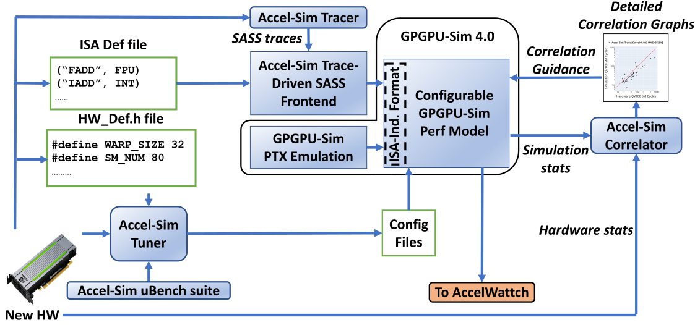
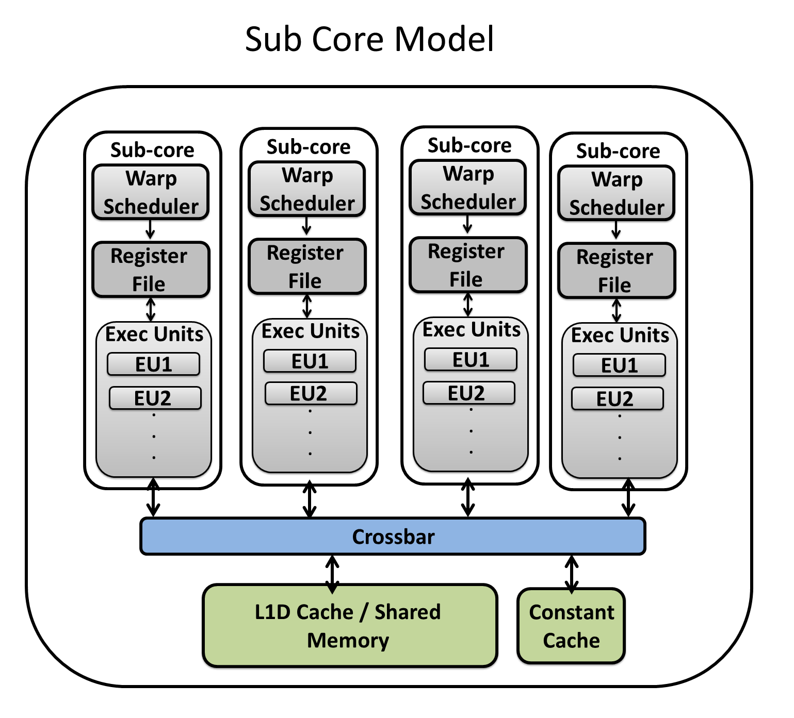
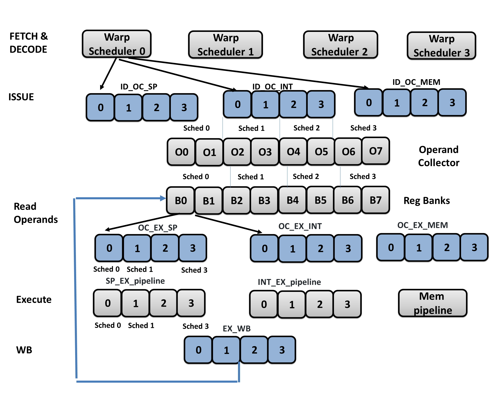
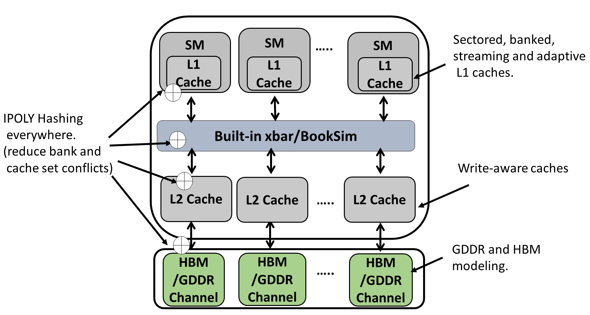

# Accel-Sim

Accel-Sim is a simulation framework for simulating and validating programmable accelerators like GPUs.

## Accel-Sim Overview

1. Accel-Sim Tracer: An NVBit tool for generating SASS traces from CUDA applications.
2. Accel-Sim SASS Frontend: A simulator frontend that consumes SASS traces and feeds them into a performance model. The intial release of Accel-Sim coincides with the release of GPGPU-Sim 4.0, which acts as the detailed performance model.
3. Accel-Sim Correlator: A tool that matches, plots and correlates statistics from the performance model with real hardware statistics generated by profiling tools.
4. Accel-Sim Tuner: An automated tuner that automates configuration file generation from a detailed microbenchmark suite.

## GPGPU-SIM 4.x Performance Model

## Accel-Sim Manual

<https://accel-sim.github.io/>

## AccelWattch Overview

