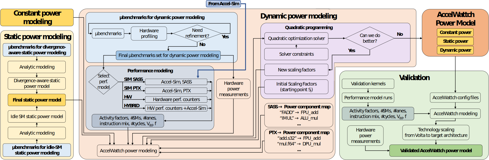

# AccelWattch

AccelWattch is a power modeling framework that is extensively validated for modern GPUs and enables reliable design space exploration.

## AccelWattch Overview

1. **AccelWattch SASS SIM**: Native ISA performance simulation
2. **AccelWattch PTX SIM**: Virtual ISA performance simulation
3. **AccelWattch HW**: Hardware performance counters from execution on real silicon
4. **AccelWattch HYBRID**: Hardware performance counters for some components; performance simulation for others

- <https://accel-sim.github.io/accelwattch.html>
- <https://github.com/accel-sim/accel-sim-framework/blob/release/AccelWattch.md>