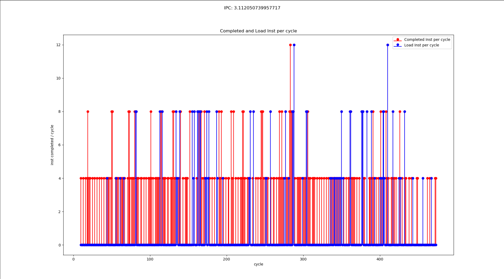
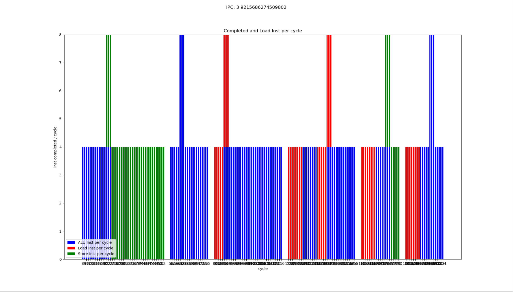
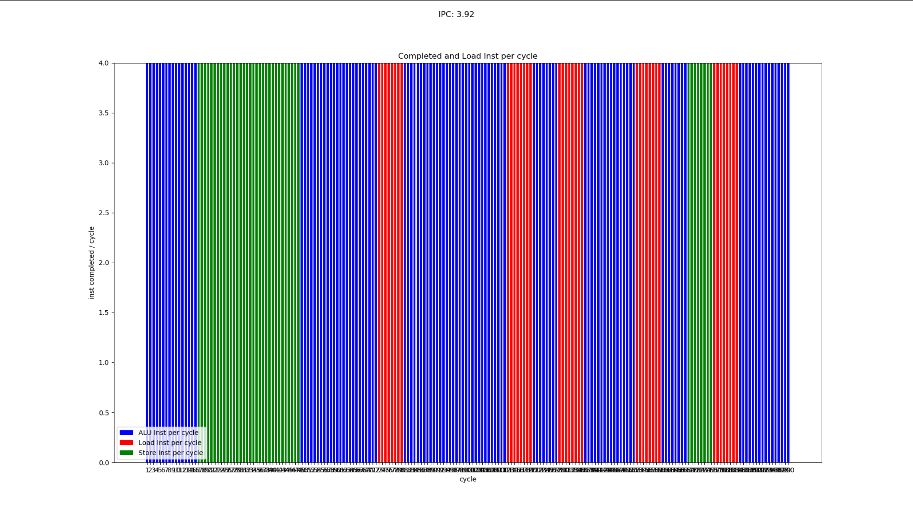

# Modeling for V2.1

经过分析，下图显示每个cycle的指令完成数量，蓝色为load指令的完成数量。如图显示，中间在380到540 cycle直接有大约160个cycle的空白，此为ddr的访问延迟。跟如下配置相关

memory partition latency config
-gpgpu_l2_rop_latency 160
-dram_latency 100

将dram_latency改为1，相当于忽略dram的影响后，指令的每cycle完成情况如下图

## 按THDC调度逻辑校准后

### Pipeline

FE
:   THDC每个Cycle从非blocked线程中取4条指令。如果所有线程都处于block状态，则会将线程状态设置为reschedule状态，并从第一个线程开始重新进入流水线，线程将不在进行换出。在EX阶段的阻塞是等待数据返回。

IS
:   根据scoreboard来判断FE_IS寄存器中的指令是否存在data hazard及判断该指令是否在EX中有available的资源，条件满足后发射到IS_RF寄存器。模拟器中指令的执行实际是在IS阶段完成

RF
:   从IS_RF流水线寄存器中获取指令，并从寄存器文件中获取源寄存器的值，供EX阶段使用。此时寄存器的读和写可能产生冲突，这种情况下，寄存器写优先级高于读

EX
:   从RF_EX流水线寄存器中获取指令，如果有指令latency，则进入EX Stage的sub_pipeline，随着cycle进行delay。对于latency耗尽的指令，直接进入WB。store指令在EX阶段ldst单元完成，不进入WB
:   未支持数据forward功能

WB
:   将指令计算的结果写入目的寄存器。由于写寄存器操作的优先级高于读操作，这里不会stall(除非寄存器文件bank conflict)。

### Cache

- L1I Cache
- L1D Cache
  block size: 128Byte(4x32)
- L2 Cache

按照THDC调度逻辑，指令完成情况

- warp size=32
- dram_latency=1

按照THDC调度逻辑，指令完成情况

- warp size=64
- dram_latency=1

按照THDC调度逻辑，指令完成情况

- warp size=32
- cache perfect hit

### Issued Instruction

1. cycle 60，200: jplnk指令是一个cycle执行完成，但是上一条指令需要还在占用
2. cycle 79，136: EX阶段有一个组int指令，其余全部都是load指令，int抢了wb，load指令停滞
3. jp类跳转指令在EX阶段的latency是1，跟其他为3的指令有影响

1. THDC
   - 所有block后，调度器停止
   - 有cache返回的线程再开始调度
2. 编辑器优先使用寄存器存参数，其次使用栈

## 按修改问题校准后

After correct above issues, the result as following
case1: Vthread=8 HThread=4

1. Finished instruction
Cycle: 8-204 Inst: 1-800

2. Issued instruction
Cycle: 1-200 Inst: 1-784

case2: Vthread=4 HThread=4

- 不是所有指令的流水是对齐的
- 前后指令有数据依赖

1. Finished instruction
Cycle: 8-232 Inst: 1-800

2. Issued instruction
Cycle: 1-228 Inst: 1-772

|   VThread   |  1   |  2   |  3   |  4   |  5   |  6   |  7   |  8   |
| :---------- | :--- | :--- | :--- | :--- | :--- | :--- | :--- | :--- |
| HThread     | 4    | 4    | 4    | 4    | 4    | 4    | 4    | 4    |
| Iussed IPC  | 1.43 |      | 2.55 | 3.38 | 3.02 | 3.37 | 3.26 | 3.92 |
| Finised IPC | 1.44 |      | 2.53 | 3.44 | 2.99 | 3.40 | 3.22 | 3.92 |

Question:

1. store是不是2个cycle结束
2. 完成8条的情况
   1. [x] Cycle 21: st + add
   2. [x] Cycle 61：jplnk + add
   3. [x] Cycle 93：beq[EX] + setlt[WB]
   4. [x] Cycle 173：st + add
   5. [x] Cycle 197: jr[EX] + add[WB]
3. 寄存器依赖，数据依赖
4. 一个cycle取一个线程
