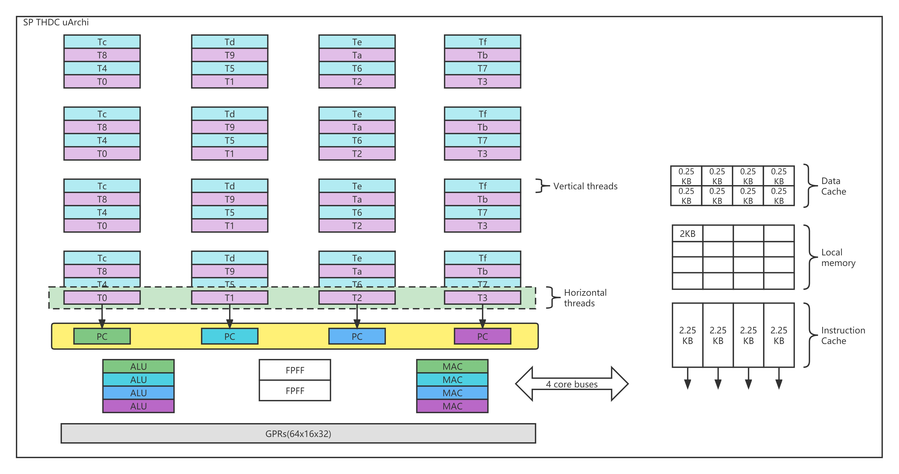
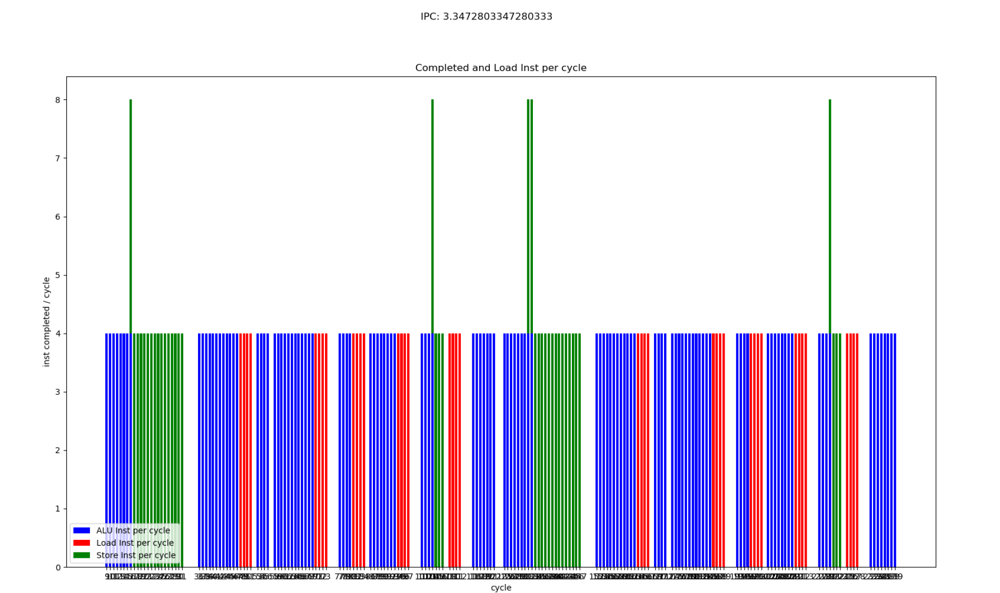
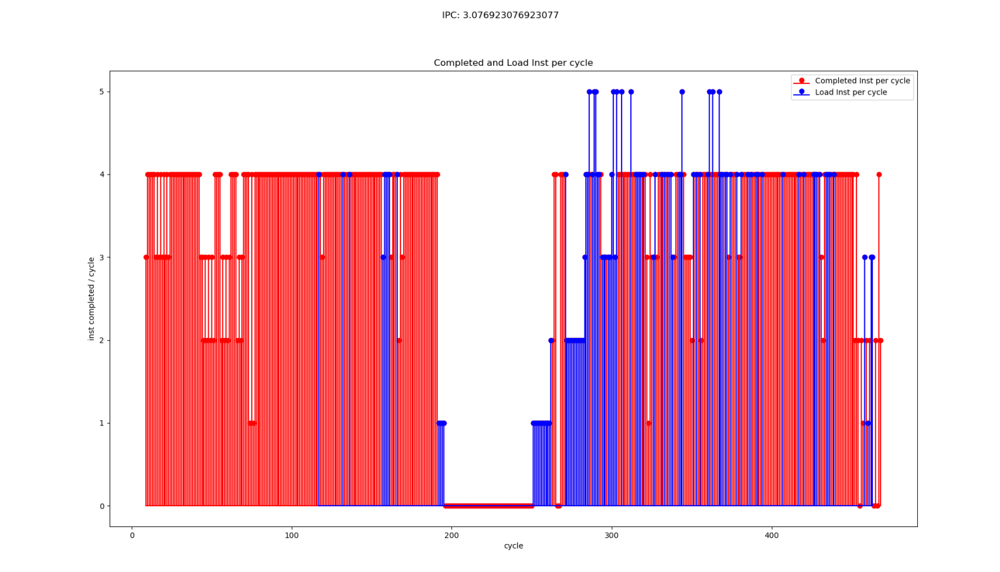

# MVPGPU-SIM Pipeline Calibration

## Application

```c
#define DATA_SIZE (32)

////////////////////////////////////////////////////////////////////////////////

// Simple compute kernel which computes the square of an input array 
//
const char *KernelSource = "\n" \
"__kernel void square(                                                       \n" \
"   __global float* input,                                              \n" \
"   __global float* output,                                             \n" \
"   const unsigned int count)                                           \n" \
"{                                                                      \n" \
"   int i = get_global_id(0);                                           \n" \
"   if(i < count)                                                       \n" \
"       output[i] = input[i] * input[i];                                \n" \
"   else                                                                \n" \
"       output[i] = 0;                                                  \n" \
"}                                                                      \n" \
"\n";

////////////////////////////////////////////////////////////////////////////////

int main(int argc, char** argv)
{
    int err;                            // error code returned from api calls
      
    float data[DATA_SIZE];              // original data set given to device
    float results[DATA_SIZE];           // results returned from device
    unsigned int correct;               // number of correct results returned

    size_t global;                      // global domain size for our calculation
    size_t local;                       // local domain size for our calculation

    cl_platform_id Platform;
    cl_device_id device_id;             // compute device id 
    cl_context context;                 // compute context
    cl_command_queue commands;          // compute command queue
    cl_program program;                 // compute program
    cl_kernel kernel;                   // compute kernel
    
    cl_mem input;                       // device memory used for the input array
    cl_mem output;                      // device memory used for the output array
    
    // Fill our data set with random float values
    //
    int i = 0;
    unsigned int count = DATA_SIZE;
    for(i = 0; i < count; i++)
        data[i] = rand() / (float)RAND_MAX;
    
    // Connect to a compute device
    //
    int gpu = 1;
    err=clGetPlatformIDs(1, &Platform, NULL);
    err = clGetDeviceIDs(Platform,CL_DEVICE_TYPE_GPU, 1, &device_id, NULL);
    if (err != CL_SUCCESS)
    {
        printf("Error: Failed to create a device group!\n");
        return EXIT_FAILURE;
    }
  
    // Create a compute context 
    //
    context = clCreateContext(0, 1, &device_id, NULL, NULL, &err);
    if (!context)
    {
        printf("Error: Failed to create a compute context!\n");
        return EXIT_FAILURE;
    }

    // Create a command commands
    //
    commands = clCreateCommandQueue(context, device_id, 0, &err);
    if (!commands)
    {
        printf("Error: Failed to create a command commands!\n");
        return EXIT_FAILURE;
    }

    // Create the compute program from the source buffer
    //
    program = clCreateProgramWithSource(context, 1, (const char **) & KernelSource, NULL, &err);
    if (!program)
    {
        printf("Error: Failed to create compute program!\n");
        return EXIT_FAILURE;
    }

    // Build the program executable
    //
    err = clBuildProgram(program, 0, NULL, NULL, NULL, NULL);
    if (err != CL_SUCCESS)
    {
        size_t len;
        char buffer[2048];

        printf("Error: Failed to build program executable!\n");
        clGetProgramBuildInfo(program, device_id, CL_PROGRAM_BUILD_LOG, sizeof(buffer), buffer, &len);
        printf("%s\n", buffer);
        exit(1);
    }

    // Create the compute kernel in the program we wish to run
    //
    kernel = clCreateKernel(program, "square", &err);
    if (!kernel || err != CL_SUCCESS)
    {
        printf("Error: Failed to create compute kernel!\n");
        exit(1);
    }

    // Create the input and output arrays in device memory for our calculation
    //
    input = clCreateBuffer(context,  CL_MEM_READ_ONLY,  sizeof(float) * count, NULL, NULL);
    output = clCreateBuffer(context, CL_MEM_WRITE_ONLY, sizeof(float) * count, NULL, NULL);
    if (!input || !output)
    {
        printf("Error: Failed to allocate device memory!\n");
        exit(1);
    }    
    
    // Write our data set into the input array in device memory 
    //
    err = clEnqueueWriteBuffer(commands, input, CL_TRUE, 0, sizeof(float) * count, data, 0, NULL, NULL);
    if (err != CL_SUCCESS)
    {
        printf("Error: Failed to write to source array!\n");
        exit(1);
    }

    // Set the arguments to our compute kernel
    //
    err = 0;
    err  = clSetKernelArg(kernel, 0, sizeof(cl_mem), &input);
    err |= clSetKernelArg(kernel, 1, sizeof(cl_mem), &output);
    err |= clSetKernelArg(kernel, 2, sizeof(unsigned int), &count);
    if (err != CL_SUCCESS)
    {
        printf("Error: Failed to set kernel arguments! %d\n", err);
        exit(1);
    }

    // Get the maximum work group size for executing the kernel on the device
    //
    err = clGetKernelWorkGroupInfo(kernel, device_id, CL_KERNEL_WORK_GROUP_SIZE, sizeof(local), &local, NULL);
    if (err != CL_SUCCESS)
    {
        printf("Error: Failed to retrieve kernel work group info! %d\n", err);
        exit(1);
    }

    // Execute the kernel over the entire range of our 1d input data set
    // using the maximum number of work group items for this device
    //
    global = count;
    err = clEnqueueNDRangeKernel(commands, kernel, 1, NULL, &global, &local, 0, NULL, NULL);
    if (err)
    {
        printf("Error: Failed to execute kernel!\n");
        return EXIT_FAILURE;
    }

    // Wait for the command commands to get serviced before reading back results
    //
    clFinish(commands);

    // Read back the results from the device to verify the output
    //
    err = clEnqueueReadBuffer( commands, output, CL_TRUE, 0, sizeof(float) * count, results, 0, NULL, NULL );  
    if (err != CL_SUCCESS)
    {
        printf("Error: Failed to read output array! %d\n", err);
        exit(1);
    }
    
    // Validate our results
    //
    correct = 0;
    for(i = 0; i < count; i++)
    {
        if(results[i] == data[i] * data[i])
            correct++;
    }
    
    // Print a brief summary detailing the results
    //
    printf("Computed '%d/%d' correct values!\n", correct, count);
    
    // Shutdown and cleanup
    //
    clReleaseMemObject(input);
    clReleaseMemObject(output);
    clReleaseProgram(program);
    clReleaseKernel(kernel);
    clReleaseCommandQueue(commands);
    clReleaseContext(context);

    return 0;
}
```

Kernel program

```s
	.text
	.section .mdebug.abi32
	.previous
	.file	"_cl_hello"
	.globl	square                  # -- Begin function square
	.type	square,@function
	.ent	square                  # @square
square:
	.frame	$sp,56,$ra
	.mask 	0x00008000,-4
	.fmask	0x00000000,0
# %bb.0:                                # %entry
	sub	$zero, $zero, $zero
	add.si	$sp, $sp, -56
	st.w	$ra, 52($sp)
	st.w	$6, 36($sp)
	st.w	$5, 32($sp)
	st.w	$4, 40($sp)
	add.si	$4, $zero, 0
	jplnk	_Z13get_global_idj
	fadd	$3, $zero, $zero
	ld.w	$4, 36($sp)
	setlt.u	$4, $2, $4
	beq	$4, $zero, .LBB0_2
	jp	.LBB0_1
.LBB0_1:                                # %if.then
	sfll.i	$3, $2, 2
	ld.w	$4, 40($sp)
	add	$3, $4, $3
	ld.w	$3, 0($3)
	fmul	$3, $3, $3
.LBB0_2:                                # %if.end
	sfll.i	$2, $2, 2
	ld.w	$4, 32($sp)
	add	$2, $4, $2
	st.w	$3, 0($2)
	ld.w	$ra, 52($sp)
	add.si	$sp, $sp, 56
	jr	$ra
	.set	macro
	.set	reorder
	.end	square
$func_end0:
	.size	square, ($func_end0)-square
                                        # -- End function

	.ident	"clang version 7.0.0 (tags/RELEASE_700/final) (ssh://lidajun@10.0.10.208:29418/llvm-7.0.0 cec070d24becf5467d66f106da98f501a660a4df)"
	.section	".note.GNU-stack","",@progbits
```

After parsing

```s
 PC=0x0000 (_cl_hello.s:13) sub$zero, $zero, $zero
 PC=0x0008 (_cl_hello.s:14) add.si$sp, $sp, -56
 PC=0x0010 (_cl_hello.s:15) st.w$ra, 52($sp)
 PC=0x0018 (_cl_hello.s:16) st.w$6, 36($sp)
 PC=0x0020 (_cl_hello.s:17) st.w$5, 32($sp)
 PC=0x0028 (_cl_hello.s:18) st.w$4, 40($sp)
 PC=0x0030 (_cl_hello.s:19) add.si$4, $zero, 0
 PC=0x0038 (_cl_hello.s:20) jplnk_Z13get_global_idj
 PC=0x0040 (_cl_hello.s:21) fadd$3, $zero, $zero
 PC=0x0048 (_cl_hello.s:22) ld.w$4, 36($sp)
 PC=0x0050 (_cl_hello.s:23) setlt.u$4, $2, $4
 PC=0x0058 (_cl_hello.s:24) beq$4, $zero, .LBB0_2
 PC=0x0060 (_cl_hello.s:25) jp.LBB0_1
 PC=0x0068 (_cl_hello.s:27) sfll.i$3, $2, 2
 PC=0x0070 (_cl_hello.s:28) ld.w$4, 40($sp)
 PC=0x0078 (_cl_hello.s:29) add$3, $4, $3
 PC=0x0080 (_cl_hello.s:30) ld.w$3, 0($3)
 PC=0x0088 (_cl_hello.s:31) fmul$3, $3, $3
 PC=0x0090 (_cl_hello.s:33) sfll.i$2, $2, 2
 PC=0x0098 (_cl_hello.s:34) ld.w$4, 32($sp)
 PC=0x00a0 (_cl_hello.s:35) add$2, $4, $2
 PC=0x00a8 (_cl_hello.s:36) st.w$3, 0($2)
 PC=0x00b0 (_cl_hello.s:37) ld.w$ra, 52($sp)
 PC=0x00b8 (_cl_hello.s:38) add.si$sp, $sp, 56
 PC=0x00c0 (_cl_hello.s:39) jr$ra
```

## MVP RTL Pipeline


## MVPGPU-SIM Pipeline


### Configuration

``` config
# high level architecture configuration
-mvpgpu_n_gpc 1
-mvpgpu_n_tpc_per_gpc 1
-mvpgpu_n_sm_per_tpc 1
-mvpgpu_n_sp_per_sm 1
-mvpgpu_max_concurrent_kernel 8 

#-mvpgpu_clock_domains in MhZ
#<Core Clock>:<Interconnect Clock>:<L2 Clock>:<DRAM Clock>:<pa_clock>:<rop_clock>:<raster_clock>:<texture_clock>
-mvpgpu_clock_domains 1000.0:1000.0:1000.0:800.0:1000.0:1000.0:1000.0:1000.0

# Pipeline widths and number of FUs
# IS_RF_SP,IS_RF_DP,IS_RF_INT,IS_RF_SFU,IS_RF_MEM,RF_EX_SP,RF_EX_DP,RF_EX_INT,RF_EX_SFU,RF_EX_MEM,EX_WB,IS_RF_TENSOR_CORE,RF_EX_TENSOR_CORE
## We need to scale the number of pipeline registers to be equal to the number of SP units
-mvpgpu_pipeline_widths 4,4,0,4,4,4,4,0,4,4,4,4,0,0

-gpgpu_num_fp32_units_per_sp 4
-gpgpu_num_int32_units_per_sp 4
-gpgpu_num_sfu_units_per_sp 2
-mvpgpu_num_ldst_units_per_sp 4

# Instruction latencies and initiation intervals
# "ADD,MAX,MUL,MAD,DIV"
# All Div operations are executed on SFU unit
-ptx_opcode_latency_int 3,3,3,3,3,3
-ptx_opcode_initiation_int 0,0,0,0,0,0

-ptx_opcode_latency_fp 3,3,3,3,3
-ptx_opcode_initiation_fp 0,0,0,0,0

# mvp local memory bankconflict detection
-mvpgpu_local_mem_num_banks 8
-mvpgpu_local_mem_read_cycle 1
-mvpgpu_local_mem_write_cycle 1

```

### FE Stage

从L1I cache中取出mem_fetch，基于该mem_fetch创建一个ifetch_buffer_t赋值给m_inst_fetch_buffer。同时将当前的cycle记录到warp中

[Open Issue]
1. FE_IS 利用的ibuffer,所以在流水线寄存器中没有体现 [后续进行修正，不影响性能准确性]
2. 线程里PC
3. WARP的PC

### IS Stage

scheduler.cycle()会从warp中m_ibuffer中取出指令。之后进行冲突检测，如果没有冲突，则根据指令操作码的类型来检查IS_RF中对应的流水线寄存器是否有空的且前一条指令与当前指令不占用同一种执行单元

#### Hazard Check

- checkCollision()会检查当前指令所有用到的寄存器（包括目的寄存器和源寄存器）是否在于scoreboard中的reg_table中，如果是表示冲突，否则不冲突。
- Issue指令后，reserveRegister()会将该指令的目的寄存器（如果有）插入reg_table中
- WriteBack阶段执行完寄存器回写操作后，releaseRegister()删除reg_table中该warp对应的寄存器

#### THDC



运行时效果


调度算法：
1. ldst遇到load指令，stall直到那会数据继续执行；
2. ldst遇到load指令，不stall，从流水线中清除该指令及已进入流水线的指令，阻塞该warp/线程的执行，直到所有线程阻塞，重新进入流水线（推测需要的数据已被cache，但实际情况是没有，cache大小或cache的替换策略相关）；
3. ldst遇到load指令后，stall，并该指令进入一个buffer，直到有数据返回再继续执行，但是其他alu继续执行；

[Open Issue]
1. 后续流水线中会有同一个warp内指令同时出现的情况[Fixed]

### RF Stage

流水线寄存器m_pipeline_reg中存放的是register_set，但register_set中的regs存放又是warp_inst_t()。所以本质上上当前实现中流水线之间传递的是warp_Inst

### EX Stage

遍历RF_EX寄存器，如果RF_EX中有指令且对应的Function Unit也是空闲的，则该指令进入该Function Unit（具体指令会给到m_dispatch_reg）。

#### Local Memory

#### ldst unit cycle()

1. ldst unit会完成load global类指令 [修改中]
2. ldst unit中load mvp_local_memory类指令会到WB完成 [已修改]

#### other FU cycle()

- 如果EX_WB有空闲并且sub_pipeline_reg[0]不空，则把sub_pipeline_reg[0]中的指令送入EX_WB
- 如果EX stage的sub流水线中还有指令，则将前一级的往后传递一级
- 如果m_dispatch_reg不空且dispatch_delay已为0，则将该指令放入sub_pipeline_reg的起始位置

### Write Back

从m_pipeline_reg[EX_WB]中get_ready()指令，然后回写到m_operand_collector。Scoreboard释放已回写的寄存器。warp指令完成。清空寄存器。

- 执行寄存器回写 m_operand_collector.writeback(*pipe_reg);
- m_scoreboard释放已被回写的寄存器
- 更新状态warp的状态

## Log Analysis

### 1. L1D Cache Perfect Hit



### Completed Instruction Per Cycle



