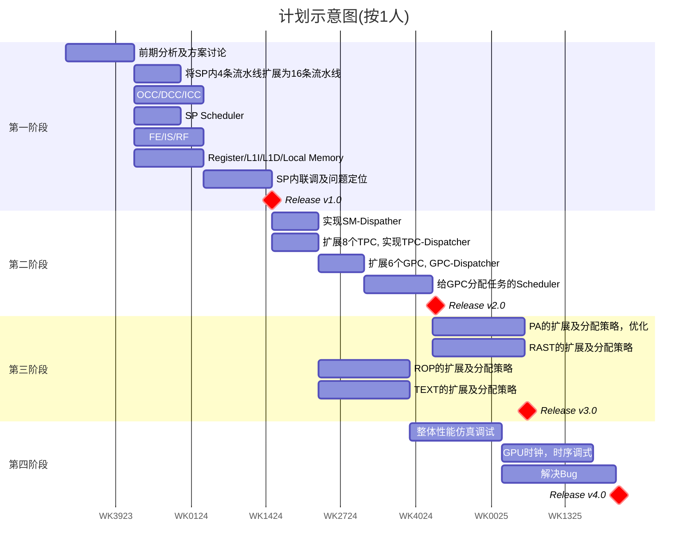

# Proposed solution for target performance

## 1. 总体概览

|参数           |目标指标     | 方案一         | 方案二         |
|:--            |:--         |:--             |:--            |
|像素填充率     |64GPixel/s   |86.4GPixel/s    |64.8GPixel/s   |
|纹理填充率     |128GTexel/s  |172.8GTexel/s   |129.6GTexel/s   |
|浮点性能FP32   |14TFLOPs     |22TFLOPs        |16.588TFLOPs   |
|GPU频率        |1.8GHz       |1.8GHz          | 1.35GHz   |
|FP32(训练)     |14TFLOPs     |22TFLOPs        |16.588TFLOPs   |
|INT8(推理)     |62TOPs       |88.4736TOPs     |66.355TOPs   |

## 2. 方案描述

### 2.1 方案一

引入GPC的概念，共6个GPC，每个GPC有8个TPC，2个PA和2个RAST，每个TPC有2个SM，1个ROP和2个TEXT，每个SM有4个SP，每个SP有16个ALU，16个MAC和16个LDST。

基于该架构，各个单元的数量如下：
GPC: 6
TPC: 48
SM: 96
SP: 384
FP32 unit(MAC): 6144
PA: 12
RAST: 12
ROP: 48
TEXT: 96

#### 像素填充率

一个Cycle完成一个Pixel情况下，48x1.8GHz=86.4。反过来推算：GPU min freq >= 1.33GHz(64GPixel/48)

#### 纹理填充率

一个Cycle完成一个Texel情况下，96x1.8GHz=172.8。反过来推算：GPU min freq >= 1.33GHz(128GTexel/96)

#### 单精度浮点

FP32性能=6144x2x1.8=22.1184TFLOPs. 反过来推算可知: GPU min freq >= 1.14GHz

#### GPU频率

在该配置下，GPU的频率大于1.33GHz即可满足所有性能指标

#### FP32(训练)

> :memo: **Note:** 同[单精度浮点](#单精度浮点)

#### INT8(推理)

把INT32 unit改进为支持4个INT8 unit, INT8性能=6144x4x2x1.8=88.4736TOPs. 反过来推算：GPU min freq >= 1.261GHz

### 2.2 方案二

跟方案一相比，只有GPU频率的差异，除了频率不能满足要求，性能指标均可满足。如果GPU频率不是硬性要求，那么方案二对时序要求更低一些，功耗更低，相对更优。

## 3. 人力

|主要任务                       |人力（人月）  |
|:--                           |:--           |
|前期分析及方案讨论              |3             |
|将SP内4条流水线扩展为16条流水线  |2            |
|OCC/DCC/ICC                   |3            |
|SP Scheduler                  |2             |
|FE/IS/RF                      |3             |
|Register/L1I/L1D/Local Memory |3             |
|SP内联调及问题定位              |3             |
|实现SM-Dispather               |2             |
|实现TPC-Dispatcher             |2             |
|GPC-Dispatcher                 |2            |
|给GPC分配任务的Scheduler        |3            |
|PA的扩展及分配策略，优化         |4           |
|RAST的扩展及分配策略            |4            |
|ROP的扩展及分配策略             |4            |
|TEXT的扩展及分配策略            |4            |
|整体性能仿真调试                |4            |
|GPU时钟，时序调式               |3             |
|解决Bug                        |5             |
|总计                           |56           |

## 4. 开发时间

## 5. 关键突破技术

1. INT32 unit可以变为 4个INT8 unit同时计算，将会影响[INT8推理](#int8推理)的性能
2. SP中Exe阶段的ALU和MAC单元优化甚至重构（是否将int和float计算分开）
3. PA/RAST/ROP/TEXT/SP等各个关键模块结构和性能优化提升
4. Memory子系统须确保384个SP的访存效率
5. 固定管线中PA/RAST/ROP/TEXT的访存效率

## 6. 风险评估(可能的技术盲区)

1. 评估GPU核心频率做到1.8GHz的可行性（考量工艺、RTL时序）
2. DRAM及BUS的性能是否会称为整体性能瓶颈
