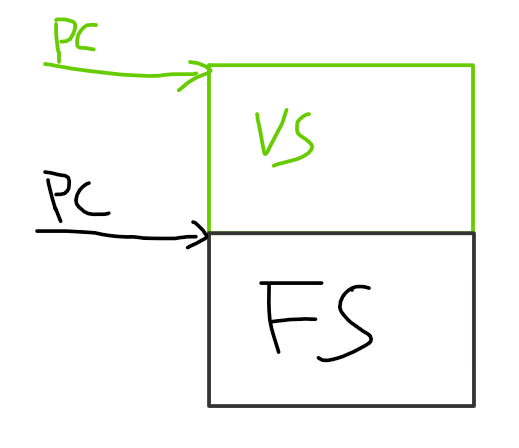
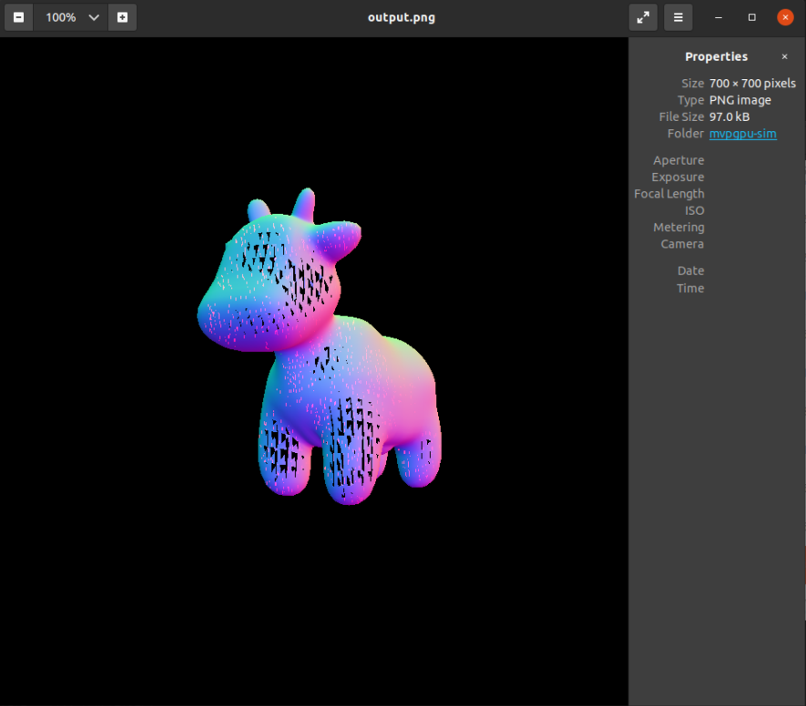

# Graphic Support Approach

## Application

- Create Vertex shader
  unsigned int vertexShader = glCreateShader(GL_VERTEX_SHADER)
- Create Fragment shader
  unsigned int fragmentShader = glCreateShader(GL_FRAGMENT_SHADER)
- Fill vertices data
  glBufferData(GL_ARRAY_BUFFER, sizeof(vertices), vertices, GL_STATIC_DRAW);
- while loop
  - glClearColor()
  - glUseProgram(shaderProgram) //Activate the shader
  - glDrawArrays(GL_TRIANGLES, 0, 3) //render the triangle
  - glfwSwapBuffers(window) //glfw: swap buffers and poll IO events (keys pressed/released, mouse moved etc.)
  - glfwPollEvents()

```c++
const char *frag_shader_source = "\n" \
" __kernel void normal_fragment_shader(__global float3* payload,                                                 \n" \
"                                      __global float3* return_color,                                             \n" \
"                                      const unsigned int n)                                                      \n" \
" {                                                                                                               \n" \
"     int tid = get_global_id(0);                                                                                 \n" \
"     if (tid < n) {                                                                                              \n" \
"         float3 color = (float3)(payload[tid].x + 1.0f, payload[tid].y + 1.0f, payload[tid].z + 1.0f) / 2.f;     \n" \
"         return_color[tid] = (float3)(color.x * 255, color.y * 255, color.z * 255);                              \n" \
"     }                                                                                                           \n" \
" }                                                                                                               \n" \
"\n";

int main(int argc, const char** argv)
{
    float angle = 140.0;
    bool command_line = false;

    // [Loading model] Load .obj File
    bool loadout = api_load_model("../models/spot/spot_triangulated_good.obj");

    // [Texture]
    std::string obj_path = "../models/spot/";
    auto texture_path = "spot_texture.png";
    Texture Text = Texture(obj_path + texture_path);
    api_texture(Text);

    Eigen::Vector3f eye_pos = {0,0,10};

    //api_set_vertex_shader(vertex_shader);
    api_set_fragment_shader("normal_fragment_shader", frag_shader_source);

    int key = 0;
    int frame_count = 0;

    //while(key != 27)
    {
        api_set_model(get_model_matrix(angle));
        api_set_view(get_view_matrix(eye_pos));
        api_set_projection(get_projection_matrix(45.0, 1, 0.1, 50));

        //r.draw(pos_id, ind_id, col_id, rst::Primitive::Triangle);
        api_draw(rst::Primitive::Triangle);
        
        key = cv::waitKey(10);

        if (key == 'a' )
        {
            angle -= 0.1;
        }
        else if (key == 'd')
        {
            angle += 1;
        }
    }

    return 0;
}
```

### How to build application and shader

构建应用和构建kernel的逻辑跟OpenCL类似。单独构建shader为kernel，然后通过接口将shader的kernel加载进可编程部分。接下来Rasterizer程序通过api来启动GPU工作，shader工作时，由固定管线部分的rast模块进行启动shader kernel。待shader kernel完成其工作后将结果返回给rast模块。

- Application building

    ```cmake
    cmake_minimum_required(VERSION 3.10)
    SET(CMAKE_C_COMPILER "/usr/bin/gcc-9")
    SET(CMAKE_CXX_COMPILER "/usr/bin/g++-9")

    project(Rasterizer)

    find_package(OpenCV REQUIRED)
    #find_package(Graphic REQUIRED)

    set(CMAKE_CXX_STANDARD 17)
    set(CMAKE_CXX_FLAGS   "-g") 
    set(CMAKE_CXX_FLAGS_DEBUG   "-O0" ) 
    set(CMAKE_CXX_FLAGS_RELEASE "-O2 -DNDEBUG " ) 

    include_directories(/usr/local/include/opencv4 $ENV{GPGPUSIM_ROOT}/gpu/graphics/include $ENV{GPGPUSIM_ROOT}/gpu/graphics/texture)
    link_directories($ENV{GPGPUSIM_ROOT}/lib)

    add_executable(Rasterizer main.cpp)

    target_link_libraries(Rasterizer PRIVATE Graphic ${OpenCV_LIBRARIES})
    ```

- Shader building
  > Now reuse opencl

在OpenGL中会将VS和FS连接为一个program，因此在实现中可以通过Shader type来决定PC的起始位置，让可编程部分运行对应的Shader。



### Refer to Shader examples

- Vertex shader

```c
#version 330 core
layout (location = 0) in vec3 aPos; // the position variable has attribute position 0
  
out vec4 vertexColor; // specify a color output to the fragment shader

void main()
{
    gl_Position = vec4(aPos, 1.0); // see how we directly give a vec3 to vec4's constructor
    vertexColor = vec4(0.5, 0.0, 0.0, 1.0); // set the output variable to a dark-red color
}
```

- Fragment shader

```c
#version 330 core
out vec4 FragColor;

in vec4 vertexColor; // 从顶点着色器传来的输入变量（名称相同、类型相同）

void main()
{
    FragColor = vertexColor;
}
```

## GPU

当前GPU中是先VS后PA，CModel中是先PA后VS，没有本质上的差异。因此，这里可先做PA后VS，后续遵循硬件设计进行调整


每一帧有多个Draw，每个Draw有多个图元(三角形，线，点)

- RAST
光栅化以图元(三角形)为单位进行，一次光栅化一个三角形，每个三角形光栅化按title(4x8)输出到local memory中(varing slot)，Rast会告诉SP有多少个点，每个SP运行32个线程并发处理32(4x8)个像素

- FS
FS会从local memory拿到所需的参数，包括坐标等信息

### MVP-Graphics API

```C++
bool api_load_model(std::string Path)
void api_texture(Texture t)
void api_set_vertex_shader(const char *shader_name, const char *shader_source)
void api_set_fragment_shader(const char *shader_name, const char *shader_source)
void api_set_model(const Eigen::Matrix4f& m)
void api_set_view(const Eigen::Matrix4f& v)
void api_set_projection(const Eigen::Matrix4f& p)
void api_draw(rst::rasterizer &rast, std::vector<Triangle*> &Triangle_List)
```

### Loading model

Load .obj file，将模型文件转换为顶点数组

```c++
bool api_load_model(std::string Path)
{
    bool loaded = Loader.LoadFile(Path.c_str());

    return loaded;
}
```

### PA

将顶点装配为三角形

```c++
void primitive_assemble(std::vector<Triangle*> &Triangle_List)
{
    for(auto mesh:Loader.LoadedMeshes)
    {
        for(int i=0;i<mesh.Vertices.size();i+=3)
        {
            Triangle* t = new Triangle();
            for(int j=0;j<3;j++)
            {
                t->setVertex(j,Vector4f(mesh.Vertices[i+j].Position.X,mesh.Vertices[i+j].Position.Y,mesh.Vertices[i+j].Position.Z,1.0));
                t->setNormal(j,Vector3f(mesh.Vertices[i+j].Normal.X,mesh.Vertices[i+j].Normal.Y,mesh.Vertices[i+j].Normal.Z));
                t->setTexCoord(j,Vector2f(mesh.Vertices[i+j].TextureCoordinate.X, mesh.Vertices[i+j].TextureCoordinate.Y));
            }
            Triangle_List.push_back(t);
        }
    }
}
```

### VS

Vertex Shader对顶点进行MVP变化

```c++
r.set_model(get_model_matrix(angle));
r.set_view(get_view_matrix(eye_pos));
r.set_projection(get_projection_matrix(45.0, 1, 0.1, 50));
r.set_vertex_shader(vertex_shader);
```

### Rasterizer

```c++
rst::rasterizer r(700, 700);
void rst::rasterizer::rasterize_triangle(const Triangle& t, const std::array<Eigen::Vector3f, 3>& view_pos)
```

### Texture

```c++
std::string obj_path = "../models/spot/";
auto texture_path = "hmap.jpg";
Texture t = Texture(obj_path + texture_path);
void api_texture(Texture t)
{
    //Texture
    RAST.set_texture(t);
}
```

### FS

Now MVPGPU-SIM don't support **OpenGL kernel** compiling，so using OpenCL kernel to implement **Fragment Shader**

```c++
const char *frag_shader_source = "\n" \
" __kernel void normal_fragment_shader(__global float3* payload,                                                 \n" \
"                                      __global float3* return_color,                                             \n" \
"                                      const unsigned int n)                                                      \n" \
" {                                                                                                               \n" \
"     int tid = get_global_id(0);                                                                                 \n" \
"     if (tid < n) {                                                                                              \n" \
"         float3 color = (float3)(payload[tid].x + 1.0f, payload[tid].y + 1.0f, payload[tid].z + 1.0f) / 2.f;     \n" \
"         return_color[tid] = (float3)(color.x * 255, color.y * 255, color.z * 255);                              \n" \
"     }                                                                                                           \n" \
" }                                                                                                               \n" \
"\n";
api_set_fragment_shader("normal_fragment_shader", frag_shader_source);
```

### ROP

```c++
void render_output(rst::rasterizer &rast)
{
    cv::Mat image(700, 700, CV_32FC3, r.frame_buffer().data());
    image.convertTo(image, CV_8UC3, 1.0f);
    cv::cvtColor(image, image, cv::COLOR_RGB2BGR);

    cv::imshow("image", image);
    cv::imwrite(filename, image);
}
```

### Output

```ini
# OBJ File Generated by Meshlab
# Object spot_triangulated_good.obj
# Vertices: 3225
# Faces: 5856
```

- Expected result

- Actual result


## Questions

- Is able to run VS and FS at the same time?
Right now, MVP don't support it.
- Putting all data in DDR
  Vertice data and color/depth/frame buffer
